# Claude Code for Everything: Finally, that Personal Assistant You've Always Wanted

### Everything you need to get started (no coding required)

Imagine a junior employee you could train to work exactly the way you want. Someone who handles the tedious, manual, soul-crushing parts of your job so you can focus on the parts that actually get you out of bed in the morning. Someone who could draft that weekly summary for the 50th time, remember that Barbara dropped the ball (again) and nudge you to follow up, and find a restaurant for the team dinner your boss just assigned to you - without needing to explain where you work, how big your team is, or that Dave is vegan.

Now imagine this same person follows you home (in a non-creepy way). They dig into treatment options for that medical thing you've been anxiously Googling and actually explain it in terms you understand. They plan date night knowing where you've already been, that you hate loud restaurants, and that your partner is dairy-free. They research neighborhoods before your next move - already knowing your commute, your dealbreakers, and that you refuse to live somewhere without good takeout.

And when you need to think through something hard? They're endlessly available for brainstorming. Willing to riff on half-baked ideas without judgment. Able to read your proposal and tell you how your VP would react or help you prep for that conversation with your landlord about the leak they've been ignoring.

Yeah, I'd kill to have that person in my corner.

That's Claude Code. The name is a misnomer - you don't need to write code, and this tool isn't just for developers. In fact, it's the biggest unlock for getting things done I've found throughout this past year of AI hype. 30 minutes to set up. Hours saved every week. Tedious tasks that used to eat your evenings, now automated.

Today is all about setup. We'll demystify the installation process so you can have this teammate helping you ASAP.

You might look at the setup instructions and see things like:

_Node.js. Terminal commands. npm install. Working directories._

And want to close the tab. Don't. I'll help you power through the jargon so you can realize what this teammate can do for you. By the end of this guide, you'll have Claude Code running in an IDE (don't worry, I'll explain what that means) with full visibility into what the Claude Code agent is doing. No prior technical experience required.

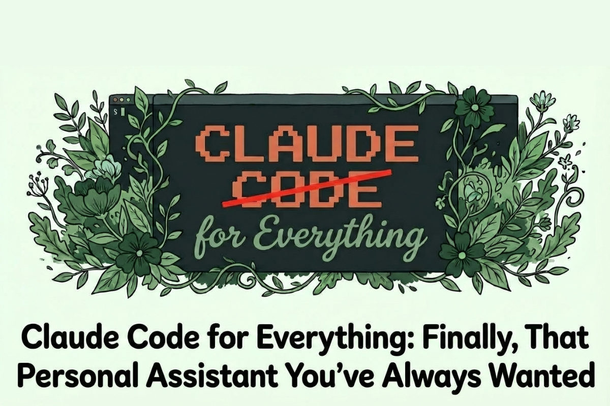

Each article in this series will focus on a single, actionable concept you can apply in under an hour. By the end, you'll be saving at least 10 hours a week. Subscribe and let's build that junior employee.

### **Prefer to watch?**

This guide is also available as a video walkthrough. Same content, same steps — just hit play.

[Claude Code Getting Started Guide: Installation & Setup (No Coding Required)](https://www.youtube.com/watch?v=m4eT9234b8w)

# What you need before starting

Before we start, make sure you have:

- **A Mac or Windows computer:** Claude Code works on both (this guide shows Mac examples, but Windows is similar)

- **An Anthropic account:** Sign up at [anthropic.com](http://anthropic.com/) if you don't have one

- **A Claude Pro or Max subscription:** Claude Code requires a paid subscription. Pro ($20/month) works, but you'll likely need Max ($100/month) to get meaningful use out of it. Pro's usage limits run out fast when you're using Claude Code regularly.

_Here's how I think about the cost:_ Consider how much you get paid per hour. If Claude Code saves you just a few hours of work per month, the Max subscription has already paid for itself. For most corporate workers, it pays off within the first week.

Budget about 30 minutes for the full setup. Once it's done, you never have to do it again.

# Step 1: Choose and install your IDE

You _could_ run Claude Code in your Mac's Terminal app or Windows Command Prompt. But you'd be working blind - unable to see your files, preview documents, or watch Claude make changes in real time. _This is not how developers work._ They use something called an IDE. (I cover why this matters in tip #1 in my first [Claude Code tips & tricks article](https://hannahstulberg.substack.com/p/skip-the-terminal-and-8-other-claude).)

**What is an IDE?** An IDE (Integrated Development Environment) is an app that gives you a file browser, text editor, and terminal all in one window. Think of it as a control center for working with files and code.

## **What does your IDE need?**

Make sure your IDE has these features:

1. **An integrated terminal:** This is where Claude Code runs. Without it, you can't use Claude Code in the IDE.

2. **Ability to show hidden files:** Claude Code stores its settings in a hidden `.claude/` folder. You need to see this folder to customize your setup.

3. **Bonus: AI chat feature:** Some IDEs have built-in chat that lets you test prompts against different models (Claude 3.5 Sonnet, GPT-4o, Gemini 2.0). Useful for comparing outputs, but not required.

I personally use **Cursor** because it has all these features. (I wrote more about why I chose Cursor in my [Claude Code tips & tricks article](https://hannahstulberg.substack.com/p/skip-the-terminal-and-8-other-claude).) Some other IDE options include: **VS Code** (free, widely used) and **Windsurf** (also free, similar to Cursor). Any IDE with terminal access will work.

#### **To install Cursor:**

1. Go to [cursor.com](http://cursor.com/)

2. Download the installer for your operating system

3. Open the downloaded file and follow the installation prompts

4. Launch Cursor when it's done

#### **Before you move on: Create your working folder**

Before you install Claude Code, you need a folder for Claude to work in. This is the most important concept to understand: _Claude Code works with files that live on your computer_ - not Google Docs that live in the cloud.

If you've used Google Docs, you know your documents exist "somewhere on Google's servers." You don't see them in locally on your computer. Instead, you access them through a browser. Claude Code is different. It works with actual files in actual folders on your machine - the kind you can see in Finder (Mac) or File Explorer (Windows).

Here's what I recommend:

1. Install a cloud storage desktop app if you haven't already ( **[Dropbox](https://www.dropbox.com/install)**, **[Google Drive](https://support.google.com/a/users/answer/13022292?hl=en)**, **[iCloud Drive](https://apps.apple.com/us/app/icloud-drive/id1070072560)**, **[OneDrive](https://www.microsoft.com/en-us/microsoft-365/onedrive/download)** - any of them work). These apps create a folder on your computer that automatically syncs to the cloud - so your files live locally (which Claude needs) but are also backed up online (so you don't lose everything if your computer crashes).

2. Open Finder (Mac) or File Explorer (Windows) and navigate to your Dropbox or Google Drive folder

3. Create a new folder inside it. Call it something like "Claude Agent" or "My Agent"

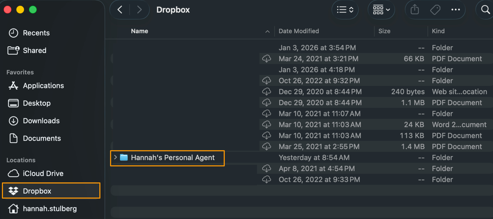

That's it. This folder is where all of Claude's work will happen - every file it creates, every document you work on together. Think of it as Claude's home base.

_If you don't use a cloud storage app, you can create the folder anywhere on your computer - just know that those files won't be backed up automatically._

# Step 2: Understand your IDE layout

## Opening your project

When you launch Cursor for the first time, you'll see an "Open Project" button. This is asking: _which folder do you want to work in?_

Click "Open Project," navigate to the folder you just created, and select it. Now that folder is "open" in Cursor - you'll see it appear in the left sidebar.

Here's the mental model: your IDE is a window into a folder on your computer. Whatever's in that folder shows up in Cursor's sidebar. If you add a file in Finder, it appears in Cursor. If Claude creates a file, you'll see it in both places. They're the same files - just two different ways of looking at them.

## The four main areas

Before we install anything else, let's get oriented. Your IDE has four main areas: file browser (left), editor (center), terminal (bottom), and AI pane (right).

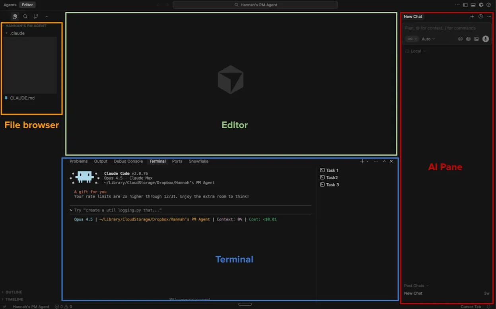

- **File browser (left sidebar):** Shows all files and folders in your working directory. Click to open files, drag to move them, right-click for options. This is your "finder" inside the IDE.

- **Editor area (center):** Where you view and edit files. Files open here when you click them in the sidebar, and you can have multiple files open in tabs.

- **Terminal (bottom panel):** Where Claude Code will run. This is where you'll type prompts and Claude will respond. You can have multiple terminals open for parallel tasks (I cover this in tips #5 and #6 in [Claude Code tips & tricks](https://hannahstulberg.substack.com/p/skip-the-terminal-and-8-other-claude)).

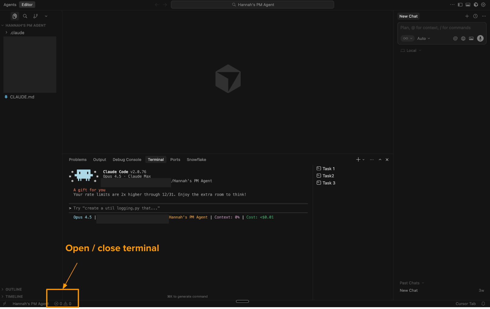

- **AI pane (right sidebar):** Cursor's built-in AI chat - NOT Claude Code. Claude Code runs in the terminal (bottom). The AI pane uses various models for quick questions and can be collapsed when not needed. (See tip #2 in [Claude Code tips & tricks](https://hannahstulberg.substack.com/p/skip-the-terminal-and-8-other-claude) for more on when to use each.)

The layout is customizable - you can drag panels to resize them, collapse sidebars, and split the editor area. But the default layout works well for most people starting out.

# Step 3: Install Claude Code

Now we install Claude Code itself. You should already have Cursor open with your working folder selected from the previous steps.

**A note on Claude Code IDE extensions vs. the Claude Code command line interface (CLI):** If you search for "Claude Code" in Cursor's or VS Code's extension marketplace, you'll find official Claude Code extensions. _Don't install those._ We're installing something different: the command line interface (CLI). A command line interface is just a program you interact with by typing text commands - in this case, you'll type commands in the terminal. The CLI version of Claude Code has more features than the IDE extensions, including critical features like the status line (which shows how much context Claude is using - more on why that matters in the [third article](https://hannahstulberg.substack.com/p/claude-code-for-everything-why-ai) of this series) and better support for parallel sessions (deeper dives [here](https://hannahstulberg.substack.com/i/184381596/2-run-parallel-sessions) and [here](https://hannahstulberg.substack.com/i/185143249/3-parallel-sessions-separate-tasks-separate-drawers)). The extensions are handy for quick questions, but the CLI is where the real power is. For more on the differences, see [the official comparison](https://code.claude.com/docs/en/vs-code#vs-code-extension-vs-claude-code-cli).

1. **Open the terminal inside Cursor** - Look for a small flask or beaker icon in the bottom-left corner of the window and click it. This opens a panel at the bottom with several tabs - click "Terminal." (You can also use the menu: `View > Terminal`, or press ``Ctrl+``` on your keyboard.)

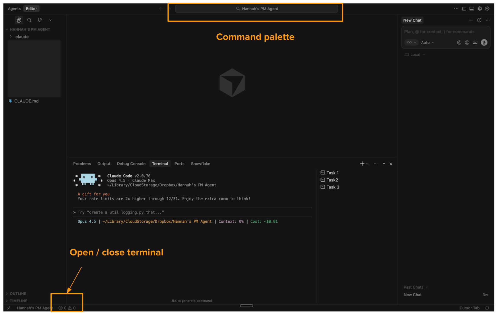

_Note: Cursor updates their interface frequently, so the exact location of icons may change. If you can't find it, search for "terminal" in Cursor's command palette (Cmd+Shift+P on Mac, Ctrl+Shift+P on Windows)._

**What is a terminal?** Think of it as a text-based way to talk to your computer. Instead of clicking icons, you type commands. It looks intimidating, but you'll only need a few commands.

2. **Install Claude Code** - There are two ways to install. The native installer is simpler (no dependencies), but either works.

### **Option A: Native Installer (Recommended)**

This is the fastest way to get started - no extra software required. Copy and paste this command into the terminal:

_Mac/Linux:_

```
curl -fsSL https://claude.ai/install.sh | bash
```

_Windows:_

```
irm https://claude.ai/install.ps1 | iex
```

Press Enter and wait for it to finish. That's it - skip to Step 4.

**Option B: Homebrew**

If Option A didn't work for you, Homebrew is a reliable backup method.

One downside to know upfront: unlike the native installer, Homebrew won't automatically update Claude Code for you. You'll need to run `brew upgrade claude-code` in your terminal occasionally to get the latest features and security fixes. (That's in the terminal itself, not inside a Claude Code session.) It's not a big deal, but worth knowing before you choose this path.

**Step 1: Check if you already have Homebrew**

In your terminal, type:

```
brew --version
```

If you see a version number (like `Homebrew 4.2.0`), you already have Homebrew - skip to Step 3.

If you see "command not found," you need to install Homebrew first.

**Step 2: Install Homebrew (if needed)**

Copy and paste this command into your terminal:

```
/bin/bash -c "$(curl -fsSL https://raw.githubusercontent.com/Homebrew/install/HEAD/install.sh)"
```

Press Enter and follow the prompts. The installation will ask for your computer password and may take a few minutes.

**Important:** After installing, completely close your terminal in Cursor (clicking the trash button) and open a new one.

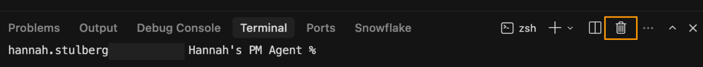

**Step 3: Install Claude Code**

Now install Claude Code with this command:

```
brew install --cask claude-code
```

_(Looking for the old npm installation method? It's been deprecated by Anthropic and replaced with the Homebrew approach.)_

# Step 4: Log in and start Claude Code

Now let's start Claude Code.

1. **In the terminal inside Cursor**, type `claude` and press Enter.


2. **Complete the login flow**. The first time you run Claude Code, it will ask you to log in. Follow the prompts to authenticate with your Anthropic account.

You should now see the Claude Code interface in your terminal. You're ready to start using it.

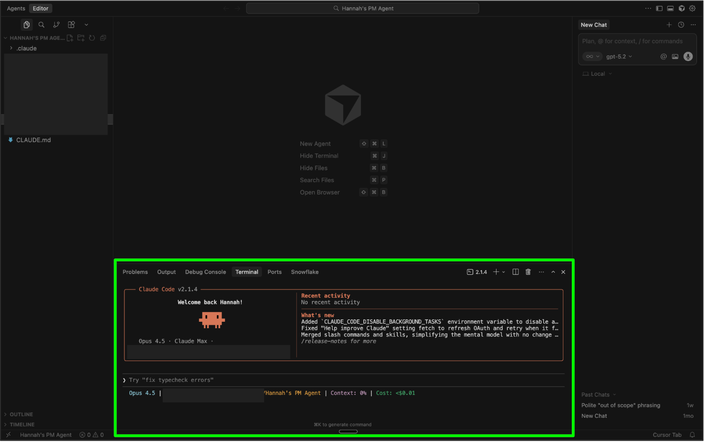

**Note:** Every time you open a new terminal within your IDE or restart your IDE, you'll need to type `claude` again to start Claude Code. It doesn't run automatically - you launch it when you need it.

# Step 5: Understanding Markdown files

As you use Claude Code, you'll notice something: it creates a lot of `.md` files. These are Markdown files, and understanding them will help you get the most out of Claude Code. (Spoiler: Claude will happily handle the nitty gritty of markdown for you. But understanding what you're looking at? That's a superpower - you can make quick edits yourself instead of waiting for Claude to do it.)

## What is Markdown?

Markdown is plain text with simple formatting symbols. The `.md` extension stands for Markdown. Instead of clicking buttons to make text bold or create headers, you use characters like `#` for headers and `**` for bold.

Here's what the most common symbols mean:

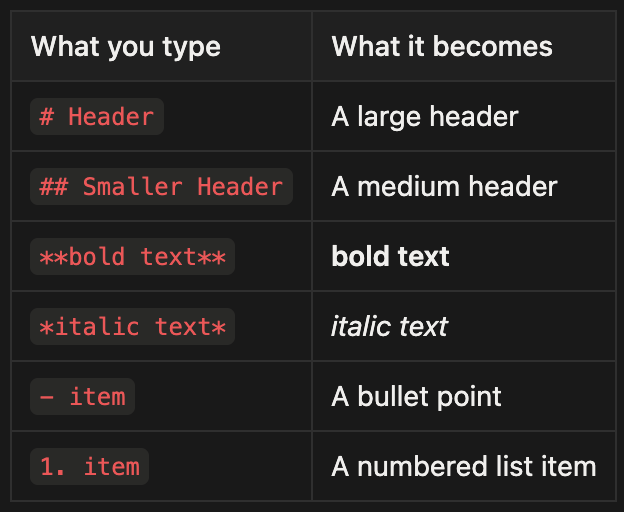

## Why does Claude Code use Markdown?

When you write in Word or Google Docs, there's hidden formatting behind the scenes - invisible codes that control fonts, spacing, and layout. Claude can't see those hidden parts, which means it might miss context or make unexpected changes.

Markdown is different. It's plain text - what you see is exactly what Claude sees. No hidden surprises. That's why it's the ideal format for working with AI.

## How to read and edit Markdown files

You don't need to read or write raw Markdown. Your IDE has a Preview mode that shows you the clean, formatted document - headers look like headers, bold text looks bold, and lists look like lists.

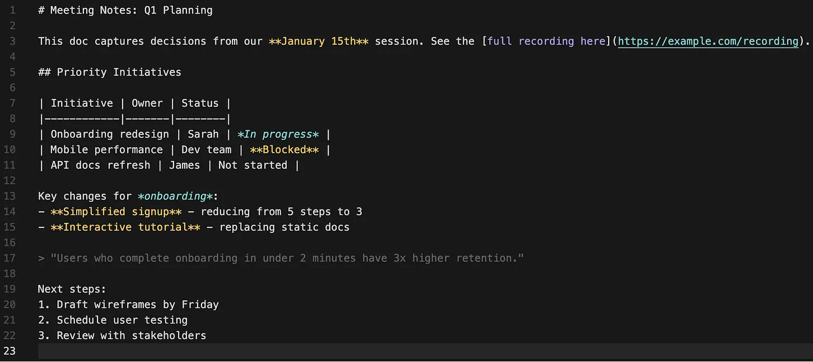

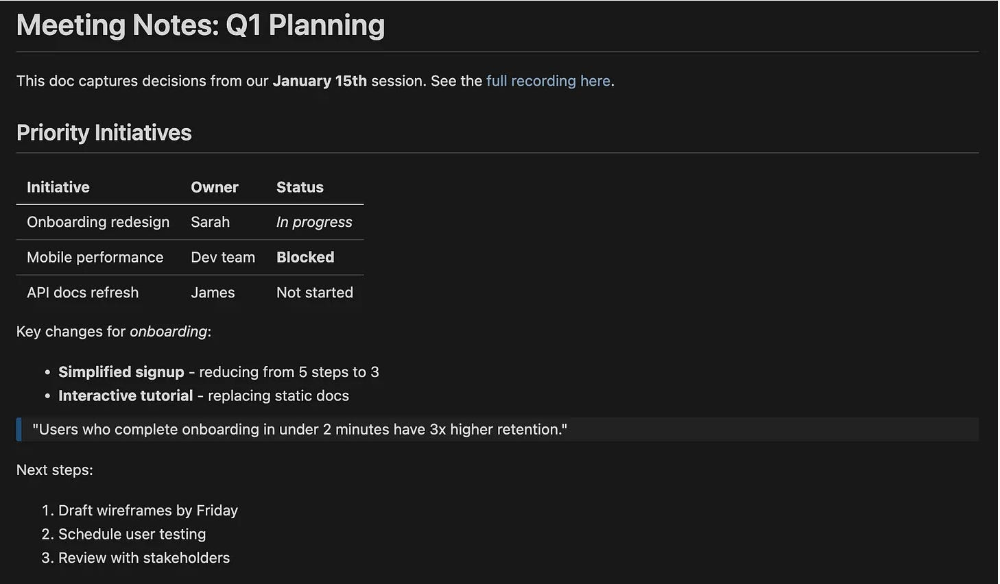

To open Preview mode, just right click on the markdown file in the file browser and select "Open Preview."

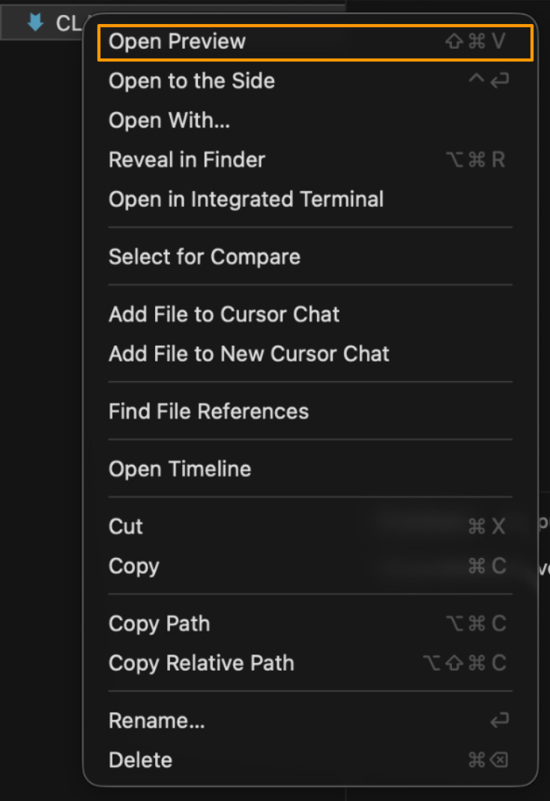

You can edit in raw markdown mode or preview mode, whichever feels more comfortable. In general, you can let Claude handle the formatting and just review the changes in preview.

## What can be a Markdown file?

The text content from many file types (Excel spreadsheets, Word docs, PDFs) can be captured in markdown, though specialized formatting and features won't carry over. That's often fine for working with Claude, since you're focused on the content itself. Future articles in this series will cover how to use Claude skills to work directly with document types like Excel and PowerPoint.

## Working with existing files

**You don't have to convert everything to Markdown.** You can drag and drop files (PDFs, images, Word docs) directly into Claude Code's terminal, and Claude can read them for reference. (I cover this in tip #4 in [Claude Code tips & tricks](https://hannahstulberg.substack.com/p/skip-the-terminal-and-8-other-claude).)

But files you _create_ with Claude Code will be Markdown - because that's what Claude can write and edit directly in your file system.

# Step 6: Understanding bash commands

As you work in Claude Code, you'll see it running "bash commands" - text commands that interact with your computer. This can feel scary if you don't know what they mean. Let me demystify them.

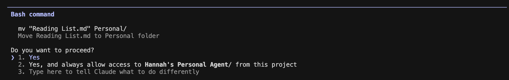

## What are bash commands?

Bash is just a language for talking to your computer through the terminal. When Claude Code needs to do something on your system - like create a folder, move a file, or open a webpage - it uses bash commands.

Here's what they look like in your terminal:

```
ls -la "/Users/yourname/Dropbox/Project Files"
cat "/Users/yourname/Dropbox/Notes/meeting-notes.md"
mv "/Users/yourname/Dropbox/draft.md" "/Users/yourname/Dropbox/final.md"
```

Here are the most common ones you'll see:

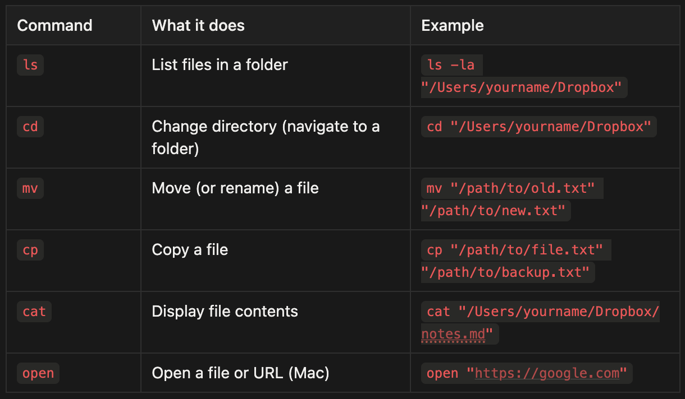

When Claude runs a command, you'll see it in the terminal. Most of the time, you can just let Claude do its thing. But if you see a command you don't understand, you can always ask Claude:

> _"What does this command do?"_

## Pre-allow safe commands

Boris Cherny, the head of Claude Code, [recommends](https://x.com/bcherny/status/2007179854077407667?s=20) pre-allowing common bash commands so Claude doesn't ask for permission every time. This lets you work faster while still staying in control.

A good starter set of safe commands: `ls`, `cd`, `mv`, `cp`, `cat`, and `open`.

Here's a prompt you can paste into Claude Code to set up your permissions:

> _"Help me set up my bash command permissions. I want to pre-allow these safe commands so I don't get prompted every time: ls, cd, mv, cp, cat, and open. Walk me through how to do this with /permissions."_

## Pre-allow file reading

By default, Claude asks permission before reading files on your computer. If you're working in a trusted directory (like your project folder), you can pre-allow reads so Claude can explore your files without interrupting you.

To allow Claude to read any file without asking:

> _"Help me set up my permissions so Claude can read any file without asking. I want to pre-allow all Read requests. Walk me through how to do this with /permissions."_

Alternatively, you can allow reads only within specific folders:

> _"Help me pre-allow Read for files in this folder only, so Claude asks before reading files elsewhere."_

## Pre-allow web fetching

When Claude Code needs to fetch content from a webpage, like checking documentation or researching something for you, it asks for permission each time. If you trust Claude to browse the web on your behalf, you can pre-allow all web fetching so it doesn't interrupt your flow.

To allow Claude to fetch any URL without asking, add this to your permissions:

> _"Help me set up my permissions so Claude can fetch any webpage without asking. I want to pre-allow all WebFetch requests. Walk me through how to do this with /permissions."_

Alternatively, you can allow specific domains only. For example, if you only want Claude to fetch from GitHub and Stack Overflow without asking:

> _"Help me pre-allow WebFetch for [github.com](http://github.com/) and [stackoverflow.com](http://stackoverflow.com/) only, so Claude asks before fetching from other sites."_

# Step 7: Install the Document Skills Plugin (Optional)

Skills are plugins that extend Claude Code's capabilities. The document-skills plugin adds the ability to create and edit Office documents (Word, Excel, PowerPoint) and work with PDFs directly from Claude Code.

**What's included:**

- **PDF:** Extract form fields and work with PDF files

- **DOCX:** Create and edit Word documents

- **PPTX:** Create and edit PowerPoint presentations

- **XLSX:** Create and edit Excel spreadsheets

**To install:**

1. First, add the Anthropic skills marketplace by typing the following into the terminal:

```
/plugin marketplace add anthropics/skills
```

2. Then install the document skills:

```
/plugin install document-skills@anthropic-agent-skills
```

3. Restart Claude Code (type `exit` then `claude` again within terminal)

**Usage example:**

After installation, reference the skill in your requests:

> _"Use the PDF skill to extract the form fields from /path/to/my-form.pdf"_

**Learn more:** [github.com/anthropics/skills](http://github.com/anthropics/skills)

Stay tuned - skills will be covered in-depth in an upcoming article.

# What you should have now

If you've followed along, you now have:

- **A complete setup:** An IDE (Cursor) and Claude Code installed, with your working directory in cloud storage for automatic backups.

- **Claude Code running:** You know how to type `claude` in your terminal to start it, and you've logged in with your Anthropic account.

- **Your bearings:** You understand the four areas of your IDE (file browser, editor, terminal, AI pane) and know that Claude Code runs in the terminal, rather than the AI pane.

- **Markdown basics:** You know why Claude uses `.md` files, how to preview them, and that you can drag-and-drop other file types directly into Claude Code.

- **Bash confidence:** You recognize common commands like `ls` and `cat`, and you know you can pre-allow safe commands, file reads, and web fetches to work faster without constant permission prompts.

- **Document skills (optional):** If you installed the document-skills plugin, Claude can now create and edit Word docs, Excel spreadsheets, PowerPoints, and PDFs.

# Next steps

You're set up and ready to use Claude Code. For now, play around. Open a file. Ask Claude to summarize it. Ask Claude to create a new document. Get comfortable with the environment. The best way to learn is to experiment.

Each article in this series will cover a bite-sized concept you can apply in under an hour. Subscribe and follow along - by the end of this series, you should be saving 10+ hours a week with Claude Code. (Honestly? Probably closer to 20.)

In the next article, I'll cover my recommended setup for actually doing knowledge work in Claude Code - the workflow tips and tricks that make your new assistant as effective as possible.

# Want to go deeper?

If you want more structured practice, I highly recommend Carl Vellotti's free course [Claude Code for Everyone](https://fullstackpm.com/cc4e). It's taught entirely inside Claude Code itself, giving you the opportunity to learn by doing.
