# Claude Code for Everything: How the Guy Who Built It Actually Uses It

### Boris's coding setup works even better for everything else

**If you've been following Claude news:** Anthropic just launched [Cowork](https://claude.com/blog/cowork-research-preview), a research preview that brings Claude Code's agentic capabilities to non-coding work. (When I say "just," I literally mean yesterday. Yes, this article got some last minute tweaks.) A research preview means it's an early version Anthropic is testing publicly before a full release. Cowork's release validates that "Claude Code for everything" isn't just a workaround - it's the direction the product is going.

Cowork is an early product. Most of the features that make Claude Code powerful, such as context management, background agents, and custom commands, aren't yet easily available in Cowork. (I fully expect this to change over the coming weeks.) I'll be writing about Cowork as it develops, exploring where each tool shines and when to use which. I highly encourage you to play with both - try the same task in Claude Code and Cowork and see what you get. That's what I'm doing!

What won't change is my focus on teaching the fundamentals. Both tools are built on the same underlying system, which means the principles I teach in this series will apply whether you end up using Claude Code or Cowork. Learn the fundamentals now, and you'll be better at both.

# The Claude Code Creator's Workflow

Boris Cherny, the creator of Claude Code at Anthropic, recently shared his personal workflow for using Claude Code. His setup is surprisingly vanilla - proof that Claude Code works well out of the box. However, one tip stood out: _most of his sessions start in Plan mode._ He goes back and forth with Claude until he likes the plan, then switches to auto-accept edits and lets Claude execute.

Boris shared this as coding advice. But here's the thing - the setup for coding is the setup for everything else too. Writing articles, planning trips, doing research, and building decks. The principle is the same: align on the plan first, then let Claude run.

That insight sent me down the rabbit hole of [his full thread](https://x.com/bcherny/status/2007179832300581177). After this little side quest, I realized that almost every tip Boris shared for developers applies directly to anyone using Claude Code - whether you're writing code or not.

If you've been paying attention to Claude Code lately, you've probably seen the content explosion. Skills. Custom commands. Background agents. MCP integrations. Everyone's sharing their fancy setups, and it can feel like you're already behind.

Here's the thing: we're going to get there. This series will cover all of it. But you learn algebra before calculus for a reason - and none of those fancy features matter if you don't have a solid working setup first. That's what this article is about.

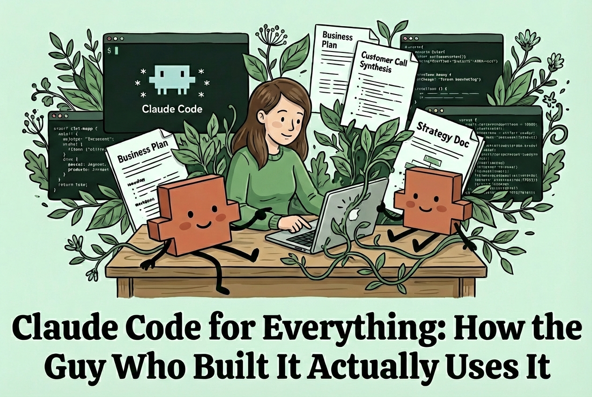

#### **By the end of this article, you'll have:**

- **Workflow fundamentals:** A core workflow for tackling any task in Claude Code

- **Workspace setup:** The environment setup I use to make working with documents easier

- **Customization options:** A preview of the advanced features - slash commands, subagents, and MCP integrations - that we'll explore together in future articles (and that Boris touches on in his thread)

These tips form the foundation of how I use Claude Code for everything. They're adapted from Boris's workflow, but you don't need to be a software engineer to use them.

# The Core Workflow

## Workflow Fundamentals

These four tips form the core of how I work in Claude Code:

1. **Plan mode:** Align on the approach before Claude starts making changes

2. **Parallel sessions:** Work on multiple tasks at once without mixing context

3. **Session management:** Name and resume sessions so you can pick up where you left off

4. **Background agents:** Hand off work and keep going

## 1\. The three modes (and when to use each)

This is Boris's [tip #6](https://x.com/bcherny/status/2007179845336527000?s=20) - and it's a game changer.

Claude Code has three modes that control how much autonomy Claude has.

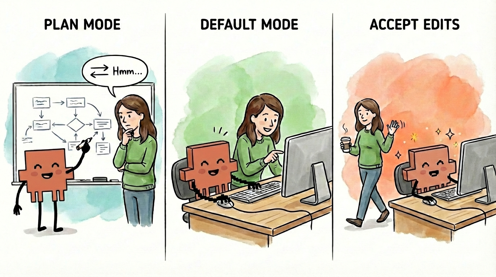

You cycle through them with `Shift+Tab` from the input line:

- **Plan mode:** Claude explores and plans but doesn't execute anything. You align on the approach first.

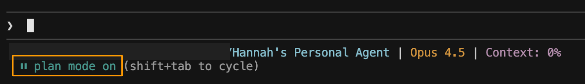

- **Default mode:** Claude asks permission before each edit. You review and approve every change.

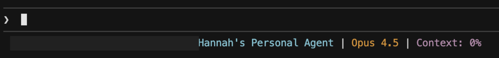

- **Accept edits:** Claude executes without asking. Changes happen automatically.

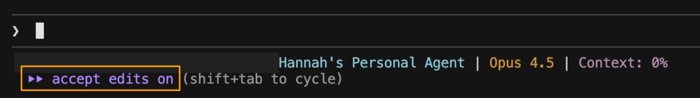

Think of it like working with a junior employee. You're constantly adjusting your oversight based on how much you trust what's about to happen:

- **Big decision or new task?** Use _plan mode_. Like asking your junior employee to outline their approach before they start - Claude explores your files, asks clarifying questions, and proposes an approach. You go back and forth until you're aligned. Boris mentions he'll sometimes engage in significant back and forth on a single plan - I do the same.

  - Claude will often ask you questions before proposing a plan - clarifying your goals, surfacing assumptions, checking constraints. This is a feature, not a bug. The questions make the plan better.

  - _Pro tip:_ [Dictating your feedback](https://hannahstulberg.substack.com/p/stop-typing-start-talking-how-dictation) is much faster than typing into the terminal (I personally use Wispr Flow.).

    [Try Wispr Flow!](https://wisprflow.ai/?utm_source=dub.co&utm_medium=affiliate&utm_campaign=AffiliateProgram&via=hannah-stulberg&dub_id=fKPSprpOjW7tSciv)

- **Executing the plan?** Use _default mode_. Like sitting side by side, reviewing each section as it's drafted by your junior teammate - Claude proposes changes one at a time, and you accept or reject each one before it moves on.

- **Simple mechanical task you're confident about?** Use _accept edits_. Like telling your junior report "just format the appendix, I trust you" - Claude executes without asking, and you check back when it's done.

The key insight: match your level of oversight to your confidence in the output. I flip between modes constantly throughout a single task. Start in plan mode to align on the approach. Switch to default mode to execute with review. Flip to accept edits for trusted stretches where I know exactly what I want. Then back to plan mode when I hit a new decision point.

**The critical part: actually read the plan and give feedback.** Claude won't always get it right on the first try - and that's fine. Remember: you're reviewing a proposal from your junior employee. You wouldn't glance at a project plan, assume it's right, and immediately say "looks great, go ahead." You'd read it. Check that it covers everything you asked for. Spot what's missing. Push back on approaches you don't like. Ask questions about parts that seem off. That iteration process - the back and forth you'd have with a junior employee - is what makes the output good. A plan you didn't read is worse than no plan at all - it gives you false confidence that you're aligned when you're not.

**A note on permissions:** By default, Claude asks for permission before running certain operations. Boris pre-allows the ones he knows are safe (his [tip #10](https://x.com/bcherny/status/2007179854077407667?s=20)) so he doesn't get interrupted every time. Pre-allowing safe operations lets you and Claude work faster across both default and accept edits modes. I cover permission set-up in [the previous article](https://hannahstulberg.substack.com/i/184061644/pre-allow-safe-commands).

## 2\. Run parallel sessions

Back to our junior employee metaphor: imagine giving one new hire three completely unrelated tasks at the same time - draft this article, research those competitors, and analyze that spreadsheet. They'd be context-switching constantly, and the output would suffer.

Now imagine you have three junior employees, each focused on one task. Much better results.

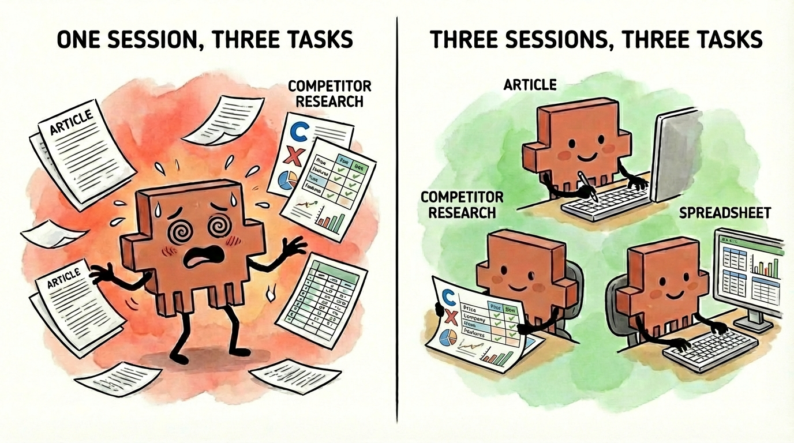

That's exactly how Claude Code works. Each instance of Claude Code is like a separate junior employee - give it one task, and it can focus completely. The technical term for this is a _session_. Boris runs 5+ sessions at once (his tips #1 and #2), each dedicated to a different task.

Why does this matter? Each session has its own _context_ - essentially, what Claude remembers and is paying attention to. If you try to draft an article and research competitors in the same session, Claude is juggling unrelated information and quality drops. Separate sessions mean each task gets Claude's full attention. (The next few articles in this series will deep dive on effective context management.)

**How to run parallel sessions:**

Open separate terminal instances in your IDE, each running Claude Code. I covered this setup in my [Claude Code tips & tricks article](https://hannahstulberg.substack.com/i/183150134/5-run-tasks-in-parallel-to-move-faster) ( [tip #5](https://hannahstulberg.substack.com/i/183150134/5-run-tasks-in-parallel-to-move-faster)).

## 3\. Pick up where you left off

Every time you start Claude Code (by typing `claude` in your terminal), you're starting a fresh session with no memory of previous work. It's like your junior employee going home and coming back the next morning with no memory of anything you discussed. That's what happens if you don't name and resume your sessions.

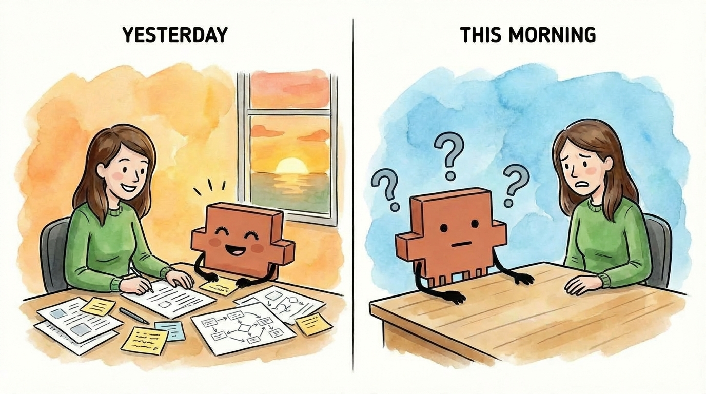

- **Name your sessions:** Use `/rename Q1 Planning Meeting` in the command-line to give your session a name. I use the same name for both my terminal and my session - so I always know which session goes with which terminal. (I cover terminal naming in [tip #6](https://hannahstulberg.substack.com/i/183150134/6-split-your-terminals-so-you-know-when-tasks-finish) of my [Claude Code tips & tricks article](https://hannahstulberg.substack.com/p/skip-the-terminal-and-8-other-claude).)

- **Resume later:** Claude Code's resume feature lets you pick up exactly where you left off within a session - all the context, all the decisions, and everything Claude learned about your task. Three ways to resume:

1. `/resume` to browse your named sessions

2. `/resume Q1 Planning Meeting` to go directly to a specific session by name

3. `claude --resume Q1 Planning Meeting` to start Claude directly into a session from your terminal

_(A note to the incredible Claude Code team, if you're reading this: I've found the resume feature to be a bit buggy - it sometimes crashes Claude Code, and the session search doesn't always work. It's still worth using, but this feature could use a little love.)_

- **Save the session name in your file:** I've found session search to be buggy, so I literally type the session name into the markdown file I'm working on. That way, when I open the doc later, I know exactly which session to resume.

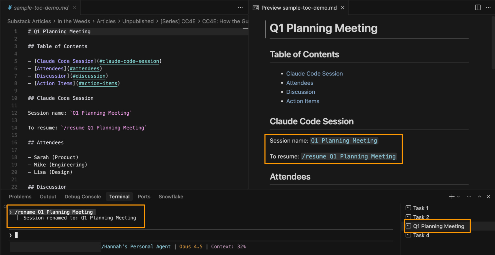

## 4\. Hand off tasks to background agents

Here's where the junior employee metaphor gets interesting. You're working with your junior employee on a big task - say, drafting an article. Partway through, you realize there's a related side task: "We need to pull together all the research sources we've referenced."

Your junior employee could stop what they're doing and handle it - but that breaks your flow. Instead, they hand it off to another junior employee they supervise. That second employee works on the research list while you and your main employee keep drafting the article. When it's done, they tap you on the shoulder.

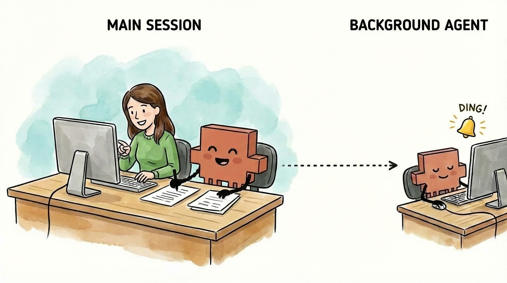

That's what background agents do. Claude (your main session) delegates a related task to another Claude instance that runs independently. You keep working with your main Claude on the main task, and when the background agent finishes, you get notified to review their work.

**How to use background agents:**

1. **Send a task to the background:** Tell Claude to run something in the background. For example:

   - "Compile all the sources we've referenced into a bibliography - do this in the background"

   - "Run this as a background agent: create a summary of the key points we've covered so far"

Claude will confirm the task is running in the background, and you can keep working on your main task without waiting.

2. **Get notified when it's done:** Claude will interrupt you when the background agent finishes. You'll see a notification in your terminal that the task is complete.

3. **Check on running tasks:** Type `/tasks` to see all your background agents - what's running, what's finished, and what the output was.

**When to use background agents:**

The sweet spot is a task that needs the context from your current session but doesn't need to block you. If the task is unrelated to what you're working on, just open a separate terminal. But if the task requires context from the current discussion in order to be executed effectively - like making a series of edits after aligning on the edits to make - a background agent is the right solution.

I'll cover background agents more deeply in a future article.

**A note on model choice:** Boris uses Opus 4.5 with thinking for everything (his [tip #3](https://x.com/bcherny/status/2007179838864666847?s=20)). His reasoning: even though it's bigger and slower than Sonnet, you have to steer it less - so it's almost always faster in the end. The same applies to everything you do in Claude Code. The extra quality from a better model compounds - less time correcting, less back-and-forth, and better first drafts. You'll get the best results from this workflow if you're using Opus 4.5.

# Setting Up Your Workspace

These next four tips help you work with files efficiently - essential when most of what you're doing involves documents, notes, and research rather than code.

1. **Split editor:** Read in preview, edit in markdown - the best of both worlds

2. **Table of contents:** Navigate long markdown files with one click

3. **IDE over terminal:** Everything in one window - files, documents, and terminals

4. **PDF extension:** View PDFs directly in your editor without switching apps

## 1\. Split your editor: markdown on the left, preview on the right

Claude generates markdown files by default (I explained why in [the first article in this series](https://hannahstulberg.substack.com/i/184061644/why-does-claude-code-use-markdown), which also covers [preview mode](https://hannahstulberg.substack.com/i/184061644/how-to-read-and-edit-markdown-files)).

**The setup I recommend:** Markdown files on the left, preview on the right. They scroll in tandem, so you can read the nicely formatted preview while making quick edits in the raw markdown.

Why this works better than preview-only: Reading in preview mode is much easier than parsing raw markdown with all the `#` symbols and `**bold**` syntax. But if you need to make a quick edit, you don't want to close preview, find the spot in the markdown, edit, then reopen preview. With this split view, you read in preview and edit in markdown - the best of both worlds.

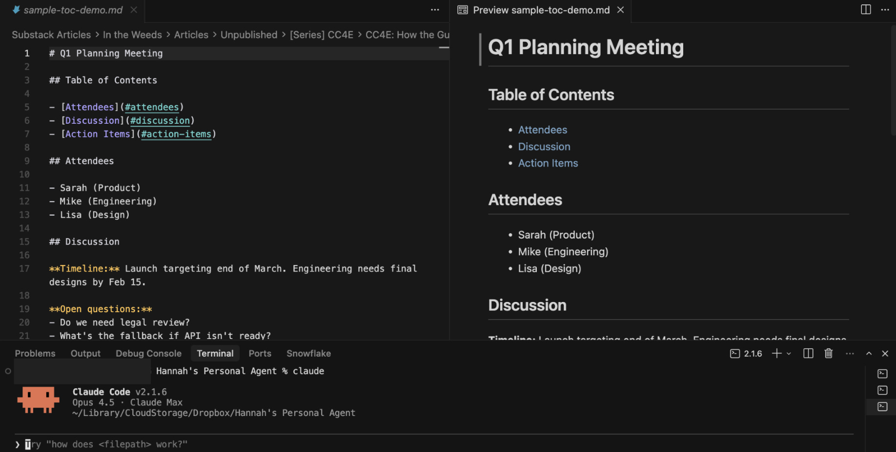

**To set this up in Cursor:**

1. Open your markdown file

2. Click the "Open Preview to the Side" button in the top right of the editor

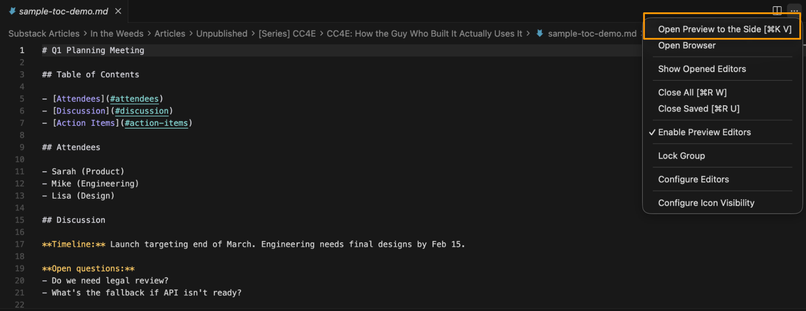

3. The preview opens on the right, markdown stays on the left

4. Scroll either side - they stay synced

**Pro tip:** If the preview ever gets stuck showing stale content, force refresh it: Open the Command Palette (`Cmd+Shift+P` on Mac, `Ctrl+Shift+P` on Windows), search for "Markdown: Refresh Preview," and hit enter.

_(To the good folks at Cursor - if you're reading this, the ability to have multiple files open in preview at the same time would be fantastic!)_

## 2\. Add a clickable table of contents to long markdown files

When your markdown files get long, add a clickable table of contents at the top. It transforms a wall of text into a navigable document - click any section to jump straight there in Preview mode.

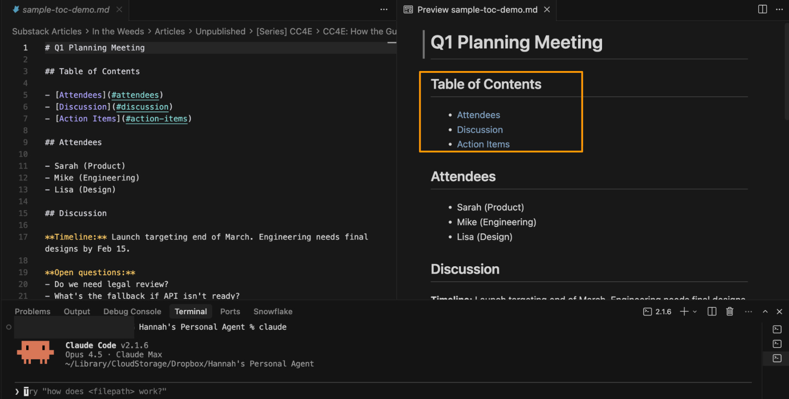

**How to ask Claude to add or update one:**

> _Add a table of contents at the top of this file with links to each section header. If one already exists, update it to reflect the current sections._

## 3\. Use an IDE, not the terminal

Even with Cowork on the horizon, this recommendation still stands strongly for Claude Code.

If you're still using Claude Code in a standalone terminal, stop. This was my [first tip](https://hannahstulberg.substack.com/i/184061644/step-1-choose-and-install-your-ide) in [the setup article](https://hannahstulberg.substack.com/p/claude-code-for-everything-finally), and it's even more important when you're working with documents.

An IDE gives you everything in one window: your file structure, your documents, and your terminals. You can see what Claude is working on, preview your markdown, and manage multiple sessions - all without switching windows.

I use Cursor because it has built-in model switching (so I can test prompts in other models when needed), but VS Code or any other IDE works too. [The setup article](https://hannahstulberg.substack.com/p/claude-code-for-everything-finally) walks through installing an IDE and its core components.

**A note on third-party wrappers:** You may have seen recommendations for software layers that sit on top of Claude Code - tools that promise to make the terminal experience "friendlier" for non-technical users. I'd encourage you to be cautious here - especially now.

When you put a layer between yourself and Claude Code, you're letting another company control your experience with the core product. You don't know how they're changing or limiting Claude Code's features under the hood - and when Anthropic ships updates, you're waiting for that third party to catch up. You're giving up significant control and distancing yourself from the product you actually want to use.

With the launch of Cowork, Anthropic is building the more user-friendly layer themselves. An IDE isn't a layer on top of Claude Code - it's just the environment where you run it. Claude Code still works exactly as Anthropic designed it. You're getting the full experience, straight from the source, with the added file management benefits that make document work easier. And using Claude Code directly now will help you learn Cowork if that's where you ultimately decide to go.

## 4\. Install vscode-pdf for viewing PDFs

Cursor doesn't support PDFs out of the box. If you try to open a PDF, you'll just see gibberish. Install the vscode-pdf extension so you can view PDFs directly in Cursor - useful when you're working with research papers, contracts, or reference documents and don't want to switch to another app.

**To install in Cursor:**

1. Open the Extensions view (View → Extensions, or `Cmd+Shift+X` on Mac and `Ctrl+Shift+X` on Windows)

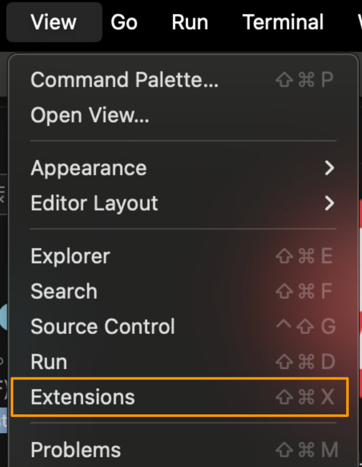

2. Search for "vscode-pdf"

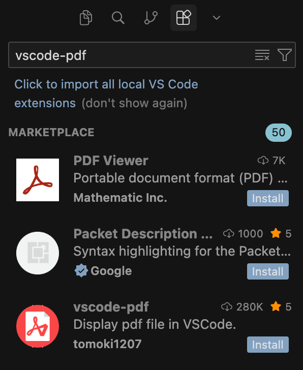

3. Click Install

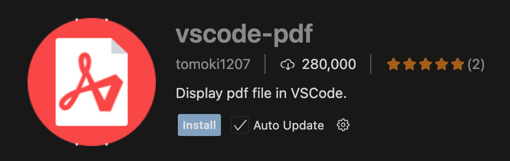

# Preview: Customization

Boris's thread covers more than just workflow fundamentals - he also shares how he customizes Claude Code to save even more time. Once you've nailed the fundamentals, these features let you automate your most common workflows and squeeze even more efficiency out of every session.

But you don't want to jump to the fancy stuff before you understand the basics. The first few articles in this series will focus on fundamentals - once those are solid, we'll dig into customization.

A quick preview of what's coming:

- **Slash commands:** Save repeated workflows as commands you can run with a single `/` command (e.g., `/summarize-meeting`)

- **Subagents:** Automate review and polish steps that you'd run on most tasks, like a doc reviewer that checks every draft

- **MCP (Model Context Protocol):** A way to connect Claude to apps like Notion and Slack so Claude can pull from them directly - no copy-pasting required

I'll cover the full setup for each of these in dedicated articles later in this series.

# What you should have now

If you've followed along, you now have:

- **A workflow for any task:** Start in plan mode, align on the approach with your junior employee, then switch to default or accept edits based on how much you trust the output. Adjust constantly.

- **Multi-tasking without the mess:** Parallel sessions let you work on multiple tasks at once. Named sessions let you pick up tomorrow where you left off today.

- **A workspace built for documents:** Markdown on the left, preview on the right. Clickable table of contents for long files. PDFs viewable without switching apps.

# The bottom line

The biggest unlock from Boris's workflow is the realization that the setup for coding is the setup for everything else. Plan mode, parallel sessions, matching your oversight to your confidence - these are productivity fundamentals, not developer tricks.

Before we get to the customization features I previewed above, there's one more foundational topic: context management. What Claude remembers, what you preserve, and how you structure information so Claude can use it effectively. That's where we're headed next.

# Want to go deeper?

If you want to see these concepts in action, check out Carl Vellotti's Claude Code resources. His latest [YouTube](https://www.youtube.com/watch?v=59gy_24KIVE) episode covers plan mode and parallel agents with live demos and his [Claude Code for Everyone](https://fullstackpm.com/cc4e) course teaches Claude Code within Claude Code.

Carl's a PM who's been deep in Claude Code - watching him work through real examples is a great way to see how these workflows actually play out.
