# Claude Code for Everything: Why AI Gets Dumber The Longer You Talk To It (And How to Fix It)

### How to get consistently great output across long conversations and complex tasks

Have you ever noticed AI getting dumber the longer you talk to it? That by message 40, it's forgotten everything you established at the start?

A few months ago, I spent an entire afternoon trying to get ChatGPT to help me write a strategy doc. I uploaded 15 documents - customer research, competitive analysis, and previous proposals. The first few responses were sharp. ChatGPT referenced specifics from my research, connected dots I hadn't seen, wrote in a voice that actually sounded like me.

Then, somewhere around message 20, things started slipping. The responses got generic. Details I'd already established disappeared. By the end of the conversation, ChatGPT was ignoring the research I'd uploaded entirely - giving me the same generic output I would have gotten if I'd never uploaded anything.

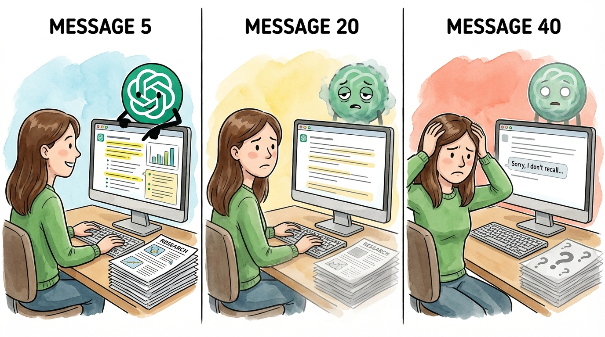

I assumed this was just how AI worked. Great at first, then gradually worse. I tried starting fresh conversations, different prompts, and shorter sessions - but I couldn't fix the output quality issue until I understood what was happening behind the scenes.

_**The culprit is context management.**_ Every interactive session with AI has a limit on how much information the agent can hold at once. When you hit that limit, the agent starts summarizing conversation content to make room. In web-based chats like ChatGPT, this happens silently in the background. Your detailed instructions become compressed notes. Your nuanced research becomes bullet points. And the worst part? You have no visibility into any of it. You can't see when it's happening, how much space you have left, or what's being kept versus discarded. You just notice the output getting worse and have no idea why.

In the [first article of this series](https://hannahstulberg.substack.com/p/claude-code-for-everything-finally), I described the junior employee you've always wanted - one who remembers that Barbara dropped the ball, that Dave is vegan, that your partner is dairy-free. One you don't have to re-explain everything to every single time. Context management is what makes that assistant possible. And effectively managing context is how you get consistently great output - the kind that actually helps with real knowledge work. Claude Code gives you more control over context management than any other tool I've used.

There's a lot of shiny, sexy Claude Code content out there right now - skills, custom commands, agents, and MCP integrations. We'll get to all of that in due time. But context management is the plumbing. The unsexy fundamental no one's talking about, but that nothing works without. **Effective context management is the secret sauce - it's what makes your personal assistant the thought partner you've been looking for and helps you get the most out of the more advanced skills.** That's why we're starting here.

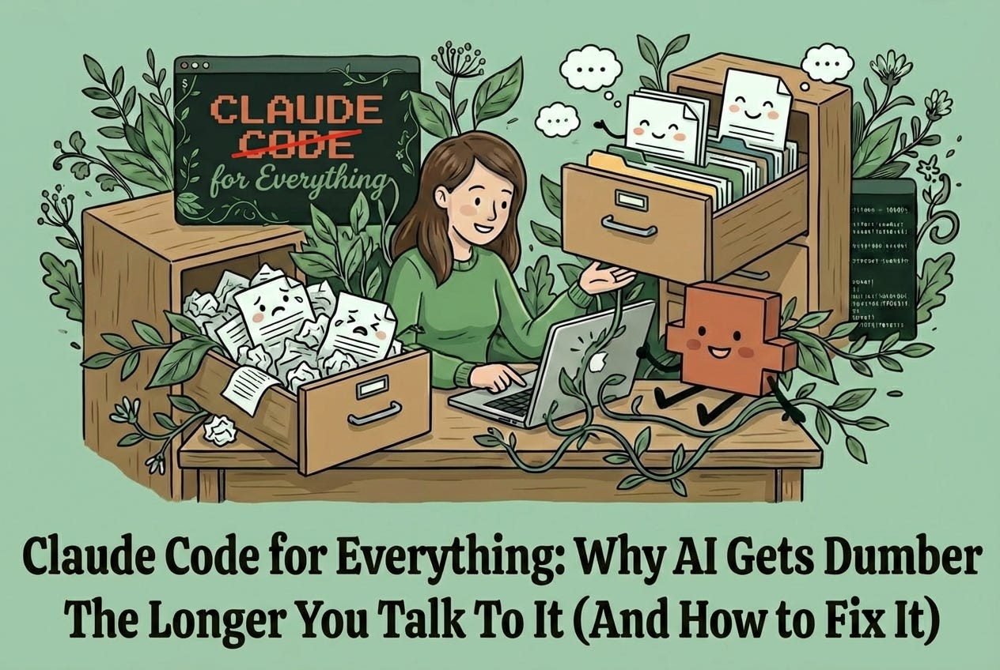

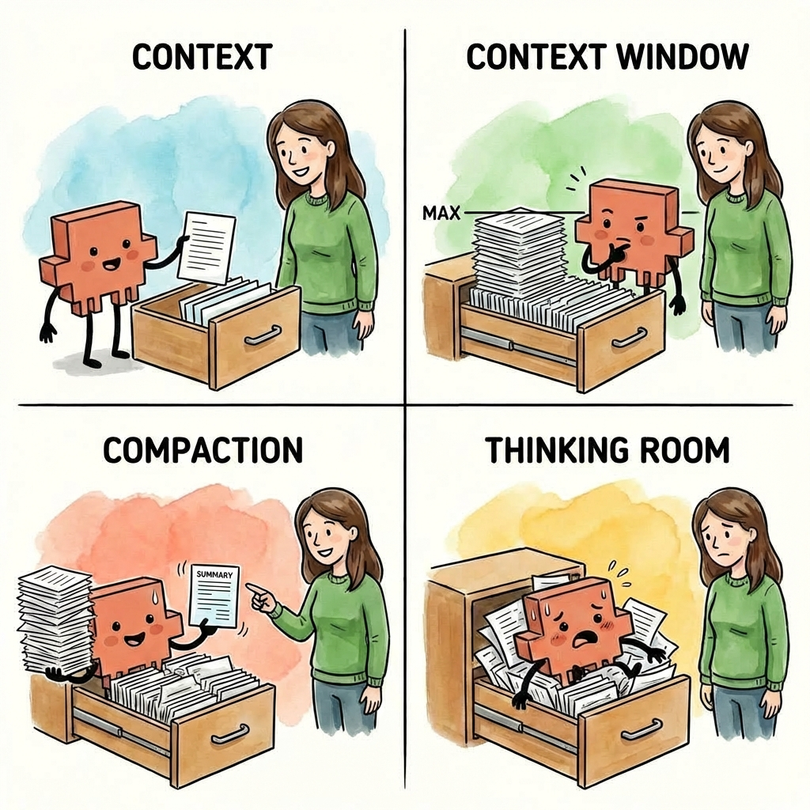

#### **By the end of this article, you'll have:**

- **An understanding of context:** What it is, how it fills up, and why it directly impacts your output quality

- **An understanding of why Claude Code gets better results:** When you can manage context effectively, you get better output than ChatGPT or Claude on the web

- **Five techniques for effective context management:** Visibility into your context usage, manual compaction to control what gets kept, parallel sessions to keep tasks focused, session persistence to pick up where you left off and background agents to split off related work

# Context 101

The junior employee metaphor extends here: your junior employee works from a filing cabinet, and each chat you start is one drawer within that cabinet. When you open a new conversation in ChatGPT, Claude, or any other AI tool, you're giving your junior employee a fresh, empty drawer to work from.

There are four things you need to understand about how that drawer works:

1. **Context:** The information your junior employee can access within that drawer

2. **Context window:** The amount of information that can fit within that drawer before it's full

3. **Compaction:** How your junior employee summarizes information when the drawer can no longer hold more

4. **Thinking room:** Why a stuffed drawer makes your junior employee overwhelmed and worse at their job

## 1\. Context

Context is the information available to your junior employee at any point in time. Within each session (or chat, in web AI terms), your employee has access to one drawer within the filing cabinet.

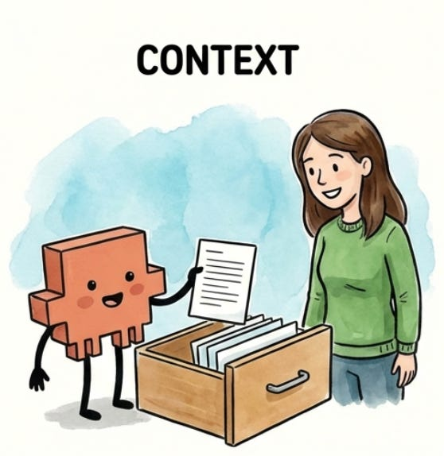

For most AI tools, that drawer starts empty. When you open a new chat in ChatGPT or Claude on the web, your junior employee has nothing to work with until you start providing information. (Claude Code is different - it can pre-load context before you even start, which we'll cover in a future article.)

As you work together, the drawer fills up. Every task you give, every document you ask your employee to read, every piece of research they pull together, and every response they write back to you - all of it goes into that drawer. In technical terms, this back-and-forth becomes the context the model uses to generate each response. If it's not in the drawer, your junior employee won't know about it.

## 2\. Context window

The context window is the size of the drawer - how much information can fit before it's full. Every AI model has a limit. For the Claude models that Claude Code uses (Opus, Sonnet, and Haiku), that limit is roughly 200,000 tokens. Think of a token as roughly one word, so 200,000 tokens is approximately 200,000 words - or about three novels worth of text.

That sounds like a lot, and it is. But the drawer fills up faster than you'd expect. Your junior employee isn't just storing documents you hand over - they're also storing every response they write back to you, every piece of research they pull together, and every back-and-forth exchange. A few long files, a detailed conversation, some web research - suddenly the drawer is getting full.

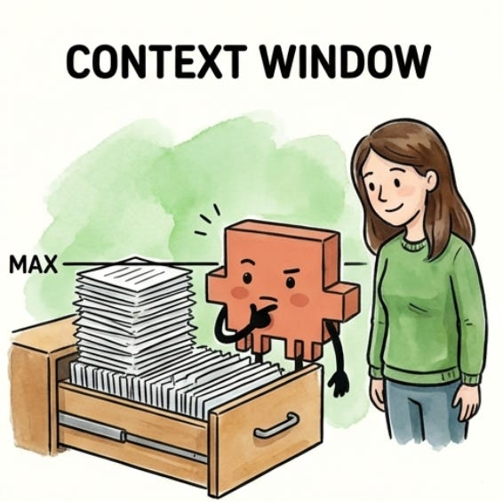

Different models have different drawer sizes - GPT-4o has a smaller window than Claude, and some models are even smaller - but they all have limits, and they all eventually fill up.

The context window is the model's memory limit - a hard cap on how much text it can hold and process at once. Unlike human memory, which is fuzzy and flexible, a context window is binary - either something fits or it doesn't. And once you hit the limit, you can't just decide to remember more.

## 3\. Compaction

Your junior employee doesn't wait until the drawer is completely full to start making room. When the drawer gets about 70-80% full, they've hit their practical context limit - the point where they need to start clearing space to keep working. Why not 100%? Because your junior employee needs room to work, not just room to store. The remaining space is where they think through problems and draft responses.

The process of making room in the drawer is called compaction. Compaction is how your junior employee summarizes the information in the drawer to free up space - pulling out detailed documents and replacing them with condensed notes that capture the key points.

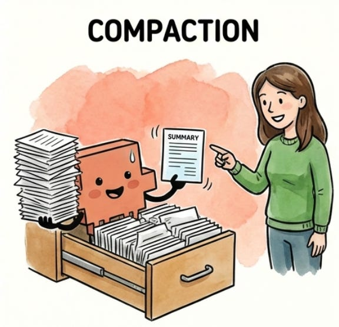

Compaction doesn't fully empty the drawer. Once you've started a session, your junior employee will never go back to that fresh start with a fully empty drawer. Everything you've put into the session goes into their summary and takes up space. The longer the session, the more space is taken up by the summary of all the work that has come before.

The process of summarization means that you lose fidelity each time compaction occurs. When information is compacted, nuances get summarized away. If you had a detailed conversation at the beginning of your session about exactly how you wanted something done, those details might not survive the summary. Your junior employee remembers that you talked about it, but they might not remember the specifics.

What's actually happening under the hood is the model is generating a compressed summary of the earlier conversation to free up tokens. The original text is gone - replaced by an approximation that captures the main ideas but loses some detail. This is why repeating important instructions later in a session can improve results. You're putting those instructions back into the context in their full form, not relying on a summary.

## 4\. Thinking room

We've established that your junior employee needs room to work, not just room to store. This is what I call thinking room - the space your employee uses to process information, reason through problems, and draft responses.

When the drawer is stuffed to capacity, your junior employee can't think at all - there's literally no room left to work through problems. But output quality starts dropping well before you hit that wall. Even at 70-80% full, your employee is running out of room to think. Imagine asking someone to solve a complex problem while their desk is getting buried in papers. They can technically do it, but they're more likely to miss things, take shortcuts, and make mistakes. The less thinking room they have, the lower the quality of their output.

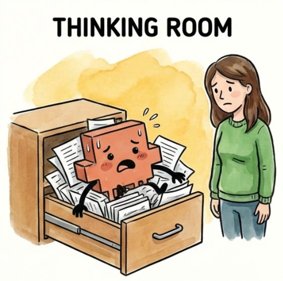

The type of work matters too. You can make simple edits late at night when you're tired, like fixing a typo or reformatting a paragraph. But complex reasoning or creative work? That requires a fresh mind with room to think. The same is true for your junior employee. Straightforward tasks can still produce reasonable output even when the drawer is getting full. But if you're asking for something that requires creativity, nuance, or complex problem-solving, you need more remaining room in the context window for your employee to do their best work.

What's happening technically: the model uses the same context space for reasoning that it uses for storage. When it's working through a complex problem, it needs room to "think out loud" - to hold intermediate steps, consider alternatives, and build toward an answer. A packed context window leaves less room for this processing, which is why output quality degrades even before you technically hit the limit.

## Why this matters for you

Everything I've described - context limits, compaction, and thinking room - applies any time you interact with AI, whether it's ChatGPT, Gemini, Claude on the web, or another product. They all have context windows that fill up, they all compact when you hit the limit, and they all produce worse output when thinking room gets tight.

Throughout this Claude Code for Everything series, a lot of readers have asked: why should I use Claude Code over ChatGPT, Claude on the web, or another product? There are plenty of special things Claude Code can do - skills, agents, and MCP connections - all of which can dramatically improve your productivity.

But one of the biggest things that sets Claude Code apart is its ability to let you effectively manage context. The visibility to see how full your drawer is. The control to compact manually and decide what gets kept. These tools let you control output quality in ways that simply aren't possible in other AI interfaces.

Here's what that difference actually looks like:

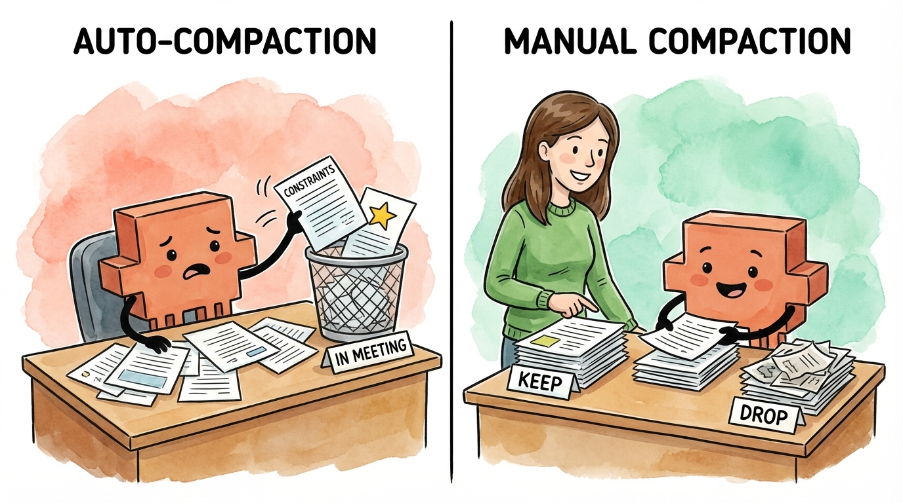

Notice the pattern? Web-based AI chat products give you almost no control over context. Claude Code gives you almost everything.

In the next section, we'll cover the practical techniques for effective context management. In future articles, we'll talk about how Claude Code makes it easy to kick off sessions with the right context already loaded - so your drawer doesn't actually have to start empty.

# Effective Context Management

These five techniques form the core of how I manage context in Claude Code:

1. **Status line:** See how full your drawer is so you can act before auto-compaction hits

2. **Manual compaction:** Shape what Claude remembers so the next task starts with the right context

3. **Parallel sessions:** Give each task a clean drawer and Claude's full focus

4. **Session management:** Preserve context you've built instead of re-explaining from scratch

5. **Background agents:** Split off related work to its own drawer while sharing your context

## 1\. The status line: You can't manage what you can't see

Remember from Context 101: your session has a drawer that fills up as you work. At 70-80% full, Claude compacts - summarizing everything to make room, losing nuance in the process. And even before compaction, a stuffed drawer means less thinking room, which means worse output quality.

You need visibility into the amount of context you've used within a session for two reasons:

1. **To compact on your terms:** If you can see compaction coming, you can trigger it manually and tell Claude what to keep. (We'll cover how to do this later in this section.)

2. **To match your work to your capacity:** Creative or complex work needs more thinking room. If you've used 60% of available context and are about to ask for something nuanced, you'll get mediocre results.

Claude Code's status line feature lets you see exactly how much context you've used within a session. You can configure it to show tokens used out of total tokens (like `47K / 200K`), a percentage (like `24%`), or both.

Think of it like checking how full your junior employee's drawer is. The fuller it gets, the harder it is for them to find what they need and think clearly:

- **0-50%:** The drawer is spacious. Your employee can easily find documents and has room to spread out and think. Work freely on any type of task.

- **50-70%:** Getting crowded. Your employee can still manage straightforward tasks, but they're starting to shuffle papers around. Consider clearing space before asking for complex or creative work.

- **70%+:** The drawer is stuffed. Your employee is about to start throwing things away to make room - and they'll decide what goes. If you want to choose what stays, compact manually now. (We'll cover manual compaction in the next section.)

### **How to turn on the status line**

Type `/statusline` in Claude Code

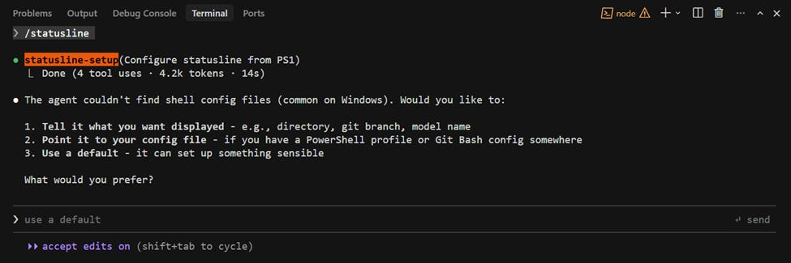

Then, tell Claude what you want to see:

> _Put my working directory, the model I'm using, and context usage (as a %) in the status line._

Once configured, you'll be able to see your context usage below the input line as you work.

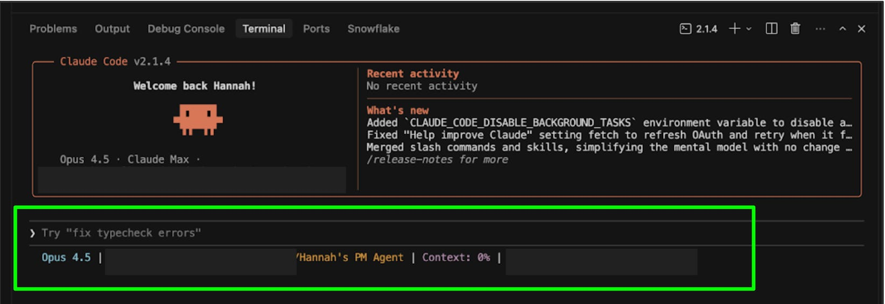

You can also specify colors (e.g., "make the context percentage orange"). For more details, see the [official status line docs](https://code.claude.com/docs/en/statusline).

**A note on command line interface (CLI) vs. extensions:** The status line is one of the features that's only available when you use Claude Code directly in the terminal (Claude Code CLI), not through the Claude Code VS Code or Cursor extensions. This is one of the reasons I recommend working directly in the terminal, which I cover in the [first article](https://hannahstulberg.substack.com/p/claude-code-for-everything-finally) (whether you remember this recommendation now depends on what's in your drawer). For more on the differences between the CLI and IDE extensions, see [the official comparison](https://code.claude.com/docs/en/vs-code#vs-code-extension-vs-claude-code-cli).

## 2\. Manual compaction: You decide what Claude carries forward

Remember from Context 101: when your session's drawer gets 70-80% full, Claude compacts automatically - summarizing everything to make room. This is called auto-compaction. During auto-compaction, Claude decides what to keep based on its own judgment, not yours - and in this process, you lose fidelity. Details get condensed, nuances get summarized away.

Think of it like your junior employee reorganizing their drawer while you're in a meeting. They'll make space, but they don't know what matters to you. Maybe they keep your code examples but lose the nuance about your project's architecture. Maybe they preserve your questions but discard the specific constraints you mentioned three hours ago.

This is another reason to enable the status line: Claude will warn you when auto-compaction is coming, giving you a chance to compact manually first.

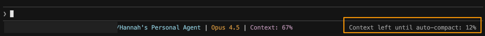

Manual compaction puts you in control. Instead of letting Claude decide what survives, you tell Claude exactly what to keep and what to drop - so the context that carries forward is shaped for what you're about to do next.

### **How to compact manually**

To compact manually, you'll run a built-in slash command called `/compact`. This command takes a set of instructions that tell Claude what to keep and what to discard. The steps below will help you figure out what those instructions should be.

**Step 1: Understand what's in context.** Before you can decide what to keep, you need to know what Claude is currently holding onto. You might be surprised - sometimes Claude is keeping detailed notes from a brainstorm three tasks ago while forgetting the core requirements you stated at the start.

Ask Claude:

> _What do you currently have in context from our conversation? Give me a summary._

**Pro tip:** I often run this prompt even when I'm not planning to compact. It's useful for checking which files Claude has or hasn't read during a conversation, or for making sure I understand what Claude is working with. When I'm getting weird output quality, I'll often find that a document I thought Claude had read wasn't actually fully loaded into context.

**Step 2: Decide what to keep vs. drop.** Read through Claude's summary and imagine you're working with your junior employee on a task. Of all the work you've done together so far, what do they actually need in order to do the next portion of the task? Keep that. Discard everything else.

- **Keep:** Current document states, active requirements, decisions already made, and constraints that still apply

- **Drop:** Early drafts you've moved past, research tangents you didn't pursue, and context from previous tasks

**Step 3: Draft your compact instructions.** Instead of figuring out how to phrase your instructions, dictate what you want to keep and drop using a tool like [Wispr Flow](https://ref.wisprflow.ai/hannah-stulberg) (I cover how voice dictation with AI cleanup helps you work faster in [a previous article](https://hannahstulberg.substack.com/p/stop-typing-start-talking)) and then ask Claude to draft the instructions for you:

> _Keep the current proposal, budget constraints, and Q2 launch decision. Drop the early brainstorming and partnership exploration. Give me a /compact command I can copy and run._

Claude will tell you exactly what to type.

**Step 4: Run the compact command.** Run `/compact` with the instructions Claude helped you draft. By being specific about what to keep and what to drop, you're clearing out the drawer so your junior employee has room to think - and making sure the only context they're working with is what's actually relevant to the next task.

> _/compact Retain the current state of the proposal, the budget constraints from our earlier discussion, and the decision to focus on Q2 launch. Drop the early brainstorming and the partnership exploration we decided against._

After compacting, your context won't go back to zero - Claude maintains a summary of the conversation, typically around 15-20% of the original size. But remember the drawer metaphor: you've just cleared out the clutter and made room for your junior employee to think. The context that remains is shaped by your instructions about what matters, not Claude's guesswork. You've given your junior employee thinking room back, and what's left in the drawer is focused on the work ahead.

**Pro tip:** To see exactly what Claude kept, press `Ctrl+O` after compaction to view the full summary. You can use this to verify Claude kept what you need before moving on.

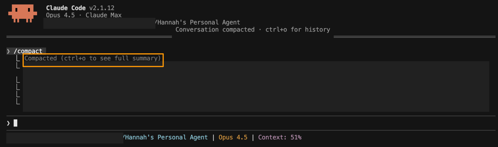

## 3\. Parallel sessions: Separate tasks, separate drawers

Remember from Context 101: everything you work on in a session goes into that session's drawer. The more tasks you pile into one session, the more crowded the drawer gets - and the harder it is for your junior employee to find what they need and think clearly.

Imagine giving your junior employee three completely unrelated tasks at the same time: draft this proposal, research competitor pricing, and brainstorm campaign names. They'd be context-switching constantly and stuffing documents from all three tasks into the same drawer. By the time they return to the proposal, they're sifting through pricing spreadsheets and naming criteria to find what they need.

Now imagine three junior employees, each with their own drawer, each focused on one task. Each drawer stays clean. Each employee has room to think. Much better results.

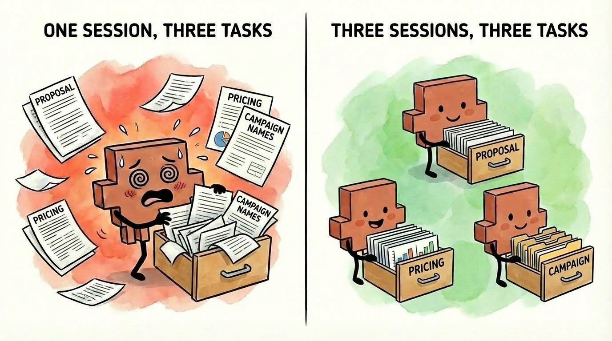

That's exactly how parallel sessions work. Each session has its own drawer. Each drawer stays focused on its specific task. Each task gets Claude's full attention because the drawer isn't polluted with irrelevant information from other work.

The key insight: parallel sessions don't just organize your work. They prevent context contamination before it starts.

I covered how to set up and manage parallel sessions in the [previous article](https://hannahstulberg.substack.com/i/184381596/2-run-parallel-sessions).

## 4\. Session management: Pick up where you left off

Every time you start Claude Code, you're starting a fresh session with an empty drawer. All the context you built up in your previous session - the files Claude read, the decisions you made, and the constraints you established - is gone.

Think about what that means through the drawer metaphor. You spent an hour filling your junior employee's drawer with exactly what they needed: project requirements, style preferences, key constraints, and decisions you'd already made together. Then they went home. The next morning, they came back with a completely empty drawer and no memory of what you discussed. You'd have to rebuild all of that context from scratch.

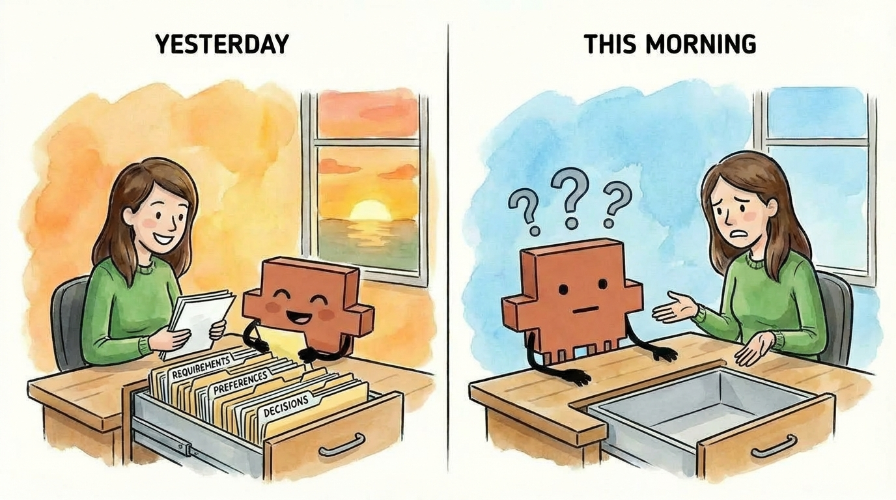

That's what happens if you don't name and resume your sessions. Session management lets you preserve the drawer contents across time - so when you come back to a task, your junior employee can open the same drawer they closed last night, with everything still in it.

I covered the mechanics of session naming and resuming in the [previous article](https://hannahstulberg.substack.com/i/184381596/3-pick-up-where-you-left-off), including how to match your terminal names to your session names so you always know which goes with which.

_(A note to the Claude Code team, if you're reading this: the resume feature needs some love. It sometimes crashes, and the session search doesn't always work. Still worth using - but this feature could be smoother.)_

## 5\. Background agents: Split off related work to its own drawer

Your drawer has limited space, and the fuller it gets, the less thinking room your junior employee has. Every task you pile into a session takes up space - not just for storing information, but for working through problems.

Now imagine you're in the middle of a focused task - drafting a proposal - when you realize there's a related side task: compiling all the sources you've referenced. If your junior employee handles it in the same session, they're stuffing source lists and formatting notes into a drawer that should be focused on the proposal. When compaction hits, they'll have to summarize away either proposal context or source-list context. Neither is ideal.

There's a better way. Your junior employee - let's call them John - hands the task off to another junior employee, Jane. Jane gets a copy of everything in John's drawer so she understands the project, but works in her own separate drawer. All her intermediate work, false starts, and drafts stay in her space, not John's. Meanwhile, you and John keep drafting with a focused drawer and full thinking room. When Jane finishes, only the final result comes back to you.

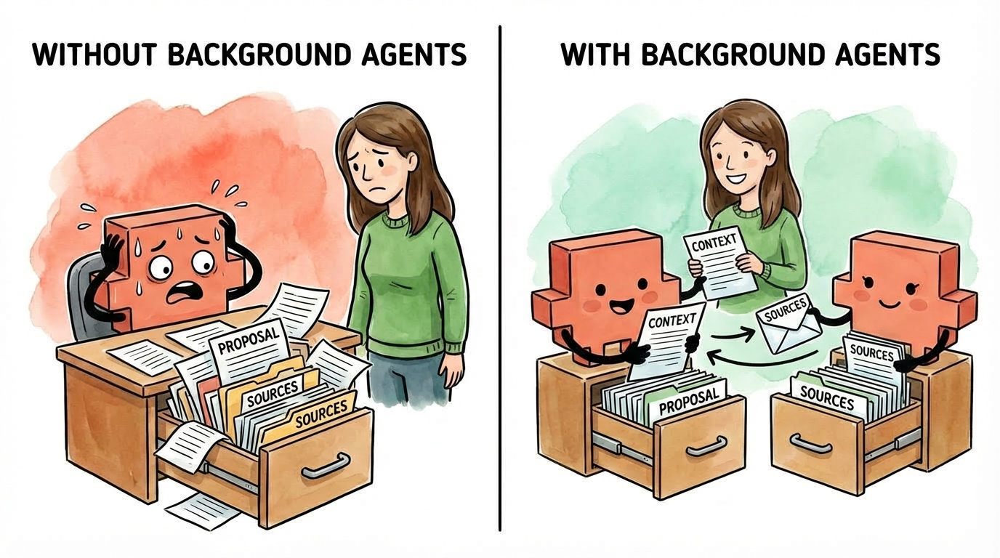

That's what background agents do. Claude delegates a task to another Claude instance that runs independently in its own context. The background agent's (Jane's) process - all the exploration and iteration - stays out of John's drawer. Only the final output returns to John's drawer. John's drawer stays focused. Your thinking room stays clear. And when compaction comes, you're not throwing away context from a side task that's already done. (For more details on how background agents work, see the [official documentation](https://code.claude.com/docs/en/sub-agents).)

When should you use a background agent vs. a parallel session? Parallel sessions are for unrelated tasks - each starts with an empty drawer. Background agents are for related tasks that need your current context but shouldn't clutter your main session.

I covered how to use background agents in [the previous article](https://hannahstulberg.substack.com/i/184381596/4-hand-off-tasks-to-background-agents), and I'll go deeper on advanced patterns in a future article.

## This is the foundation

These five practices - visibility, manual compaction, parallel sessions, session persistence, and background agents - are the core of effective context management within a session. They improve output quality and help you get work done efficiently, with AI as a true thought partner.

## Context management in Cowork

Many of the features that enable effective context management in Claude Code aren't available in Cowork yet. They may be added in the coming weeks, but this is one of the reasons why I'm still recommending Claude Code over Cowork (for now).

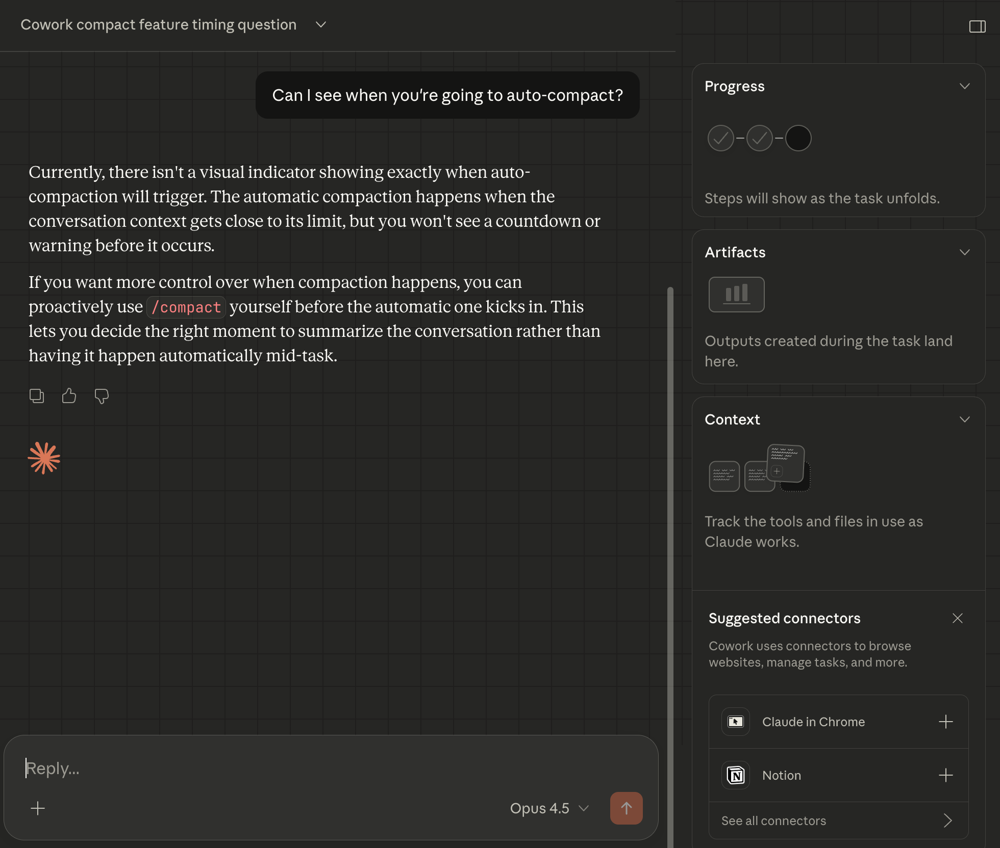

## A note on Projects, Gems, and Custom GPTs

If you've used ChatGPT Projects, Claude Projects, Gemini Gems, or Custom GPTs, you might be wondering: don't those solve the same problem? They do give you persistent context - custom instructions, uploaded files, saved conversations.

But they don't give you control over in-session context management. You can't see how full your context window is, or what's actually being used from everything you've provided. You can't manually compact when things get noisy. You can't spin up background agents to handle side tasks without cluttering your main conversation. Those tools give you a persistent starting point, but once you're in a conversation, you're back to the same limitations we talked about earlier.

Claude Code gives you both: in-session control (what we just covered) and persistence (which we'll cover next).

But they don't solve one problem: how do you give your junior employee the context to effectively get started on a task? How do they approach the problem with the same level of understanding that you have?

There's one more tool that changes that.

# What you should have now

If you've followed along, you now have:

- **A mental model for context:** Every session is a drawer that fills up as you work. When it gets full, Claude compacts - summarizing to make room and losing nuance in the process. And even before compaction, a stuffed drawer means less thinking room and worse output quality.

- **Clarity on why Claude Code is different:** You can see your context and control it, which you can't do in web-based AI chat products.

- **Five techniques for managing context to improve output quality:** You can now monitor how full your drawer is, compact on your terms to decide what stays in the drawer, use separate sessions to give each task a clean drawer, name and resume sessions to preserve the information in your drawer across time, and delegate side tasks to background agents without cluttering your main drawer.

# What comes next: CLAUDE.md files

You now understand how context works. You know the drawer fills up, you know how to monitor it, and you know how to manage it when things get tight.

But here's the thing: every session you start with Claude Code still begins with an empty drawer. Your junior employee walks in each morning with nothing - no memory of yesterday's project, no knowledge of your preferences, and no record of decisions you've already made. Just like opening a new chat in ChatGPT. Every. Single. Time.

You've been doing the work manually - re-explaining your project, reminding Claude of constraints, pasting in the same background context. That repetition isn't just annoying. It's eating into the drawer space you now know how to protect.

CLAUDE.md files change this.

They're text files that Claude reads automatically when a session starts - before you type a single word. Your junior employee walks in already briefed: they know the project structure, your preferences, and the decisions you've already made. No "let me catch you up." No re-explaining from scratch.

This is the real power of Claude Code over web-based AI chat. Your junior employee doesn't start each day blank. You choose what they already know.

Next article, we go deep: where to put these files, what to include, and how to structure them so every session starts exactly where you want it.

# Want to go deeper?

If you want to understand exactly how compaction works under the hood, I recommend [Tal Raviv's](https://substack.com/@talsraviv) article ["I wanted to know how 'compaction' works, so I did brain surgery on Claude Code."](https://www.talraviv.co/p/i-wanted-to-know-how-compaction-works) He digs into the actual mechanics - how Claude Code stores your conversations, what happens when you run `/compact`, and why it's all "just text files on your hard drive." This article covers the conceptual framework and practical techniques. Tal's covers the technical implementation. Between the two, you'll have the full picture.
