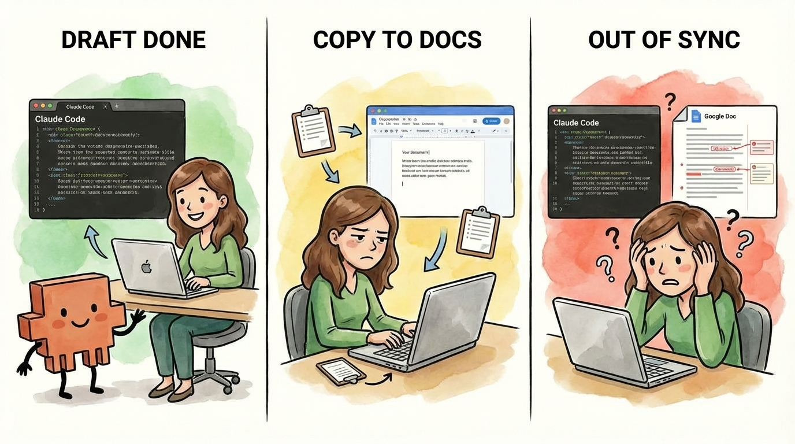
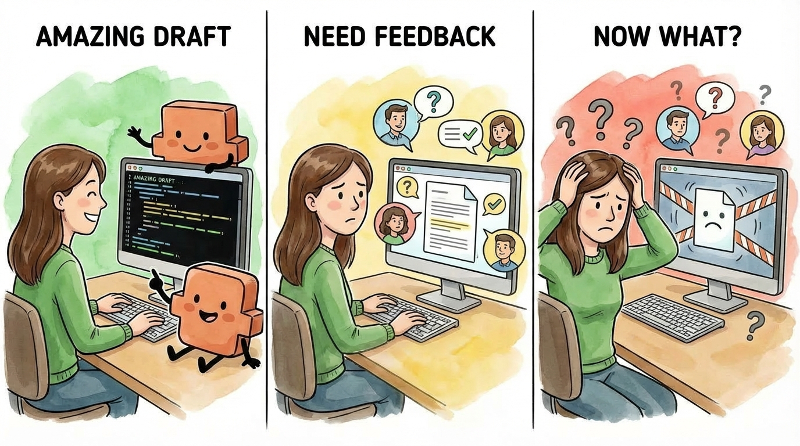
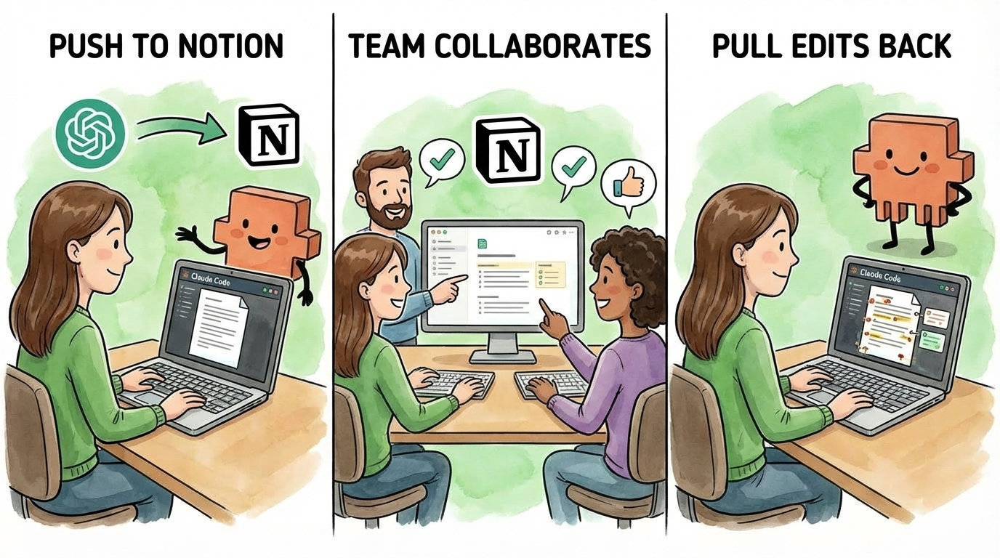
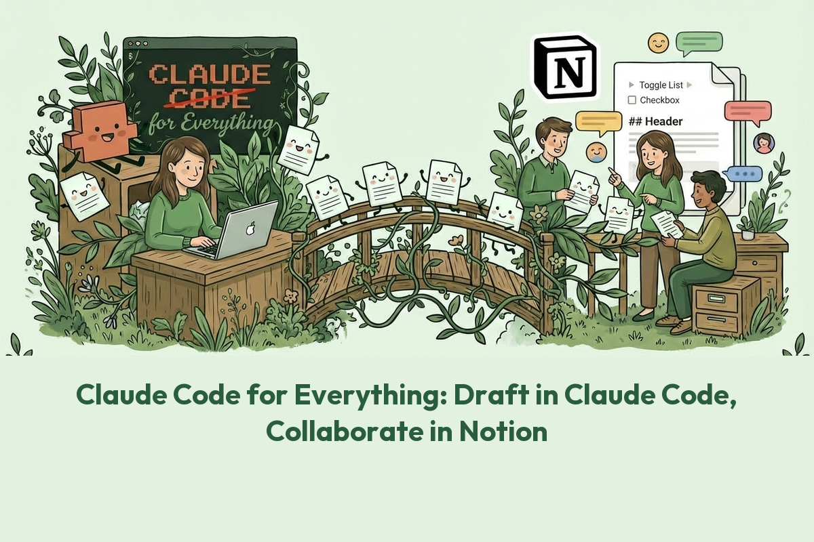
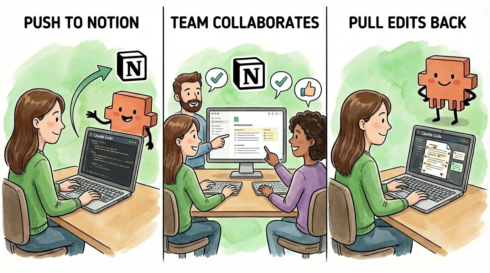

# Claude Code for Everything: Draft in Claude Code, Collaborate in Notion

### How to sync documents between Claude Code and Notion to enable collaboration (no more copy-pasting)

You're drafting a strategy doc in Claude Code. It's incredible - Claude knows your writing style, remembers the context from last week's session, and you're flying through the first draft. Two hours of work done in less than 30 minutes.

Then, you need feedback. Your manager wants to review it. Your team lead has context to add. Legal needs to flag concerns. And suddenly you're staring at a [markdown file](https://hannahstulberg.substack.com/i/184061644/step-5-understanding-markdown-files) on your local computer wondering: _how do I actually share this?_

 _Markdown file example_

Copy-paste into Google Docs? Now you have two versions, and any edits in Google Docs don't automatically sync back. Email the markdown file? I can barely read raw markdown (the plain text format Claude Code uses) myself - good luck getting your manager to open it. Export to PDF? Great, but now nobody can comment.



I ran into this constantly. Claude Code is the best drafting environment I've ever used, but great work isn't done in isolation. Collaboration is where the magic happens, whether it's a strategy doc, a deck, a new product proposal, or a marketing plan. The gap between "drafted in Claude Code" and "ready for team input" was killing my workflow.

_**Then I found a way to connect Claude Code directly to Notion.**_ Notion is a collaborative workspace similar to Google Docs where teams can comment and edit together. Less than 30 minutes to set up, and now I draft in Claude Code, push to Notion when I need collaboration, and pull edits back when I'm ready to continue. The two stay in sync. No copy-pasting. No version confusion. And it works the other direction too: if your company already uses Notion for meeting notes or project docs, you can pull that context into Claude Code (the [previous article](https://hannahstulberg.substack.com/p/claude-code-for-everything-why-ai) covers how this context improves Claude's response quality).

Why Notion and not Google Docs? Because Notion has an official MCP server (built and maintained by Notion itself). Google Docs doesn't have an official one yet. If and when it does, the same principles in this article will apply.





#### By the end of this article, you'll have:

- Claude Code connected to Notion

- A place in Notion to organize your synced documents

- One-step shortcuts for syncing in both directions

- A way to pull Notion docs into Claude Code as context (if your company already uses Notion)

With less than 30 minutes of investment, you'll never have to choose between Claude Code's drafting power and collaboration again.

Let's set it up.

# What you need before starting

- **Claude Code set up and running:** If you haven't installed Claude Code yet, start with my [Claude Code getting started guide](https://open.substack.com/pub/hannahstulberg/p/claude-code-for-everything-finally?utm_campaign=post-expanded-share&utm_medium=post%20viewer)

- **A Notion account:** Free or paid, either works. Sign up at [notion.so](http://notion.so/) if you don't have one.

# How Claude Code talks to Notion

By default, Claude Code can only work with files on your computer (more on this [here](https://hannahstulberg.substack.com/i/184061644/before-you-move-on-create-your-working-folder)). To collaborate in Notion, it needs a way to reach outside your local file system. That's where MCP (Model Context Protocol) comes in - an emerging standard that lets AI tools connect to other software.

For Claude Code to connect to an app, an MCP server needs to exist for it. These can be built by the company itself or by third parties - but official ones from the company are generally the safest choice. Notion has an official MCP server. Google Docs doesn't have one yet. That's why we're using Notion.

You add Notion's MCP to Claude Code, authenticate with your Notion account, and suddenly Claude Code can create pages, read content, and update documents directly in your Notion workspace.

This means you can:

- Send a document from Claude Code to Notion with a single command

- Pull edits made in Notion back to Claude Code

- Pull comments left by collaborators into Claude Code to summarize or act on

- Keep both versions in sync without manual copy-pasting

- Pull Notion docs into Claude Code to build context - meeting notes, project briefs, and reference material all become available without copy-pasting

That last point is worth highlighting. In the [previous article](https://hannahstulberg.substack.com/p/claude-code-for-everything-why-ai), I explained how context - the information Claude can access - directly impacts output quality. If your company already uses Notion for meeting notes, project documentation, or knowledge bases, the Notion MCP connection means you can pull that context directly into Claude Code. No more copying and pasting critical context documents from Notion to Claude Code.

# Setting Up Notion MCP

I'll walk you through each step - but remember, you can always just ask Claude Code directly. When I was setting this up, I literally typed:

> _"Hey Claude, I want to connect to Notion. How can I do this?"_

And it walked me through the whole thing.

That said, here's the full breakdown:

#### **Step 0: Make sure Claude Code is running**

These steps assume you already have Claude Code up and running. If you don't, start with my [getting started guide](https://open.substack.com/pub/hannahstulberg/p/claude-code-for-everything-finally).

#### **Step 1: Add the Notion MCP server**

You can just ask Claude:

> _"Add the Notion MCP server for me."_

This tells Claude Code to find Notion's MCP server. You should see a confirmation that it was added successfully.

Note: Claude Code can add a MCP for just the current project or for all your projects. If you want Notion available across all projects tied to your Anthropic account, you can ask Claude:

> _"Add the Notion MCP server globally, not just for this project."_

#### **Step 2: Restart Claude Code**

Close your current Claude Code session (type `exit`) and start a new one (type `claude`). Claude Code only recognizes new MCP servers on startup, so you need to restart for Notion to appear.

#### **Step 3: Authenticate with Notion**

Run `/mcp` in Claude Code. You should see "notion" listed as a server. Click through the OAuth flow to connect your Notion account. You'll authorize Claude Code to access your Notion workspace.

_Follow the URL to continue authenticating in your browser_

_Opening the link from Claude Code will open your browser to this screen_

#### **Step 4: Verify it's working**

Ask Claude Code:

> _"Search my Notion workspace for recent pages."_

Claude will ask for permission to use the Notion tools - you may need to approve a couple of these the first time. If it returns results, you're connected.

#### **If you need to re-authenticate later**

Your Notion connection can expire. When it does, you'll see Claude say something like: "It looks like the Notion MCP connection needs to be re-authenticated."

Don't panic - this is normal and takes about a minute to fix. Here's what to do:

1. **Run**`/mcp` **in Claude Code.** You'll see your Notion server listed with "Auth: ✗ not authenticated"

2. **Select "Authenticate" from the menu.** Claude Code will say "A browser window will open for authentication"

3. **Complete the sign-in in your browser.** You'll see Notion's "Connect with Notion MCP" page. Select your workspace, check the box that says "I recognize and trust this URL," and click Continue

4. **Go back to Claude Code.** You should see "Authentication successful. Connected to notion."

That's it - you're reconnected.

Claude Code and Notion can now talk to each other. But before you start syncing documents, you need somewhere for them to land.

# Setting Up Your Notion Workspace

You could just create individual pages in Notion, but that gets messy fast. Documents are scattered everywhere, there's no way to see what's synced, and no way to track status.

Instead, we'll create an organized table (known as a database in Notion) to track your documents - each row is a document, each column tracks something about it: the title, whether it's a draft or final, or the last time you synced. It holds everything in one place, easy to filter and sort.

Here's the thing: you don't need to figure out the perfect setup yourself. When I created mine, I just told Claude what I wanted:

> _"I need a place in Notion to track documents I'm syncing between Claude Code and Notion."_

And we figured it out together. I didn't know exactly what information I'd need to track. We went back and forth until it made sense for my workflow.

Here's what we landed on - four pieces of information for each document:

That's it. You can see at a glance what's a draft vs final, when you last synced, and where to find the original file. We'll cover how to actually send documents to Notion in the next section.

To create yours, just use that prompt from earlier:

> _"I need a place in Notion to track documents I'm syncing between Claude Code and Notion."_

Claude will set up the database within Notion for you. If Claude needs to know anything - like where to put it or what to call it - Claude will ask. You don't need to figure out Notion's settings or learn how databases work. Just describe what you want and Claude will handle the rest.

# The Sync Workflow: Sending Documents to and from Notion

## Creating New Documents

When you're sending a document to Notion for the first time, just tell Claude what you want:

> _"Send this document to Notion."_

That's it. The workflow looks like this:

1. **Draft in Claude Code:** Write your document locally, in markdown (more on drafting documents efficiently in Claude Code [here](https://hannahstulberg.substack.com/i/184381596/setting-up-your-workspace))

2. **Send to Notion:** Create a new page in your database with the full content

3. **Share the Notion URL:** Send it to collaborators for comments and edits

4. **Collaborators work in Notion:** They add comments, make edits, and insert images

For new documents, a full content push is exactly what you want. Notion creates the page, formats your markdown beautifully, and gives you a shareable URL.

## Updating Existing Documents

Here's where it gets tricky. Once a document exists in both places, you can't just overwrite one with the other.

**The trap:** Your collaborators added comments in Notion. They inserted images. They formatted a table just right. If you do a full content replacement from Claude Code, _all of that disappears_. Notion-only content gets wiped because it doesn't exist in your local markdown file. The same problem happens in reverse - if you pull everything from Notion, you might overwrite local work in progress.

**The solution:** Targeted updates that only change what's actually different.

### **Pulling edits from Notion to Claude Code**

Your collaborators made edits in Notion. You want those changes in your local file. Just ask:

> _"Compare the Notion version of this document to my local file. Show me what's different and let me choose what to pull."_

Claude fetches the Notion page, compares it to your local file, shows you what changed, and asks if you want to update. Only the sections you approve get updated - your local work stays intact.

### **Pushing edits from Claude Code to Notion**

You've continued drafting locally. You want to update the Notion page without wiping out your collaborators' additions. Just ask:

> _"Compare my local file to the Notion version. Show me what's different and let me choose what to push."_

Claude compares your local file to the Notion page, shows you what's different, and updates only the sections you approve. Comments, images, and formatting your collaborators added stay exactly where they are.

## **Handling conflicts: changes on both sides**

Sometimes you've edited locally _and_ your collaborators edited in Notion. If you push without checking, you'd overwrite their work. If you pull without checking, you'd overwrite yours.

This is why the prompts from earlier explicitly ask Claude to compare before syncing. When you say:

> _"Compare my local file to Notion and show me what's different."_

Claude can identify conflicts:

> _"I found changes in both places. In Notion, sections X and Y were updated. Locally, you changed sections Y and Z. Section Y was edited in both - how do you want to handle this?"_

From there, you can:

- **Review section by section:** Look at what changed in each place and pick which version to keep.

- **Merge manually:** Take parts from both versions and combine them.

- **Pull first, then re-apply your changes:** Accept the Notion version as your new starting point, then add your local edits back on top. This works well when your collaborators' changes are substantial and you want to incorporate them before layering in your own.

**Important:** If you skip the comparison step and just say "push this to Notion" or "pull from Notion," Claude may overwrite without warning. The compare-first behavior isn't automatic - it's built into the prompts and commands we covered. That's why we set them up that way.

This is the key insight: _**always compare before syncing, never overwrite blindly.**_

### **A note on comments**

When your collaborators review in Notion, they'll probably leave comments. Notion has two types:

- **Page comments:** A discussion thread at the top of the page, like a group chat about the document

- **In-line comments:** Highlighting specific text and commenting on it, like track changes in Google Docs

Here's the catch: Claude can only see page comments. In-line comments - the ones most people use for detailed feedback - aren't accessible through Notion's MCP.

This isn't a dealbreaker, it just means you need to review in-line comments directly in Notion. Open the page, work through the feedback, make your edits in Notion, then pull those changes back to Claude Code.

If your collaborators know this upfront, they can leave high-level feedback as page comments (which Claude can read and summarize for you) and save in-line comments for specific line edits you'll review yourself.

_(To the good folks at Notion: if you're reading this, adding in-line comment access to the MCP would be game-changing.)_

# Making It One Step: Custom Commands

If you're syncing documents regularly, typing out those prompts gets old. You can create custom slash commands that do all of this in one step. I'll cover custom commands in depth in a future article in this series. For now, here's what you need to get started.

Just ask Claude:

> _"Create /push-to-notion and /pull-from-notion commands. Push should compare my local file to Notion and let me choose what to sync - handling both new documents and updates. Pull should compare Notion to my local file and let me choose what to pull."_

Claude will create command files in your `.claude/commands/` folder. After that, syncing is as simple as typing `/push-to-notion` or `/pull-from-notion`.

The commands encode all the logic we covered: search before creating, compare before syncing, show the diff, update only what's different. You approve the changes, Claude handles the rest.

## **Why I'm showing you my commands (but you shouldn't copy them)**

There's a lot of content online that says "use my magic command" or "download this config and you'll get X." I get the appeal - it's fast, it's easy, you get results immediately.

But when you do that, you're robbing yourself of the ability to learn. When something breaks - and it will - you won't know why it's broken or how to fix it. You'll be stuck waiting for someone else to update their magic command.

That's not what I want for you. The goal of this article is to teach you the fundamentals of how Notion sync works so that when something breaks, you know how to fix it because _it's yours_. You built it, you understand it, and you can iterate and improve on it to make it work exactly the way you need.

I'm including my actual commands below as a reference - but use them as inspiration, not a template. If you understand the principles - where to store your documents in Notion, what fields to track, how to compare before syncing, when to use targeted updates vs full replacements - you can build exactly what you need and adapt it as your workflow evolves.

### **My Push Command (**`/push-to-notion` **)**

Create a file at `.claude/commands/push-to-notion.md`:

```
---
description: Push a document to Notion for collaboration
allowed-tools: Bash, Glob, Read, mcp__notion__notion-create-pages, mcp__notion__notion-search, mcp__notion__notion-fetch, mcp__notion__notion-update-page, AskUserQuestion
---

# Push to Notion

Push a local document to Notion. Only syncs changes - won't overwrite if already in sync.

## Input

The user provides the file path as $ARGUMENTS.

## Notion Database

- **Data Source ID:** [your-database-id]
- **Database URL:** [your-database-url]

## Process

### 1. Read the local file
- Find and read the specified file
- Extract the title from the first heading

### 2. Search Notion for existing page
Use `mcp__notion__notion-search` with the document title

### 3. If NOT found (new document)
- Show user: "New document - will create in Notion"
- Ask user to confirm
- Create new page with full content

### 4. If FOUND (existing document)
a. Fetch current Notion content with `mcp__notion__notion-fetch`
b. Compare local vs Notion content
c. If NO differences: "Already in sync, nothing to push"
d. If differences exist:
   - Show summary of what will change
   - Ask user: "Push these changes to Notion?"
   - If confirmed: Use `replace_content_range` for targeted updates

### 5. Confirm success
Show the Notion URL
```

### **My Pull Command (**`/pull-from-notion` **)**

Create a file at `.claude/commands/pull-from-notion.md`:

```
---
description: Pull edits from Notion back to local file
allowed-tools: Bash, Glob, Read, Write, Edit, mcp__notion__notion-search, mcp__notion__notion-fetch, AskUserQuestion
---

# Pull from Notion

Sync edits made in Notion back to the local file. Only syncs changes - won't overwrite if already in sync.

## Input

The user provides the document name or local file path as $ARGUMENTS.

## Notion Database

- **Data Source ID:** [your-database-id]
- **Database URL:** [your-database-url]

## Process

### 1. Search Notion for the document
Use `mcp__notion__notion-search` with the document title

### 2. Fetch full content from Notion
Use `mcp__notion__notion-fetch` to get the page content

### 3. Identify the local file
Search locally by document title or use the Local Path property from Notion

### 4. Read local file content
Read the current local file

### 5. Compare Notion vs local
- Is the content different?
- What sections changed?

### 6. If NO differences
- Tell user: "Already in sync, nothing to pull"
- Exit without changes

### 7. If differences exist
- Show summary of what changed in Notion
- Ask user: "Pull these changes?"
- If confirmed: Update local file with Notion content
```

### **Now go review the commands Claude made for you**

If you asked Claude to create your commands earlier, go back and read them. Don't let Claude blindly create commands without reviewing what it built. Open the files in your `.claude/commands/` folder and make sure they're going to do what you expect.

**Key elements to look for:**

- **Search before creating:** Don't create duplicates

- **Fetch and compare:** Know what's different before changing anything

- **Show the diff:** User confirms before any sync happens

- **Targeted updates:** Only change what's actually different

Do they check all those boxes? If something looks off, ask Claude to fix it - or fix it yourself now that you understand how it should work.

Then test them. If your new commands don't show up when you type `/` into the command line, try exiting and reopening Claude Code (kill the terminal instance and start fresh) - Claude Code sometimes needs a restart to recognize new commands. Push a document. Pull it back. Try making edits in both places and see how conflicts get handled. Better to find issues now than when you're rushing to share something important.

# Document Your Setup

You've done the hard part. But here's what happens if you stop now: next session, Claude can connect to Notion, but it won't know which database to use, what fields to fill in, or how you've set things up. You'll end up re-explaining your workflow every time.

Fix that by documenting your setup in your project's CLAUDE.md file. This file gets loaded into Claude's memory every time you start a session, so anything you put here becomes part of Claude's context automatically. (I'll do a deeper dive on CLAUDE.md files and how memory works in Claude Code in the next article in this series.)

You can just ask Claude to do this:

> _"Add documentation about our Notion sync setup to my CLAUDE.md file."_

Here's what mine looks like:

```
## Notion Sync

Bi-directional sync between Claude Code and Notion for article drafts.

**Notion Workspace:**
- Articles Database: [your-database-url]

**Database Schema:**
| Property | Type | Purpose |
|----------|------|--------|
| Title | title | Document name |
| Status | select | Draft, In Review, Final |
| Local Path | text | Path to local file for sync |
| Last Synced | date | When you last pushed/pulled |

**Workflow:**
1. Draft in Claude Code
2. Push to Notion for collaboration
3. Edit in Notion
4. Pull back to Claude Code when ready
```

Now Claude will know about your Notion setup in every future session - no re-explaining needed.

# When to Use This Workflow

This workflow shines for documents that:

- **Start solo but need collaboration:** Strategy docs, proposals, project plans

- **Go through review cycles:** Legal review, manager approval, stakeholder input

- **Need rich formatting:** Notion handles images, embeds, and formatting better than markdown

When _not_ to use it:

- **Personal notes:** If nobody else needs to see it, keep it local

- **Quick drafts:** Not worth the sync overhead for throwaway content

- **Real-time collaboration:** If you're editing simultaneously with others, just work in Notion directly

### Bonus: Pulling Context from Notion

This workflow isn't just for documents you're drafting - it works in reverse too. If your team already uses Notion for meeting notes, project briefs, or reference docs, you can pull that content into Claude Code to give it context. As I covered in the [previous article](https://hannahstulberg.substack.com/p/claude-code-for-everything-why-ai), the more relevant context Claude has, the better its responses. Just ask:

> _"Pull the meeting notes from \[page name\] in Notion."_

Claude can read them directly (goodbye copy-paste).

### What You Should Have Now

If you've followed along:

- Claude Code can read and write to your Notion workspace

- You have a place in Notion for your synced documents

- You know how to push new docs and pull edits back without overwriting anything

- You have commands that make syncing between Claude Code and Notion one step

- You can pull Notion docs into Claude Code as context for your work

The first time you push a document to Notion, share it with a collaborator, and pull their edits back - no copy-pasting - you'll wonder how you ever worked without this.



# Next Steps

Start with something low-stakes - a meeting agenda, a project update, a draft you're already working on. Get comfortable with the push-pull flow before using it for anything critical.

Your first version won't be perfect, and that's the point. Maybe you'll realize you need a "Project" field in your database to organize docs. Maybe your pull command should create a backup before overwriting. Maybe you want separate commands for different types of documents.

That's iteration. Now that you understand how this works, you can evolve it. Add fields when you need them. Tweak your commands when they don't quite fit. Build something that works for _your_ workflow, not a generic template you downloaded from the internet.

Remember that gap between "drafted in Claude Code" and "ready for team input"? It's gone. You get Claude Code's drafting power _and_ real collaboration - no more choosing between them.
