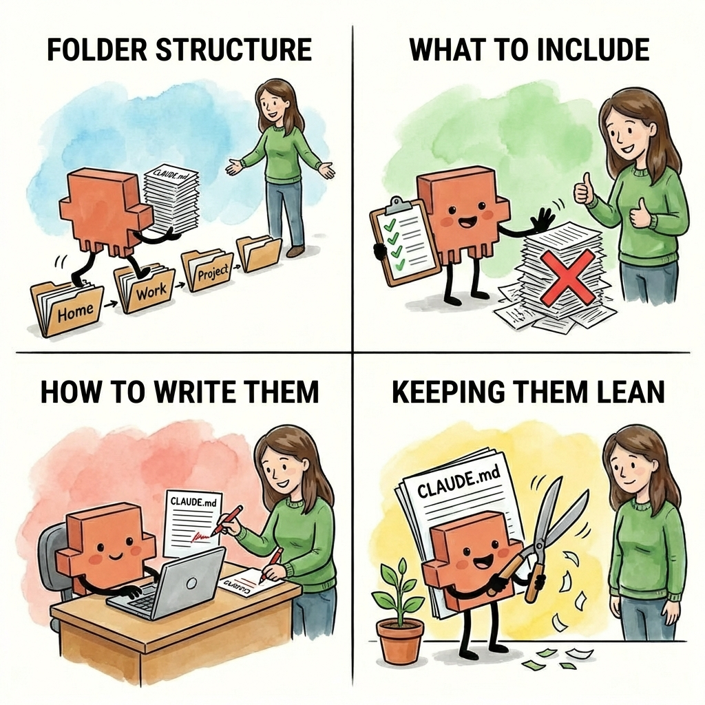
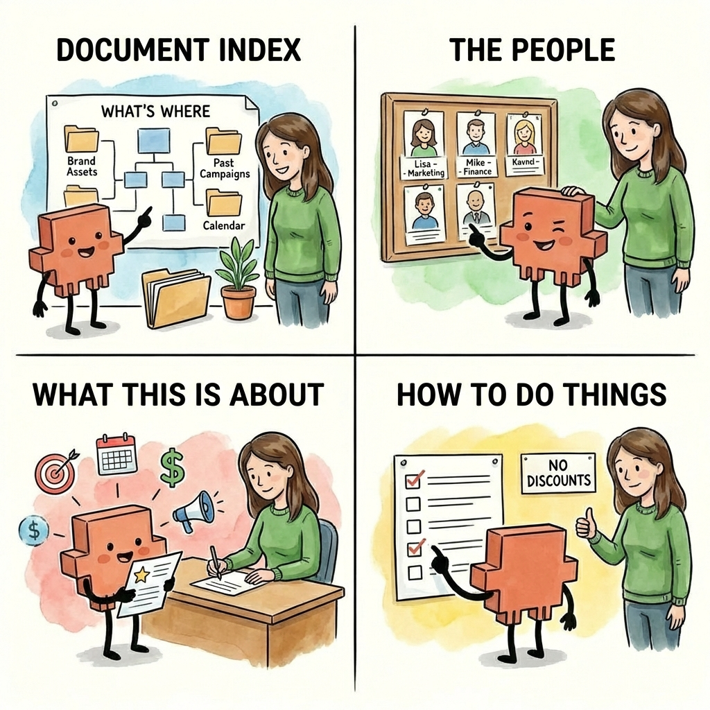
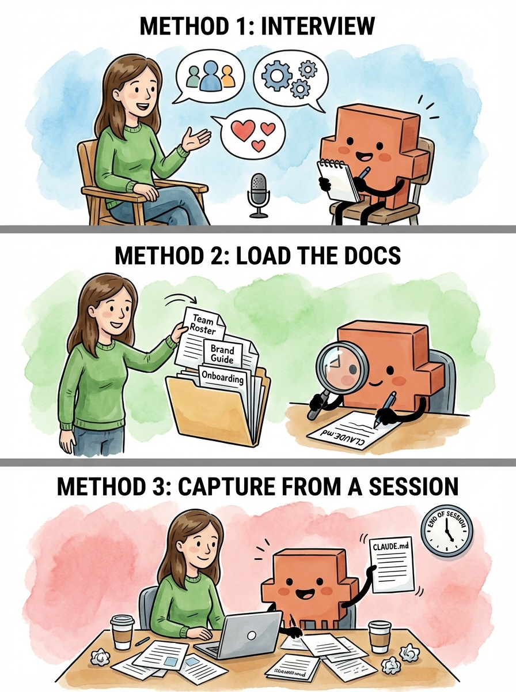
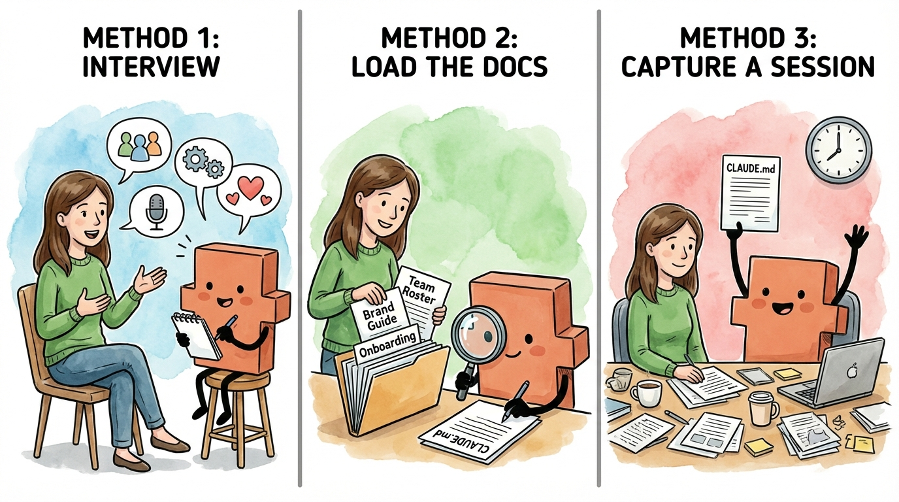

# Claude Code for Everything: The Best Personal Assistant Remembers Things About You (A CLAUDE.md Deep Dive)

### How CLAUDE.md files give Claude the context it needs to be effective, automatically, every session

"Hi! Nice to meet you. What's your name? What do we do here?"

It's 9am. You spent all of yesterday onboarding this person. Building the context they need to actually be effective in their role - not just what the project is, but how your organization works. Which stakeholders matter. The unwritten rules. Your preferences, your constraints, and the decisions you've already made. This is the expensive part of having an employee: the hours you invest building the context that turns them from "new hire who needs hand-holding" into "teammate who can actually help."

By end of day yesterday, that investment paid off. They finally had enough context to be useful. And now they're back at your desk asking who you are. This isn't new. This is your morning routine now - and has been for three months.

Every single day, you rebuild from scratch. Your role, the project, the constraints. Your VP hates bullet points. Legal needs two weeks for any contract review. The NYC office runs on a different fiscal calendar. All the context that took you months to accumulate - you re-transfer it in an hour every morning. And every night, it disappears.

By 10am, they're up to speed. And here's the thing - once they have context, they're _good_. Really good. They draft proposals that actually sound like you. They organize research the way you'd organize it. They make decisions you agree with. Sharp, capable, the kind of help you've always wanted.

That's why you keep doing it. The hour of rebuilding is worth it for a full day of actually useful work.

Then they go home. And the next morning: "Hi! Nice to meet you."

You'd never keep an employee like this - except they're so valuable once they're up to speed that you tolerate the daily reset.

This is exactly what using most AI tools feels like - ChatGPT, Claude on the web, you name it. Every session, a blank slate. Every conversation, starting from zero. And just like with that employee, you tolerate it - because once you've rebuilt the context, the output is worth it.

But what if you didn't have to start from scratch?

Claude Code has a feature that changes this: CLAUDE.md files. They're onboarding documents that load automatically before you type a single word. Your AI agent shows up already knowing who you are, what you're working on, and how you like things done. No re-explaining. No starting from zero.

_**That's the employee you actually wanted and that's what this article is about.**_

**A quick note:** This article focuses on CLAUDE.md files in Claude Code, but everything covered here applies to Claude Cowork (which loads CLAUDE.md files the same way when you open a folder) and AGENTS.md in Cursor, Antigravity, or any other AI tool that auto-loads instruction files. If you want to learn how to give your AI agent persistent memory across sessions - regardless of which tool you use - this article is for you. Everything covered in this guide, from hierarchical loading to structuring context by project, works the same way regardless of which tool you use. The time invested in learning how to organize and auto-load context through your folder structure pays off everywhere. As you read, just replace "CLAUDE.md" with "AGENTS.md" — or whatever your favorite tool calls it. _(For the official guide on CLAUDE.md files, see [Anthropic's documentation](https://claude.com/blog/using-claude-md-files).)_

# **By the end of this article, you'll have:**

- **An understanding of what CLAUDE.md files are:** Simple markdown files that give Claude persistent memory.

- **A folder structure that matches how you work:** Organized so the right context loads automatically for each area and project without cluttering your sessions with context you don't need.

- **A framework for what goes in each CLAUDE.md file:** What to include at each level of your work, from broad preferences down to specific project details, with concrete examples you can adapt.

- **Three methods for writing CLAUDE.md files:** Load existing docs, generate at the end of a session, or have Claude interview you. Claude does the writing, and you edit.

- **The full picture:** How intra-session context management ( [the previous article](https://hannahstulberg.substack.com/p/claude-code-for-everything-why-ai)) and inter-session context (this article) work together.

- **Your first CLAUDE.md file:** By the end, you'll create a CLAUDE.md file for one of your own projects. You won't just learn the system - you'll actually start using it.

**One thing before we dive in: this is a long guide, and you're not going to walk away with the perfect folder structure and perfectly tuned CLAUDE.md files in one sitting. That's not the goal. The goal is to understand the system - how CLAUDE.md files load, what goes in each one, and why folder structure matters - so that when something isn't working, you know what to change and where.**

Start by building out the folder structure and CLAUDE.md files for the area where you work most and expand from there. You'll figure out what works by using them - noticing what context you keep re-explaining, what instructions Claude isn't following, and what's loading that you don't need. That's not a sign you're doing something wrong. That's the process. What matters is starting - documenting the context Claude needs to show up as an effective junior employee every session, and iterating from there.

### **Prefer to watch?**

This guide is also available as a [video walkthrough](https://www.youtube.com/watch?v=bEpU2svjd9w). Same content, same steps — just hit play.

# **Quick Refresher: Context 101**

CLAUDE.md files give your employee memory. But there's a catch you need to understand first.

Claude can only hold so much information at once. Every AI model has a limit on how much text it can see and work with in a single conversation - this is called the context window. Think of it like a filing cabinet. Each conversation you start is one drawer, and that drawer has a fixed amount of space.

As you work together, the drawer fills up. Everything you say to Claude, every file you share, every response Claude writes back - it all goes into that drawer. And it fills up faster than you'd expect. A few long files, a detailed back-and-forth, some research - suddenly the drawer is getting crowded.

**Here's what most people miss: the space in that drawer isn't just for storage. It's also where Claude** _**thinks**_ **.** The room left over after all your messages and files is where Claude reasons through problems, considers options, and drafts responses. This is [thinking room](https://hannahstulberg.substack.com/i/185143249/4-thinking-room).

A stuffed drawer doesn't just mean less storage - it makes Claude worse at its job. Less room to think means lower quality output, more shortcuts, and more missed details. _(For the full deep dive on context and how it impacts output quality, see [the first article on context management](https://hannahstulberg.substack.com/p/claude-code-for-everything-why-ai).)_

_**More context loaded = less room to think = lower quality output.**_

That's counterintuitive. You'd think giving Claude _more_ information would make it smarter. But there's a trade-off: every piece of context you load takes up space that Claude could be using to think. It's like giving your employee a 500-page briefing document before a 30-minute task. Sure, somewhere in those 500 pages is the info they need. But now they're drowning in paper instead of doing the work.

Remember: CLAUDE.md files load automatically when you start a session. That's the whole point - your employee shows up already briefed, no re-explaining required. But that same power makes it easy to shoot yourself in the foot. That auto-loaded context goes into the drawer _before you even type anything_. Every line in your CLAUDE.md file takes up space. Load a 500-line file full of project history, meeting notes, and every decision you've ever made? You've already eaten into your [thinking room](https://hannahstulberg.substack.com/i/185143249/4-thinking-room) before the conversation begins.

This is why we need to get CLAUDE.md files right. The goal isn't to stuff Claude full of information. **The goal is to give Claude** _**exactly**_ **what it needs for** _**the specific task you're working on**_ **\- and nothing more. That's what this article teaches: how to use CLAUDE.md files to load the right context at the right time - not all the context, all the time.**

# **What CLAUDE.md Files Are (and How They Work)**

CLAUDE.md files are plain text files written in [markdown](https://hannahstulberg.substack.com/i/184061644/step-5-understanding-markdown-files). The name tells you what they are: files written _for_ Claude, _in_ markdown format.

Think of them as onboarding guides for your employee. Not the kind they read once and forget - the kind they read every single morning before starting work. Who you are and how you work. What this project is about. Key decisions that have already been made. Where to find things. Your employee shows up already knowing all of it, every session, without being told.

To see how this works in practice, meet Sarah. She's Head of Ops at Acme, a 20-person startup, and she works across Marketing, Finance, and Operations. That means she needs Claude to understand completely different contexts depending on what she's working on.

Remember, Claude Code works with [files and folders on your computer](https://hannahstulberg.substack.com/i/184061644/before-you-move-on-create-your-working-folder). (If you followed my [installation guide](https://hannahstulberg.substack.com/p/claude-code-for-everything-finally), your working folder is backed up to cloud storage so you're not at risk of losing anything locally.) Sarah has actual folders on her computer (created within the Google Drive desktop app), and each one has its own CLAUDE.md file:

Each file contains context specific to that level. The deeper the folder, the more specific the context. Sarah will be our running example for the rest of this article.

Here's where it gets powerful. Claude doesn't just load one CLAUDE.md file - it loads every CLAUDE.md file from the folder you're working in all the way up to the top. These onboarding guides stack. More specific folder means more specific context layered on top of the general stuff.

What happens when two files disagree? Say Sarah's top-level ~/CLAUDE.md says "Use bullet points over long paragraphs." But her Marketing CLAUDE.md says "Use flowing paragraphs for brand storytelling." When she's working in Marketing, the Marketing instruction wins — the more specific file takes priority. When she's in Finance, the top-level rule still applies because nothing more specific in the Finance CLAUDE.md has replaced it. Think of it like a department manager's instructions overriding the company handbook.

Sarah opens her IDE in her Acme folder and tells Claude:

> _Draft the launch email for our Q1 campaign._

Claude navigates to the Q1 Campaign folder and four CLAUDE.md files load automatically:

- **Personal preferences** (`~/CLAUDE.md`): How Sarah communicates, her working style

- **Company context** (`~/Acme/CLAUDE.md`): What Acme does, Sarah's role, and her team

- **Marketing context** (`~/Acme/Marketing/CLAUDE.md`): Brand voice, target audience, and tone

- **Campaign context** (`~/Acme/Marketing/Q1 Campaign/CLAUDE.md`): Campaign goals, key messaging, and target segments

Claude already knows who Sarah is, what Acme does, the brand voice, and the campaign goals. She doesn't re-explain any of it. She just asks for the email.

Later that day, Sarah switches gears:

> _Finalize the office move timeline._

Claude navigates to the Office Move folder and a different set of CLAUDE.md files loads.

How does Claude know where to go? Remember, Sarah opens Claude Code in her Acme folder.

The Acme CLAUDE.md loads immediately - and it includes a project structure that maps out all her folders (we'll cover how to set this up later in the article). When she mentions the office move, Claude sees Operations/Office Move/ in that map and navigates there. As it does, the Operations and Office Move CLAUDE.md files load along the way.

- **Same personal preferences** (`~/CLAUDE.md`)

- **Same company context** (`~/Acme/CLAUDE.md`)

- **Operations context** (`~/Acme/Operations/CLAUDE.md`): vendor contacts and processes

- **Office move context** (`~/Acme/Operations/Office Move/CLAUDE.md`): timeline, budget, and lease details

No marketing context loading when she's doing operations work. No operations context when she's doing marketing.

_**This is how you load the right context, not all the context.**_

To check what Claude has loaded at any point, just ask:

> _Which CLAUDE.md files are in your context?_

Claude will tell you exactly which files it's working with. You can also watch it happen in real time: when Claude navigates to a folder, the terminal shows each CLAUDE.md file loading in, one by one. This is another reason to use the [Claude Code CLI in your terminal](https://hannahstulberg.substack.com/i/184061644/step-3-install-claude-code) rather than the Claude Code IDE extension: you can see exactly what Claude is doing at every step.

# **The CLAUDE.md How-To**

You now understand what CLAUDE.md files are and how they load. Now let's learn how to set yours up. This section covers four things:

1. How to organize your folders so the right context loads automatically

2. What to include in each CLAUDE.md file (and what to leave out)

3. How to write them (Claude does most of the work - you edit)

4. How to keep them lean over time as your work evolves

We'll cover each one twice - first the short version, enough to start building right now, then the deep dive for when you want the full picture. The short version tells you _what_ to do. The deep dive tells you _why_ it works - so when your setup isn't working the way you'd expect, or you're trying to optimize what you've built, you'll know exactly where to look.

## **The short version**

Here's how to set up your CLAUDE.md files in four steps:

1. **Organize your folders to mirror how you think about your work.** Your folder structure is the foundation - it directly controls what context Claude loads and when. Most people's work naturally falls into a few levels: the project itself, the areas within it (marketing, finance, operations), and the specific things you're working on (Q1 campaign, 2026 budget). Each level maps to a folder, and each folder can hold a CLAUDE.md file. The structure should mirror how _you_ already think about your work - not some arbitrary system you're forcing yourself into.

2. **Create a CLAUDE.md file in each active folder.** Not every folder needs one - just the ones where you're actively working across multiple sessions. Each CLAUDE.md file covers four types of context: a document index (where things are), the people involved (so Claude knows who "Lisa" is without you re-introducing her), what this is about (goals, decisions, key facts), and how you want things done (workflows, guardrails, preferences). Higher-level files should be shorter. Your top-level preferences file should fit on one screen. Your project-level files can be longer.

3. **Let Claude write them.** You don't write CLAUDE.md files from scratch - Claude does most of the work, and you edit. There are three methods depending on what you're starting with: 1) go into [plan mode](https://hannahstulberg.substack.com/i/184381596/1-the-three-modes-and-when-to-use-each) and have Claude interview you about your work (great when the context lives in your head), 2) point Claude to existing docs and have it generate the file (great when you already have briefs or wikis), or 3) ask Claude to capture context at the end of a working session. Whichever method you use, review every line. Claude produces a starting point, not a finished product.

4. **Keep them lean.** CLAUDE.md files tend to grow as you add context after sessions - that's fine, as long as you periodically trim. Two habits help: after big sessions, ask Claude if the CLAUDE.md needs updating, and when a file has gotten noticeably longer than when you created it, check if everything still earns its place. Cut anything about finished projects, outdated decisions, or context that's only relevant sometimes.

One thing to keep in front of you through all four steps: remember the trade-off from earlier - every line in a CLAUDE.md file costs [thinking room](https://hannahstulberg.substack.com/i/185143249/4-thinking-room). The goal isn't to document everything. It's to give Claude _exactly_ what it needs, and nothing more.

And don't worry about getting it perfect on the first try. Your CLAUDE.md files will evolve as you use them - you'll notice what's missing, what's cluttering things up, and what needs to move. That's the whole point of step 4. Start lean, iterate as you go.

If you want to start building now, skip to [Your First Hour](https://hannahstulberg.substack.com/i/187471997/your-first-hour). Otherwise, keep reading - the rest of this section goes deep on each of the four steps.

## **The deep dive**

### **1\. Your folders control what Claude knows**

_How your folder structure determines which context loads automatically - and how to organize yours so the right information shows up without the wrong information coming along for the ride._

We just saw how Sarah's CLAUDE.md files stack automatically based on where she's working. Marketing context loads for marketing work, operations context for operations work. The right context, not all the context.

But here's what makes that possible: **her folder structure.**

Your folders aren't just a way to keep files organized. They directly control what context Claude has access to. The folder structure is the foundation of the whole system.

Most people's work naturally falls into a few big buckets - a work project, a personal project, maybe a side project. Each of those becomes a top-level folder on your computer, and that's where you open Claude Code. Sarah opens Claude Code in her Acme folder (~/Acme/ - the ~/ is shorthand for your home folder, the starting point on your computer where all your other folders live). From there, when she asks Claude to do something, Claude navigates to the relevant subfolder and picks up the CLAUDE.md files along the way. Her top-level context loads immediately when she starts the session, and more specific context layers on as Claude goes deeper.

Within each project, think about your work in levels:

- **Level 0:** Who am I?

- **Level 1:** What's the company?

- **Level 2:** What areas do I work in?

- **Level 3:** What am I working on right now?

Each level maps to a folder. Each folder can have a CLAUDE.md file with context relevant to that level. The structure should mirror how _you_ think about your work, not some arbitrary system. If you think "I'm working on the Q1 campaign," your folders should let you navigate to that place.

Here's what Sarah's full folder structure looks like:

The CLAUDE.md file at each level serves a distinct purpose:

- **Level 0: Top-level** **CLAUDE.md**(~/ CLAUDE.md) is about how you work. Writing preferences, communication style, and formatting preferences. This is portable - it follows you everywhere, even if you change jobs.

- **Level 1: Company CLAUDE.md** (~/Acme/CLAUDE.md) is about what you do here. Your role, your team, and what areas exist. This is where you put team context so Claude knows who "Lisa" is when you say "Lisa thinks we should push the launch."

- **Level 2: Area CLAUDE.md** (~/Acme/Marketing/CLAUDE.md) is domain-specific context. Brand voice for marketing, budget structure for finance, and vendor processes for operations.

- **Level 3: Project CLAUDE.md** (~/Acme/Marketing/Q1 Campaign/CLAUDE.md) is the specific thing you're working on right now. Goals, timeline, key decisions, and current status.

Not every folder in your structure needs a CLAUDE.md file. Notice in the tree above: within Marketing, there are two kinds of folders. **Q1 Campaign** has a CLAUDE.md file - that context loads automatically whenever Sarah works there. But **Past Campaigns** and **Brand Assets** are just folders full of files, with no CLAUDE.md. When Sarah is working on a marketing project, those three past campaign briefs don't automatically load and eat up [thinking room](https://hannahstulberg.substack.com/i/185143249/4-thinking-room). But Claude knows they're there because of the folder structure, and can read them on demand when Sarah asks for inspiration. Best of both worlds.

**Rule of thumb:** Only create a CLAUDE.md when you have context that's (1) specific to that level and (2) needed across multiple sessions. A folder with just reference files (like Past Campaigns) doesn't need one - Claude can read those on demand when you ask. A folder where you're actively working on something with ongoing context (like Q1 Campaign) probably does. This distinction matters because every word loaded into context costs [thinking room](https://hannahstulberg.substack.com/i/185143249/4-thinking-room) \- if you create a CLAUDE.md in every single folder, you'll load a wall of unnecessary context every session, defeating the whole purpose.

**How to tell if you've loaded too much:** If you've set up the [status line](https://hannahstulberg.substack.com/i/185143249/1-the-status-line-you-cant-manage-what-you-cant-see), keep an eye on your context usage as you work. As Claude navigates to different folders in your project, it loads the relevant CLAUDE.md files along the way - and you can watch your context usage climb. Remember, output quality starts to degrade [around 50% context usage](https://hannahstulberg.substack.com/i/185143249/1-the-status-line-you-cant-manage-what-you-cant-see) \- so if your CLAUDE.md files alone are pushing you to 10-15% before you've even started working, they're too heavy. The fix: shorten CLAUDE.md files that have grown too long, or remove CLAUDE.md files from folders that are just reference storage.

If you're not sure where to start trimming, Claude can help diagnose the problem:

> _Look at the CLAUDE.md files in this project. Are any of them too long, redundant, or loading context that I probably don't need every session? Suggest how to trim them down._

**Not sure how to organize your folders?** You don't need to have an existing folder structure or documents already saved on your computer. Many knowledge workers keep everything in Google Docs, Notion, or other cloud tools - the folders you're setting up here are specifically for organizing your work with Claude Code. Go into [plan mode](https://hannahstulberg.substack.com/i/184381596/1-the-three-modes-and-when-to-use-each) and have Claude interview you about your work. Claude can help you think through how you work, what areas you cover, and what projects are active - then propose and create a folder structure that makes sense for you. Ask Claude:

> _I want to set up folders in my workspace so I can use CLAUDE.md files to give you the right context for different areas of my work. Interview me about what I do, what areas I work in, and what projects I have. Then propose a folder structure. Once we agree, create the folders for me._

And don't worry too much about getting the perfect setup on the first try. Your folder structure will evolve the longer you use Claude Code, and that's completely normal. As you work more, you'll naturally discover what context you actually need, what's cluttering things up, and where new CLAUDE.md files would help. When that time comes, Claude can help you reorganize. At the end of a working session, when Claude has context about how you've been working:

> _Based on the work we just did, does my folder structure or any of my CLAUDE.md files need to be updated or reorganized?_

Or at the start of a fresh session, when you just want a structural review:

> _Look at my current folder structure and CLAUDE.md files. Is anything too long, redundant, or at the wrong level? Suggest how to reorganize._

### **2\. What actually belongs in a CLAUDE.md file**

_The four types of information that make Claude noticeably more effective, how long each file should be, and what to leave out._

You've got your folder structure. Each folder level has a place for a CLAUDE.md file. But what actually goes in them?

The answer depends on the level. Remember, every word in a CLAUDE.md file costs [thinking room](https://hannahstulberg.substack.com/i/185143249/4-thinking-room) \- it loads every session you work in that folder. A top-level CLAUDE.md file with three screens of dense context is eating up space before you've even asked your first question. A project-level CLAUDE.md file that's too sparse wastes the opportunity to give Claude the specific context it needs to be useful.

**The general principle: higher levels should be shorter.**

These aren't hard rules - but if your top-level CLAUDE.md file is three pages long, it's probably too heavy. And if your project-level CLAUDE.md file is two sentences, it's probably not pulling its weight.

There's a practical ceiling here, too. An instruction is any directive Claude needs to follow: "be concise and direct," "for new campaigns, start by reviewing results from similar past campaigns," or "budget over $5k needs Mike's approval." Each bullet point, each rule, and each preference counts. AI models can reliably follow roughly 150 to 200 of these at a time. Claude Code's own system prompt, the built-in instructions that tell Claude how to behave before your CLAUDE.md files even load, already takes up about 50 of those. That leaves around 100 to 150 instructions spread across all of your CLAUDE.md files combined, and when you exceed that limit, instruction-following quality doesn't just degrade for the newest additions. It degrades across the board. Every instruction gets a little less reliable. This is why keeping CLAUDE.md files lean isn't just about saving context space. It's about keeping Claude sharp on the instructions that actually matter.

If you're not sure where you stand, you can ask Claude to check:

> _Read all the CLAUDE.md files loaded in this project and count the number of distinct instructions, rules, and preferences. How close am I to the 150 instruction limit?_

If you're not sure what belongs in a CLAUDE.md file, start by including what you find yourself repeating at the beginning of sessions. The context you re-explain every time is the context that should be there permanently. You don't need to get this right on the first try - include what feels relevant, use it for a few sessions, and trim what Claude never actually needed. The file is a text file, not a contract. You can edit it anytime.

You won't be writing these from scratch - Claude does most of the heavy lifting there, and we'll cover how in the next section. For now, here's what each CLAUDE.md file should contain. These recommendations are geared toward knowledge work - if you're a developer, your CLAUDE.md files will look different.

Four types of information make Claude noticeably more effective:

#### **1\. A document index: a map of what's where.**

A document index is a quick reference that tells Claude what's in the folder and where to find things. Instead of Claude searching blindly for your brand guidelines, the document index says: "Brand assets are in Brand Assets/. Past campaigns are in Past Campaigns/. The content calendar is content-calendar.md." This is especially useful at the area and project levels, where Claude needs to navigate to the right files without guessing. Think of it like giving your junior employee a tour of the office on their first day - show them where things are so they're not opening every drawer looking for the stapler. This also includes any external tools Claude can access through MCP servers, which are connections that let Claude talk directly to tools like Notion, Figma, or Slack. Documenting what each one connects to and when Claude should use it means you're not re-explaining your tooling setup every session. (For a full walkthrough of setting up and documenting an MCP server, see the [Notion article](https://hannahstulberg.substack.com/p/claude-code-for-everything-draft-in-claude-code-collaborate-in-notion) in this series.)

There's also a step beyond pointing Claude to files: **importing them**. You might already know that typing @ followed by a filename in Claude Code helps Claude find and read that specific file. The same syntax works inside CLAUDE.md files. Adding @./Brand Assets/tone-of-voice.md to your CLAUDE.md tells Claude to find that file and load its contents as part of your instructions — automatically, every session. A document index says "here's where to find the brand guide if you need it." An import says "the brand guide is part of your briefing, every session."

You might wonder: if the imported file loads into context either way, why not just paste its contents directly into the CLAUDE.md? From Claude's perspective, it's the same — it all becomes context. The benefit is on the human side:

1. **Reuse.** Sarah's brand voice guide needs to be loaded in both her Marketing and Product folders, but not Finance or Operations. Without imports, she'd copy-paste the guide into both the Marketing CLAUDE.md and the Product CLAUDE.md — and update both every time the guide changes. With imports, both files point to the same tone-of-voice.md. She updates it once and every CLAUDE.md that imports it picks up the change.

2. **Readability.** A 500-line CLAUDE.md becomes hard to scan and update, but breaking it into focused files — one for brand voice, one for approval workflows, one for team context — keeps the main CLAUDE.md short and scannable.

3. **Modularity.** Sarah's Marketing CLAUDE.md can import the brand voice guide plus campaign workflows, while her Product CLAUDE.md imports the same brand voice guide plus competitive analysis conventions. Different combinations, one source of truth.

Just remember that imported files still cost context space - they load in full every session. If you're importing a long file, consider creating a shorter summary version to import instead - one that contains truly only what's needed in 80% of your sessions. You keep the single source of truth, just a leaner one. The full file still lives in the folder for Claude to read on demand when you need the details.

#### **2\. The people involved.**

Names, roles, and what they do - at whatever level is relevant. Your company-level CLAUDE.md file doesn't need every person at the company. But your project-level CLAUDE.md file should probably include your project team, because when you say "Lisa thinks we should push the launch," Claude should know who Lisa is without you explaining it every session. This is the kind of context you'd put in an onboarding doc for a new team member - the basics they need to follow conversations.

#### **3\. What this is about.**

The identity, goals, and key facts that give Claude the background to do useful work. At the company level, this might be what your company does and your role. At an area level, it could be your brand voice and target audience. At a project level, it's the specific goals, timeline, budget, and messaging. This is the context that turns Claude from a generic assistant into one that actually understands your work. Without it, you're re-explaining the basics every session - "we're a B2B SaaS company targeting mid-size teams" - instead of jumping straight into the real work.

#### **4\. How you want things done.**

Workflows, processes, preferences, and guardrails that shape how Claude works in this area. "For new campaigns, start by reviewing results from similar past campaigns." "Budget over $2k needs my sign-off, over $5k needs Mike's." "Give me a plan before executing - I like to review your approach before you make changes." This also includes constraints from decisions already made - if you've decided "we're positioning as premium, no discounts," putting that guardrail in the CLAUDE.md file prevents Claude from suggesting discount strategies every session. Without it, you'll waste time re-explaining the same constraints. With it, Claude starts every session already aligned on your direction.

These four categories aren't a rigid template. Not every CLAUDE.md file needs all four. _**The goal isn't to document everything you know - it's to give Claude exactly what it needs to work effectively at each level.**_

A natural question: what about _you_ \- your personality, your values, your professional background? These can be useful, but only when they translate to something Claude can act on. "I'm detail-oriented" is wasted context - it's a personality trait, not an instruction. "Double-check all numbers and calculations before presenting them" is an instruction Claude can follow. Same with professional background: you don't need your full LinkedIn profile in your CLAUDE.md. But "I have 15 years of marketing experience - don't explain basic marketing concepts" saves you from getting Marketing 101 explanations every session. The test is always the same: does including this change how Claude works with you? If yes, include it. If it's just nice-to-know, skip it.

**What doesn't belong:**

- Passwords, API keys, or anything sensitive

- Context that belongs at a different level (don't repeat company-wide info in every project CLAUDE.md file)

- Information that changes so frequently it'll be outdated by your next session

- Templates (email formats, brief structures, PRD outlines, slide frameworks)

The first two are straightforward. The third is worth explaining: if your project status changes every few days, putting it in a CLAUDE.md file means it'll be stale by the next session. Better to update Claude in the moment - "here's where we are on the campaign" - than to load outdated context automatically.

The fourth is a common instinct, especially if you're a knowledge worker who's been trained on templates for everything - campaign briefs, status updates, forecasting models, email formats. Templates feel important enough to always have loaded, but they're usually long and you only need a specific one when you're actually creating that type of document. A three-page campaign brief template eating [thinking room](https://hannahstulberg.substack.com/i/185143249/4-thinking-room) while you're drafting an email is wasted context. The better home for templates is custom slash commands and skills, which let you load a template on demand when you need it. (We'll cover these later in the series.)

A good litmus test for everything in your CLAUDE.md files: if a piece of context isn't relevant to the vast majority of sessions where that file loads, it doesn't belong there. Move it to a separate file that Claude can read when you ask, or into a custom slash command you run when you need it. Your CLAUDE.md files should contain the context you need _every_ time, not the context you _might_ need _sometimes_.

### **3\. How to write CLAUDE.md files**

_Three methods for having Claude draft your CLAUDE.md files for you - whether you're starting from scratch, from existing docs, or from a working session you just finished._

Claude is surprisingly good at writing its own CLAUDE.md files. You provide the raw material - documents, conversation, or answers to questions - and Claude organizes it into a structured file that captures the context it needs. You review the output, cut what doesn't belong, and add anything Claude missed. The result is better than either of you would produce alone: Claude catches context you'd forget to document, and you catch context Claude shouldn't have included.

One detail to get right up front: the filename must be exactly CLAUDE.md - all caps. claude.md or Claude.md won't load.

Here are three methods for writing CLAUDE.md files that work well for knowledge workers.

#### **Method 1: Plan mode interview**

_Use when you have context in your head but no docs_

This one is for when the context lives in your head but isn't written down anywhere. Maybe you have a new role and haven't documented your team or processes yet. Maybe you have years of institutional knowledge that's never been captured in a file. You know the information - you just need help getting it out.

If you used [plan mode](https://hannahstulberg.substack.com/i/184381596/1-the-three-modes-and-when-to-use-each) to design your folder structure earlier in this article, this is the same approach for a different goal. Switch to plan mode (Shift+Tab) and let Claude interview you:

> _I want to generate a CLAUDE.md file for \[folder name\]. Interview me to understand what you'd need to work effectively there. Ask me questions about the project, the people involved, and how I want things done. Then draft the file based on my answers._

Claude will start asking questions. Who's on the team? What are the goals? What decisions have already been made? What workflows do you follow? How do you want to work? Answer conversationally - dictating with a tool like [Wispr Flow](https://ref.wisprflow.ai/hannah-stulberg) is much faster than typing, and your natural speech patterns often capture context more completely than careful typing does. You'll mention things off the cuff that you'd forget to include if you were writing from scratch.

Sarah uses this method for her top-level CLAUDE.md file - the one in her home folder that captures how she works. There's no document that describes her working style. It's all in her head: she likes to review a plan before Claude executes, she prefers bullet points over paragraphs, and she wants two or three options with trade-offs rather than a list of ten. Claude asks her about communication preferences, formatting, and how she likes to give and receive feedback. Sarah answers off the cuff, mentions things she wouldn't have thought to write down - like that she always wants tables for comparisons, or that she hates corporate jargon. Claude drafts the CLAUDE.md, and Sarah has a preferences file she never would have written from scratch.

Plan mode is important here because it keeps Claude in exploration mode. Without plan mode, Claude tends to generate a CLAUDE.md file after your first or second answer - and the result is too thin to be useful. Plan mode tells Claude to keep asking, keep refining its understanding, and only propose the file once it has the full picture. After several rounds of questions, Claude drafts the CLAUDE.md file. Review it, adjust anything that's not quite right, and save.

#### **Method 2: Load the docs, then generate**

_Use when you have existing documents for this area_

Remember the folder structure from the previous section - each level has a place for a CLAUDE.md file, and surrounding folders hold the reference files Claude can read on demand. If you already have documents that capture most of what Claude needs to know at a given level - project briefs, team wikis, brand guidelines, strategy decks, or process docs - start by saving them into the right folders in your structure. These files will live there permanently, so Claude can reference them in future sessions whenever you ask.

Once the relevant docs are in place, ask Claude to read through them and generate a CLAUDE.md for that level:

> _Read through the files in \[folder name\] and generate a CLAUDE.md file for that folder. Focus on what you'd need to know to work effectively there: what this is, who's involved, key decisions that have been made, and where to find things._

Here's what this looks like for Sarah. She wants to create her company-level CLAUDE.md file - the one that tells Claude what Acme does, who's on the team, and what areas exist. She has a team roster and a one-pager about the company she used for onboarding. She saves them into her Acme folder, then asks Claude to read through them and draft the CLAUDE.md.

Claude produces a draft. It's a solid starting point, but it needs editing. Claude pulled in too much detail from the onboarding doc - a full company history section that isn't relevant to most sessions. But it nailed the team section - names, roles, and who reports to whom - and correctly identified the folder structure with Marketing, Finance, Operations, and Product as the key areas. Sarah tells Claude to trim the company history down to two sentences and add a line about approval workflows she knows from experience but hadn't documented. A few prompts of back and forth, and the CLAUDE.md file is done.

The key with this method: save the docs that belong at _that level_ into the right folder, not everything you have into one place. Company-level docs - team rosters, onboarding guides - go in the company folder. Marketing docs - brand voice guide, audience research, campaign process - go in the Marketing folder. When you generate the CLAUDE.md, Claude reads what's in the folder and drafts from the right material. Same principle as the CLAUDE.md files themselves: more isn't better, right is better.

#### **Method 3: Generate from a session**

_Use when you just finished a working session_

Sometimes the best context comes from doing the work itself. You spend an hour with Claude researching competitors, drafting a campaign brief, or building a budget model - and by the end of the session, Claude has absorbed a ton of context about your project through the conversation. Who's involved, what the goals are, what decisions you've made, and what constraints exist. All of it came up naturally while you were working.

The question to ask yourself: will future sessions in this folder need the same context? If you're going to keep working on this campaign, this budget, or this project across multiple sessions - that's when it's worth capturing. If it was a one-off task you won't revisit, you probably don't need a CLAUDE.md file for it.

When the answer is yes, that's the perfect moment to capture it:

> _We just did a lot of work in this area. Generate a CLAUDE.md file for this folder based on everything we covered. Focus on context that would be useful at the start of any future session here, and ask me about any context you're not sure is relevant to future work._

This method works especially well when you're starting something new. Say Sarah spends a session brainstorming the Q2 marketing campaign with Claude. They talk through goals, channels, messaging angles, and budget allocation. By the end, Claude knows this is a content-focused campaign targeting existing customers, that Lisa will lead execution, and that the budget is tighter than Q1. None of that exists in a document yet - it all came out through the conversation. Sarah asks Claude to create a Q2 Campaign folder in Marketing and generate a CLAUDE.md file for it. Now the next time she works on the Q2 campaign, all of that context is waiting for her.

Ideally, do this before you close the session. If you close the terminal without saving the context and haven't [named the session](https://hannahstulberg.substack.com/i/184381596/3-pick-up-where-you-left-off) in a way that makes it easy to find, all of that context is gone - and you're back to re-explaining everything from scratch. If you do forget, you can resume a named session later and generate the CLAUDE.md then. But the easiest path is to capture it at the end of the session, when Claude already has the full picture.

One thing to watch for: Claude may include context that was relevant to _this_ session but won't matter in future ones. If you spent twenty minutes debugging a specific email draft, Claude might include details about that draft in the CLAUDE.md file. Cut anything that's about the current task rather than the ongoing project. The CLAUDE.md file should capture the durable context - the stuff that's true across sessions - not a summary of today's work.

Pick whichever method matches where you are right now and start with the area or project where you're using Claude Code the most. You don't need CLAUDE.md files across your entire folder structure before you start seeing results. One CLAUDE.md file in your most active project folder and you'll immediately feel the difference.

**Whichever method you use, the same principle applies:** what Claude produces is a starting point, not a finished product. Review every line against the litmus test from the previous section: if a piece of context isn't relevant to the vast majority of sessions where that file loads, cut it or move it to a separate file Claude can read on demand. Remember, every CLAUDE.md file that loads for a session shares the same budget of around 100 to 150 instructions - so every line you add to one file leaves less room for the others. A lean CLAUDE.md file that Claude follows reliably is better than a comprehensive one where every instruction gets a little less sharp.

**One more tip that applies to all three methods:** You speak 3-4x faster than you type. If you use a dictation tool like [Wispr Flow](https://ref.wisprflow.ai/hannah-stulberg), you can answer Claude's questions, describe your workflows, and brain-dump context at the speed of speech instead of the speed of typing.

**A note for developers:** Claude Code also has a `/init` command that generates a CLAUDE.md file by analyzing your folder structure and codebase. It works well for technical projects with clear organization. For knowledge work, Methods 1-3 tend to produce better results - `/init` generates generic structural context that misses what actually matters for knowledge workers: your role, your team, key decisions, and how you want things done.

### **4\. Keeping CLAUDE.md files lean over time**

_Your CLAUDE.md files will grow. Here's how to catch the bloat before it starts hurting your output quality - and when to check in._

CLAUDE.md files aren't something you set up once and forget about. Your work evolves - projects wrap up, new ones start, team members change, and processes get refined. The CLAUDE.md files should evolve with it.

The good news: maintenance is easy, because Claude does the heavy lifting here too. The key is building the habit of checking in on your CLAUDE.md files at two natural moments.

**After a big working session:** You just spent an hour with Claude making decisions, refining strategy, or changing direction on a project. Before you close the session, ask:

> _Based on the work we just did, does the CLAUDE.md for \[folder name\] need to be updated with any new context?_

Claude already has the full picture of what changed - it can identify what's worth capturing and propose specific updates. You review, approve what makes sense, and move on. This is easier than trying to remember what changed a week later.

**When you keep re-explaining the same thing:** If you find yourself giving Claude the same context at the start of every session - who someone is, what a project is about, how you want something done - that context belongs in a CLAUDE.md file. Tell Claude to add it:

> _I keep having to explain \[X\] every session. Update the CLAUDE.md for \[folder name\] so you have that context automatically._

**One thing to know about timing:** CLAUDE.md files load when a session starts, not continuously. If you edit a CLAUDE.md file in the middle of a session, Claude won't see the changes automatically. You have three options:

1. Ask Claude to reread the file ("Reread the CLAUDE.md in this folder")

2. Run `/clear` to reset the session (which reloads all CLAUDE.md files)

3. Start a new session

The easiest approach is to make your updates at the end of a session, so the next session picks them up naturally.

**Signs a CLAUDE.md file needs trimming:**

- It's noticeably longer than it was when you created it. CLAUDE.md files tend to grow over time as you add context after sessions. Periodically check if everything still earns its place.

- It contains details about finished projects or past decisions that no longer affect current work. If the Q1 campaign is over but its CLAUDE.md file still has the timeline, budget breakdown, and launch event details, that's dead context loading every time you navigate through that folder.

- It has detailed context about multiple different projects. If Sarah's Marketing CLAUDE.md has grown to include specific goals, timelines, and messaging for both the Q1 campaign and a separate product launch, that context should live in its own CLAUDE.md file inside each project's folder - not in the area-level file that loads for all marketing work.

When in doubt, Claude can help diagnose the problem:

> _Look at the CLAUDE.md files in this project. Are any of them too long, redundant, or loading context that I probably don't need every session? Suggest how to trim them down._

The instinct is to keep adding context because more feels safer. But a file that's grown from a tight page to three pages isn't giving you three times the value. _**The leanest CLAUDE.md file that covers what you actually need is always the best one.**_

# **What this looks like in practice (reference examples)**

_Sarah's complete CLAUDE.md files at every level - from personal preferences to a specific campaign - with annotations explaining why each section is there._

This section has Sarah's full CLAUDE.md files at each level. Use them as starting points when you're ready to build your own - yours will look different, but the structure translates to any kind of knowledge work.

## **Level 0: ~/ CLAUDE.md (Sarah's preferences)**

This CLAUDE.md file follows Sarah everywhere. It's about how she works, not where she works - if she left Acme tomorrow, this CLAUDE.md file would stay exactly the same. Short, portable, and entirely about preferences - the lightest CLAUDE.md file in the stack.

## **Level 1: ~/Acme/ CLAUDE.md (Company context)**

This is Sarah at Acme - what the company does, her role, her team, and where things live. The team section is what lets Sarah say "Lisa thinks we should push the launch" without re-introducing Lisa every session. The tree-format document index shows Claude the full landscape - what's where, what each area is for, and which folders have their own CLAUDE.md files with deeper context. The .claude/ folder is where custom commands, skills, and agents live, and the Connected Tools section documents what MCP servers are available (we'll deep dive into all of these in future articles in this series).

## **Level 2: ~/Acme/Marketing/ CLAUDE.md (Area context)**

Marketing-specific context that applies to any marketing work Sarah does, not just one campaign. Brand Voice and Target Audience give Claude the domain knowledge to write on-brand content. Notice the @ import on the brand voice line — Sarah keeps the detailed brand voice guidelines in a separate file. She imports the file rather than pasting the guidelines directly into this CLAUDE.md. This way, she can also load these guidelines into other CLAUDE.md files that need to know about brand voice, like the Product one. One file, multiple imports, always in sync. The team section tells Claude who Rachel and PixelForge are when Sarah mentions them, the document index drills into the Brand Assets folder so Claude knows where to find things, and the workflows tell Claude how to approach marketing tasks — including approval guardrails.

## **Level 3: ~/Acme/Marketing/Q1 Campaign/ CLAUDE.md (Project context)**

The most specific level - the actual project Sarah is working on right now. This is the longest CLAUDE.md file, because project-level work needs the most specific context. The Messaging section keeps the campaign's core identity consistent across sessions - angle, positioning, and differentiator all in one place. The Product Context section shows a powerful pattern: the CLAUDE.md file can point to files anywhere in the project, not just its own folder. When Sarah asks Claude to draft ad copy, Claude can pull in the product positioning and competitive analysis without her having to explain the product every session. And the Campaign Team narrows the people context to just who's working on this project - including cross-functional contributors like Alex from engineering.

**The pattern across all four levels:** each CLAUDE.md gets more detailed as the context gets more specific. But notice that even the longest CLAUDE.md file - the project level - stays focused. It's not a brain dump of everything Sarah knows about the Q1 campaign. It's the context Claude needs to pick up where the last session left off and work effectively from the start.

# **Putting it all together**

You now have two systems working together. The [previous article](https://hannahstulberg.substack.com/p/claude-code-for-everything-why-ai) taught you how to manage context while you're working - seeing how full your session is, compacting on your terms, and keeping tasks focused. This article taught you how to make sure Claude already has the right context before you start working - so you're not re-explaining your project, your team, and your preferences every session.

Together, they form a cycle:

1. **You start a session.** CLAUDE.md files load automatically. Your junior employee walks in already briefed on who you are, what you're working on, and how you want things done.

2. **You work.** Because Claude already has the right context, you skip the re-explaining and get straight into productive work. The session accumulates more context as you go - files read, decisions made, and drafts written.

3. **You manage context.** When the session gets full, you compact on your terms, keeping what matters and clearing the rest - so output quality stays high throughout the session.

4. **You close the session.** If anything durable came out of the work - new decisions, new team members, or new processes - you update the CLAUDE.md file so the next session starts with that context too.

Remember [parallel sessions](https://hannahstulberg.substack.com/i/185143249/3-parallel-sessions-separate-tasks-separate-drawers) from the previous article? Each Claude Code session you open gets its own CLAUDE.md context based on where you're working. Open a session in your Marketing folder and you get a junior employee who already knows your brand voice, your audience, and your campaign workflow. Open one in Finance and you get a junior employee who knows your budget structure, approval flows, and reporting cadence. Open one in Operations and you get one who knows your vendors, contracts, and office logistics. Same Claude, but each session starts with the exact expertise Claude needs for the work at hand.

**One practical tip:** Sarah opens a session in her Marketing folder. Her marketing CLAUDE.md files load - brand voice, audience, campaign workflow - and she has a few tasks to get through. She drafts an email sequence with Claude, and now the session is full of drafts, revisions, and feedback that aren't relevant to her next task. She runs `/clear`. Claude wipes the session context - the email drafts, the back-and-forth, all of it - but keeps her CLAUDE.md files loaded. She still has her marketing junior employee, with all the brand voice, audience, and workflow context intact. Just a clean slate for the next task. It's the fastest way to move between tasks within the same area without starting a whole new session.

# **What you should have now**

If you've followed along, you now have:

- **An understanding of what CLAUDE.md files are:** Why loading the right context matters more than loading all of it. Simple markdown files that Claude reads automatically when a session starts, so your junior employee walks in already briefed.

- **A folder structure that matches how you work:** Organized so the right context loads for each area and project without cluttering your sessions with context you don't need.

- **A framework for what goes in each CLAUDE.md file:** What to include at each level of your work, from broad preferences down to specific project details, with concrete examples you can adapt.

- **Three methods for writing CLAUDE.md files:** [Plan mode](https://hannahstulberg.substack.com/i/184381596/1-the-three-modes-and-when-to-use-each) interview, load existing docs, or generate from a session. Claude does the writing, and you edit.

- **The full picture:** [Intra-session context management](https://hannahstulberg.substack.com/p/claude-code-for-everything-why-ai) and inter-session context working together in a cycle. Your junior employee starts each session briefed, works effectively, and carries what they learned into the next one.

- **Your first CLAUDE.md file:** A working CLAUDE.md file in one of your own project folders, with a top-level ~/CLAUDE.md capturing how you work. The start of a system you'll keep building on.

# **Your first hour**

You don't need the perfect folder structure or perfectly tuned CLAUDE.md files to start seeing results. One file in your most active project folder and you'll immediately feel the difference. Here's how to spend your first hour:

1. **Think of an area where you want to start using Claude Code** (10 min) - Maybe it's a work project you're managing, a side project, or even something personal like planning an event. Create a folder for it on your computer and save a few relevant docs there - project briefs, notes, anything Claude might need as context. If you're not sure how to organize it, use the prompt from the [folders section](https://hannahstulberg.substack.com/i/187471997/1-your-folders-control-what-claude-knows) to have Claude interview you and create a structure. Don't overthink it - you can always reorganize later.

2. **Create your top-level ~/CLAUDE.md** (10 min) - This file lives in your home folder (~/) — above all your project folders — so it loads no matter where you work. You can create it from any Claude Code session. Switch to [plan mode](https://hannahstulberg.substack.com/i/184381596/1-the-three-modes-and-when-to-use-each) and use this prompt (Remember to keep it short! This is your "how I work" file, not a project file):

> _Interview me about my working style and preferences, then create a CLAUDE.md file in my home folder (~/CLAUDE.md). This should cover how I like to communicate, formatting preferences, and general working style. Keep it to one screen — this file will follow me across every project._

3. **Create a CLAUDE.md for that project** (20 min) - Use whichever method fits where you are: plan mode interview if the context lives in your head, load existing docs if you have briefs or wikis, or generate from a session if you just finished working with Claude on it. Focus on the four types of context: what's here, who's involved, what it's about, and how you want things done.

4. **Use it for a real task** (20 min) - Start a new session in that project folder and work on something real. Notice what you don't have to re-explain. At the end, ask Claude: "Does the CLAUDE.md for this folder need to be updated with anything from our session?" That's the cycle: use it, notice what's missing, update, repeat.

**One tip for all of these steps:** Dictate instead of type. You speak 3-4x faster than you type, and your natural speech patterns capture context you'd forget to write down. A tool like [Wispr Flow](https://ref.wisprflow.ai/hannah-stulberg) lets you talk through Claude's questions at the speed of thought.

You started this article with a junior employee who showed up every morning with no memory of yesterday. Now they walk in already knowing your project, your team, your preferences, and how you want things done. You've given Claude the one thing it always needed: _**memory that persists.**_

# **Want to go deeper?**

This article focused on knowledge work. If you want a coding-focused deep dive on CLAUDE.md files, check out the [CLAUDE.md Masterclass](https://newsletter.claudecodemasterclass.com/p/claudemd-masterclass-from-start-to) from Claude Code Masterclass. It covers the developer side of things: codebase-aware CLAUDE.md files, technical project structure, and patterns that work well for engineering teams. Between this article and that one, you'll have the full picture regardless of how you use Claude Code.
