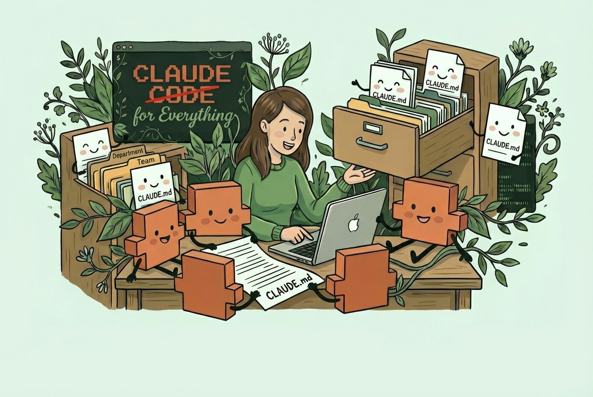
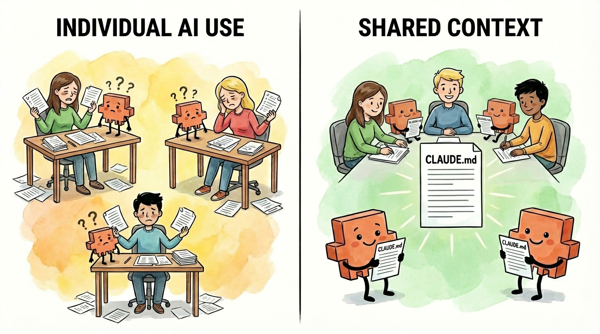
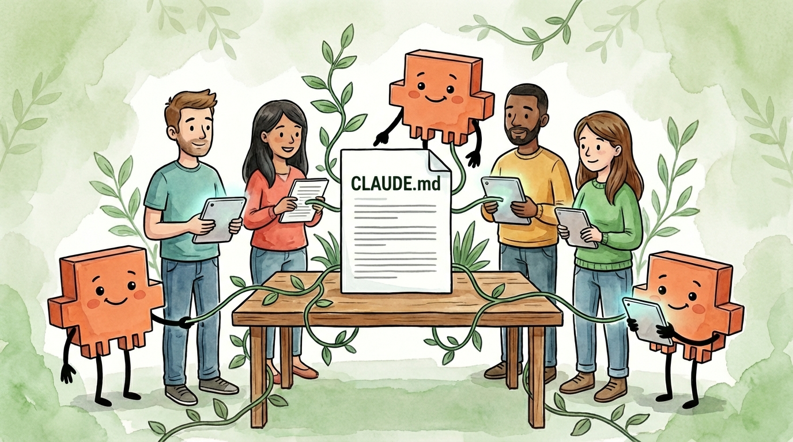
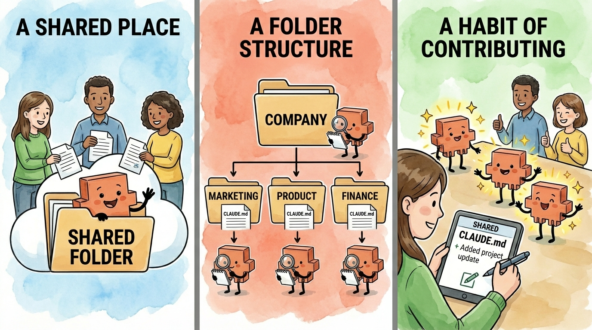

# The One File That Can Save Your Team Thousands of Hours (really!)

### How shared context files turn individual AI use into team intelligence

_Shared AI context files (like CLAUDE.md or AGENTS.md) eliminate the thousands of hours teams waste re-explaining company context to AI tools each year. By organizing instruction files in shared folders that mirror a company's structure, every team member's AI session loads the right context automatically, and every correction one person makes compounds across the entire team._

Imagine paying three full-time employees to do nothing but re-explain your company to an AI that forgets everything overnight. That's what's happening right now at most organizations. Keep reading to see how that happens.

Today's guest, [Hannah Stulberg](https://open.substack.com/users/4630983-hannah-stulberg?utm_source=mentions), is a product manager at DoorDash and author of _[In the Weeds](https://hannahstulberg.substack.com/?utm_source=mention&utm_content=writes)_, a newsletter on practical AI workflows for non-technical professionals. She started her career in Google's Associate Product Manager program, working on Google Maps and YouTube, before joining early-stage startups. She also writes an amazing series called [Claude Code for Everything](http://hannahstulberg.substack.com/s/claude-code-for-everything) about using AI coding tools for work and life - no coding required.

Here's [Hannah Stulberg](https://open.substack.com/users/4630983-hannah-stulberg?utm_source=mentions)!

## **Shared AI Context: How One Change Saves Teams Thousands of Hours**

_How shared context files turn individual AI use into a company-wide advantage_

Right now, most teams using AI at work are doing it the same way: individually. Everyone's got their own setup, their own prompts, their own way of explaining the same company context to ChatGPT or Claude or whatever tool they're using. Every session starts from scratch. Every person re-explains the business context, the competitive landscape, the project goals, the decisions that have already been made.

Now do the math. Say each person spends just 5 minutes per session re-explaining context, and they start 3 AI sessions a day. That's 15 minutes per person, per day, spent on setup instead of output. Across a team of 100 people, that's 25 hours a day - over 6,000 hours a year. That's the equivalent of 3 full-time employees doing nothing but re-explaining your company context to an AI agent that keeps forgetting. And 5 minutes is generous - in reality, good context means explaining your:

- Company context (mission, values, how you work)

- Team context (who's involved, what you're responsible for)

- Role context (your function, your expertise, your preferences)

- Project context (goals, decisions made, current status)

The actual time employees at your company spend re-explaining context to AI is almost certainly much higher than 6,000 hours per year. You're probably spending the equivalent of several full-time employees just on providing context to AI agents - and that number only grows as your team adopts AI more.

**There's a better way. And the most forward-thinking teams have already figured it out.**

It starts with one shift: moving your team from web-based AI tools (like ChatGPT or claude.ai) to folder-based AI tools like [Claude Code](https://code.claude.com/docs/en/overview), [Claude Cowork](https://claude.com/product/cowork), [Cursor](https://www.cursor.com/), or [Antigravity](https://antigravity.google/). The difference matters. Web-based AI tools start every conversation blank - no memory of your company, your projects, or your preferences. Folder-based AI tools work directly with the files and folders on your computer (or your team's shared drive), which means they can read instruction files that tell the AI agent who you are and how you work - automatically, every time. That's what makes shared context possible.

## **The Solution: Shared Context Files**

AI coding tools like [Claude Code](https://code.claude.com/docs/en/overview), [Cursor](https://www.cursor.com/), and [Antigravity](https://antigravity.google/) can read instruction files automatically at the start of every session (this also applies to [Claude Cowork](https://claude.com/product/cowork)). These are plain text files written in [markdown](https://hannahstulberg.substack.com/i/184061644/what-is-markdown) (a simple formatting language - think of it as a text document with some basic structure) that tell the AI agent who you are, what you're working on, and how you like things done.

In Anthropic's ecosystem, these are called CLAUDE.md files - the name tells you what they are: files written _for_ Claude, _in_ markdown format. Other tools have their own versions - Cursor uses AGENTS.md, for example.

The concept is the same: _**instead of re-explaining your context every time you start a conversation, the AI agent shows up already knowing it.**_

Think of CLAUDE.md and AGENTS.md as onboarding documents for your AI agent. Not the kind it reads once and forgets - the kind it reads every single morning before starting work. Your brand guidelines, your tone of voice, your project goals, your team's decisions. All loaded automatically, every time. (For a full deep dive on how these files work and how to write them, see my [in-depth CLAUDE.md guide](https://hannahstulberg.substack.com/p/claude-code-for-everything-the-best-personal-assistant-remembers-everything-about-you). If you're brand new to Claude Code, my [first article](https://hannahstulberg.substack.com/p/claude-code-for-everything-finally) covers setup and installation.)

And here's what makes them powerful for teams: these files are organized by folder. Each folder can have its own instruction file, and they stack - deeper folders layer more specific context on top of the general stuff. So your company-level context loads first, then your department context, then your project context. The right information for the right work, automatically. That also means you can set company-level context once and every employee's AI agent loads it - your mission, your values, how you communicate, what tools you use. Set it once, and it applies everywhere.

## **Why Sharing Context Makes Your Whole Team Better**

Some people at your company are likely already using these files individually. They set up their own, they refine them over time, and the AI agent gets better at working with _that particular employee_. That's already a big improvement over that employee starting every session from zero - they're no longer wasting time on setup.

But when a team shares context files, something more powerful happens: **knowledge compounds.**

Say your marketing team works out of a shared Marketing folder. The shared instruction file has your brand guidelines, your target audience, your tone of voice. Everyone on the team - whether they're drafting a campaign email, writing ad copy, or building a landing page - starts every AI session with the same shared context. No one's referencing outdated docs. No one's re-explaining the brand voice. Everyone's AI agent is aligned.

And here's where it compounds: when one person on the team notices the AI agent doing something wrong - say, using the old logo guidelines - they add a correction to the shared file. Now _everyone's_ AI knows not to make that mistake. The person who added the fix benefits. But so does everyone else on the team, automatically, the next time they start a session.

This is exactly how the team at Anthropic builds Claude Code. Boris Cherny, the creator of Claude Code, [shared how his team works](https://x.com/bcherny/status/2007179840848597422):

> _"Our team shares a single CLAUDE.md for the Claude Code repo. We check it into git, and the whole team contributes multiple times a week. Anytime we see Claude do something incorrectly we add it to the CLAUDE.md, so Claude knows not to do it next time. Other teams maintain their own CLAUDE.md's. It is each team's job to keep theirs up to date."_

If Anthropic's own team is doing this, it's worth paying attention to.

## **How to Set It Up for Your Company**

You don't need a technical background to get started. My [full CLAUDE.md how-to](https://hannahstulberg.substack.com/i/187471997/the-claudemd-how-to) covers everything about writing and organizing these files - folder structure, what to include, and three methods for writing them. Here's what you need to get started:

1. **A shared place to work** where your company or team collaborates

2. **A folder structure** that mirrors how your company and teams work

3. **A habit of contributing** so the files stay useful over time

**1\. A shared place to work**

Your team needs a shared folder where everyone can access the same files. This can be:

- **Shared cloud storage** (Dropbox, Google Drive, iCloud, OneDrive): The easiest option for non-technical teams. Everyone opens their folder-based AI tool - Claude Code, Claude Cowork, Cursor, Antigravity - in the shared folder and gets the same context files automatically. (This doesn't work with web-based AI like ChatGPT or claude.ai - you need a tool that can [read files from your computer](https://hannahstulberg.substack.com/i/184061644/before-you-move-on-create-your-working-folder).) Most of these cloud storage services have version history built in, so you can see what changed and roll back if needed.

- **Git** (GitHub, GitLab): Best option for technical teams. Built-in version control, the ability to review proposed changes before they go live, and a full history of who changed what and when.

The key is making sure changes don't get lost or overwritten. With cloud storage, you'll want a simple approval workflow - even something as basic as "propose changes in Slack, one person reviews and updates the file." You don't want unapproved edits slipping into the files everyone's AI agent is reading.

**2\. A folder structure that mirrors how your company and teams work**

Your folders control what context the AI agent loads. Structure them around how your company is actually organized - departments, teams, and projects:

Each level gets more specific. The company-wide file covers context everyone needs - your mission, your values, how decisions get made. Department folders cover shared context across teams (like brand guidelines for all of Marketing). Team folders get more specific (the Content Marketing team's editorial calendar, the Growth Marketing team's attribution model). And project folders cover what you're actively working on right now.

When someone on the Content Marketing team asks the AI agent to draft a Q1 campaign email, it loads the company context, the Marketing department context, the Content Marketing team context, and the Q1 campaign context - all automatically, without anyone re-explaining a thing.

**3\. A habit of contributing**

The most important part isn't the initial setup - it's the ongoing contributions. Every time someone notices the AI agent making a mistake or missing context, they propose an update to the shared file. You'll want approval processes that match each level - maybe anyone on the Content Marketing team can update their team's file, but changes to the company-wide file go through leadership review. Over time, these files become living documents that capture your organization's collective knowledge - how you work, what you've decided, and what the AI agent needs to know to get things right.

This is where the compounding really kicks in. Each update doesn't just help the person who made it - it helps everyone at that level and below, from that moment forward.

## **Start Small**

You don't need to roll this out across your entire company overnight. Start with one department or one team. Create a shared folder, write a single CLAUDE.md or AGENTS.md file together that captures the basics: what this team does, what the AI agent needs to know, and how you want it to work here. (For a step-by-step guide on writing your first file - including three methods for having Claude draft it for you - see my [CLAUDE.md guide](https://hannahstulberg.substack.com/p/claude-code-for-everything-the-best-personal-assistant-remembers-everything-about-you).)

Then use it. Notice what's missing. Update. That's the whole process. Once one team sees the benefit, it spreads naturally - other teams will want the same advantage.

The best part? Every update improves the AI agent for everyone at that level and every level below it. That's the compounding effect. And once you've experienced it, individual AI use feels like leaving value on the table.

_Want to go deeper? Check out Hannah's series on Claude Code for Everything - work and life. [Subscribe to In the Weeds](https://hannahstulberg.substack.com/) to get these guides straight to your inbox._

1. _[First article](https://hannahstulberg.substack.com/p/claude-code-for-everything-finally) covers setup and installation._

2. _[Second article](https://hannahstulberg.substack.com/p/claude-code-for-everything-how-the) covers the core workflow: plan mode, parallel sessions, and session management._

3. _[Third article](https://hannahstulberg.substack.com/p/claude-code-for-everything-why-ai) covers context management - the key to maintaining great output quality over long conversations with Claude._

4. _[Fourth article](https://hannahstulberg.substack.com/p/claude-code-for-everything-draft-in-claude-code-collaborate-in-notion) covers drafting in Claude Code and collaborating in Notion._

5. _[Fifth article](https://hannahstulberg.substack.com/p/claude-code-for-everything-the-best-personal-assistant-remembers-everything-about-you) covers CLAUDE.md files - so Claude already knows how you work before you say a word._
