# Claude Code for Everything: Your Status Line Is Empty (Let's Fix That)

### Turn the terminal into a command center

I work 8 to 12 hours a day in Claude Code. I rarely open other apps these days.

For months, I didn't have my status line set up. I'd be deep in a task and stop to ask Claude what model I was running, or what folder I was in, or how full my context was - and by the time I got the answer, I'd lost my train of thought. Or worse, I wouldn't think to check at all. I'd keep working in a session long past the point where my context was full, wondering why Claude's output was getting worse, not realizing the answer was right there if I'd just had it visible. Small interruptions, ten times a day, minimum.

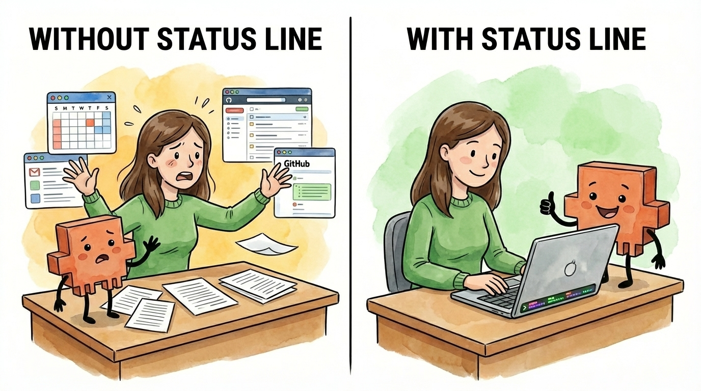

Then I set up my status line - just the basics at first, model and working directory - and the interruptions stopped. The information was just _there_. When I got deeper into [context management](https://hannahstulberg.substack.com/p/claude-code-for-everything-why-ai), I added a color-coded context bar so I could see at a glance when my context window was getting full. When I started [working in GitHub](https://hannahstulberg.substack.com/p/tool-school-github-101), I added my current branch so I'd stop accidentally committing to the wrong one. Each time I caught myself stopping to check the same thing multiple times a day, I'd add it to the status line instead.

Now, my status line is my command center. And honestly, configuring it is just fun - picking your colors, choosing what data matters to you, making the tool feel like yours. The tools you use every day should reflect how you work.

Every time I'm working with someone in Claude Code, whether it's a friend, a reader, or a coworker, I notice that their status line is empty and they're flying blind in the terminal. This article is going to change that.

## **By the end of this article, you'll have:**

A status line that keeps you oriented, focused, and in flow. Your model, your context usage, your git branch, unread emails, your next meeting, the weather, and live sports scores - anything that pulls you out of your workflow to check can instead be always visible on your status line. You'll optimize your status line to reflect how you actually work and know how to iterate on what's displayed as your workflow evolves.

# **Meet the status line**

The status line is a customizable bar at the very bottom of your Claude Code terminal. It's always visible while you work, you decide what shows up on it, and it's one of the features that's only available in the Claude Code Command Line Interface CLI - not the VS Code or Cursor extensions. (This is one of the reasons I recommend working directly in the terminal, which I cover in [the first article](https://hannahstulberg.substack.com/i/184061644/step-3-install-claude-code).)

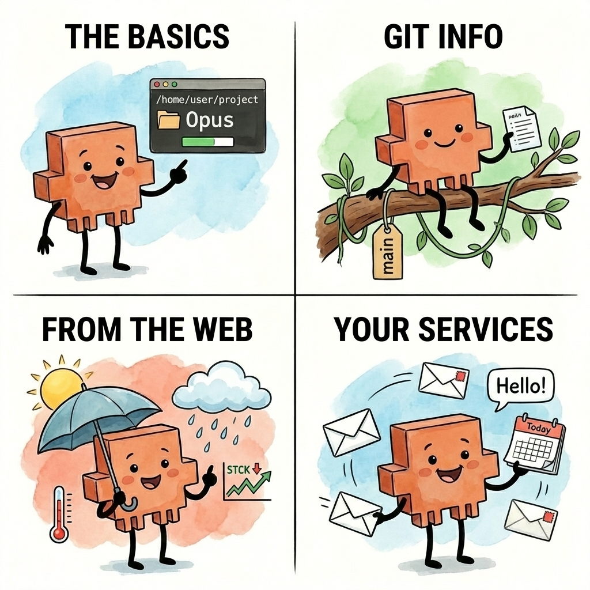

Before we set yours up, here's a quick status line 101: why it matters, what you can put on it, and how it can pull in data from way beyond Claude Code.

## **Every check breaks your flow**

When you're deep in a task, the last thing you want is to stop and ask Claude what branch you're on, how full your context is, or what model you're running. Every time you do, you break your focus - and then you have to spend a minute remembering where you left off. Your status line keeps all of that visible at a glance, so you never have to interrupt yourself to check.

But staying oriented is just the beginning. Your status line can also replace the tabs and apps you keep switching to throughout the day - your inbox, your calendar, or your pull requests. Instead of opening a browser, checking one thing, then getting pulled into another and losing five minutes, you just glance at the bottom of your terminal. Everything you need is right there, without breaking your flow.

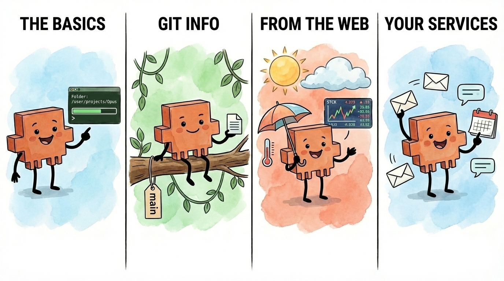

## **What you can put on your status line**

Here's the full menu, from essential to extra.

**The basics:**

- _Your current folder:_ So you always know where you're working

- _Which model you're using:_ Opus, Sonnet, or Haiku

- _Context usage:_ How full your context window is ( [output quality drops as it fills up](https://hannahstulberg.substack.com/i/185143249/2-context-window))

- _Session cost:_ If you're on API billing and want to keep an eye on spend

**Git info:**

- _Which branch you're on:_ So you don't accidentally commit to the wrong one

- _Number of uncommitted files:_ A quick reminder of what's changed

**Anything else you want to keep an eye on:**

- Unread emails

- Current weather

- Your next calendar event

- Open pull requests on GitHub

- Really, anything - if you can describe what you want to see, Claude can usually put it on your status line

That last category is the key. The status line can display any data that Claude can access - which means you can turn it into a dashboard for whatever matters most to you.

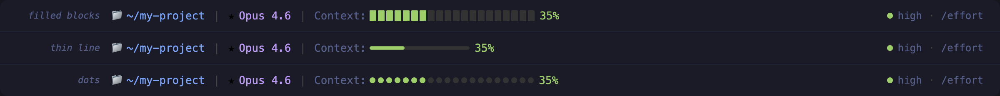

## **Where the data comes from**

When you tell Claude you want something on your status line - say, your next calendar event - Claude figures out how to get that data. Here's where your status line can pull information from:

- **The web:** Current weather, for example - Claude can pull that from a weather service without you installing or connecting anything.

- **Command-line tools you have installed:** Tools like the GitHub CLI (gh). If you've already installed a tool and logged in, your status line can use it.

- **Services you've connected via an API or MCP:** If you've set up an [MCP connection](https://hannahstulberg.substack.com/i/184213725/how-claude-code-talks-to-notion) to a service like Google Workspace or Slack, your status line can pull data like unread emails, calendar events, or messages. And if there's no MCP available for a service you want to connect to but the service has APIs, you can use those APIs directly - things like Jira ticket counts or Salesforce pipeline updates.

The good news is that Claude handles all of this for you. When you tell Claude what you want to see, Claude picks the best way to get it and walks you through any setup needed.

I recommend starting with the basics - model, context usage, maybe a git branch - and adding more information over time as you notice what keeps pulling you out of your workflow. In the next section, I'll walk you through configuring your status line with examples of how to pull in each type of data we just covered.

# **Build your status line**

We're going to build your status line in two parts:

1. **The basics:** Your core dashboard - folder, model, context usage, and cost - plus choosing your visual style.

2. **External data sources:** Pulling in unread emails, upcoming meetings, git info, and more.

_Before we start:_ your status line configuration lives in `~/.claude/settings.json` \- a global file, so your status line looks the same across all your projects. How Claude sets up that configuration differs by platform.

**Mac and Linux:** Claude writes your status line as an inline command in settings.json. Every time you make changes, you need to restart Claude Code for them to take effect (type `exit`, then `claude`).

**Windows:** Inline commands in `settings.json` often break on Windows because Windows shells handle certain characters differently - commands that work perfectly on Mac fail silently. The fix: tell Claude to write your status line as a Node.js script file instead. Node.js is already installed (Claude Code runs on it), so there's nothing new to set up. And because your config always points to the same script file, changes take effect automatically within a few seconds - no restart needed. _Every sample prompt in this article is written for Mac/Linux._ To adapt them, just tell Claude to use a Node.js script at `~/.claude/statusline.js` \- the rest of the prompt stays identical.

Here's what the difference looks like:

**Mac/Linux:**

> _"Set up my status line to show my current folder and which model I'm using."_

**Windows:**

> _"Set up my status line **as a Node.js script at ~/.claude/statusline.js** to show my current folder and which model I'm using."_

The prompts throughout this article are set up so that Claude will test and show you the output in chat, so you can iterate before committing to anything.

## **Part 1: Your core dashboard**

### **Folder and model**

Let's start with one prompt and instant payoff. This sets up your status line with two essentials: your current folder and which model you're running. Your folder tells you which project you're in at a glance - Claude Code works inside whatever folder you open it in (covered in [the installation guide](https://hannahstulberg.substack.com/i/184061644/opening-your-project)).

Without labels:

> _"Set up my status line to show my current folder and which model I'm using. Test it and show me how it looks."_

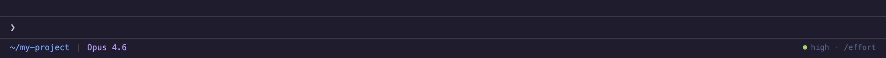

With labels - easier to scan at a glance, especially as you add more segments:

> _"Set up my status line to show my current folder and which model I'm using (labeled 'Model'). Test it and show me how it looks."_

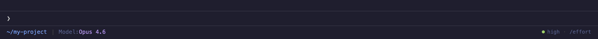

You can add labels to anything on your status line. Just tell Claude what labels you want.

**Icons:** You can also add icons to any segment. Two options:

- **Emoji:** Colorful and expressive (like a folder, money bag, or sun). Browse the [full emoji list](https://emojipedia.org/).

- **Unicode symbols:** Minimal and clean (like a star, checkmark, or lightning bolt). Browse [Unicode symbols](https://symbl.cc/en/unicode-table/).

Both work in the status line - it's a visual preference. You can also just describe what you want ("add an envelope icon next to my email count") and let Claude pick one.

With icons:

> _"Set up my status line to show my current folder with a folder emoji and which model I'm using with a star Unicode symbol. Test it and show me how it looks."_

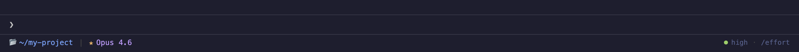

**A note on the prompts in this article:** Every prompt from here on includes a label and an icon so you can see how they look in practice. Neither is required - leave them out if you prefer a cleaner look or swap in your own.

### **Make it look good**

Now that you have data on your status line, let's talk about how it looks. There are two visual styles - same data either way, purely cosmetic.

**Plain text with pipes:** Clean, simple, works out of the box. Sections separated by \| characters with colors. This is the default, and it's what you're seeing right now.

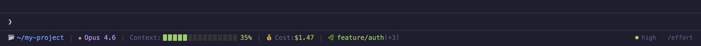

**Powerline:** Segmented colored blocks with arrow-shaped separators. Looks polished but requires installing a Nerd Font.

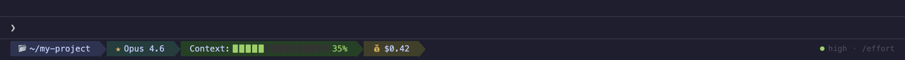

If you want the powerline look, you'll need to install a Nerd Font first. Nerd Fonts are regular coding fonts patched with extra symbols - the arrow-shaped separators that make powerline look polished. I'd recommend JetBrains Mono Nerd Font.

1. Download [JetBrains Mono Nerd Font](https://www.nerdfonts.com/font-downloads) (or any Nerd Font you like)

2. Install the font on your system (on Mac, double-click the downloaded `.ttf` files or on Windows, right-click and select **Install**)

3. Then tell Claude:

> _"Update my status line to use powerline style with segmented colored blocks. I've installed JetBrains Mono Nerd Font - help me set it as my terminal font. Test it and show me how it looks."_

**Colors:** Everything is color-customizable. You can describe what you want ("softer green," "muted blue") or use the [256-color cheat sheet](https://www.ditig.com/256-colors-cheat-sheet) for precision. I've found that picking a number from the cheat sheet is faster than trying to describe the exact shade you're after.

### **The one I'd call essential**

This is the context progress bar.

If you've read the context management article, you know that [output quality degrades as your context fills up](https://hannahstulberg.substack.com/i/185143249/context-101) and that you want to [compact manually before Claude does it for you](https://hannahstulberg.substack.com/i/185143249/2-manual-compaction-you-decide-what-claude-carries-forward). The problem is that you have no way to see how full your context is unless you stop what you're doing and ask Claude. A color-coded progress bar changes that - you glance down, see where you stand, and manage your context effectively without ever breaking your flow. _**Green means keep going. Yellow means start wrapping up or plan a compact. Red means stop and compact now.**_

> _"Add a color-coded context window progress bar to my status line labeled 'Context' - green when I'm under 50%, yellow from 50-70%, red above 70%. Test it and show me how it looks."_

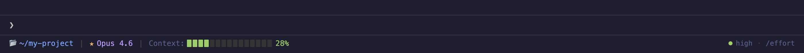

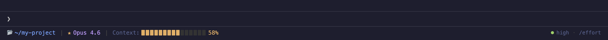

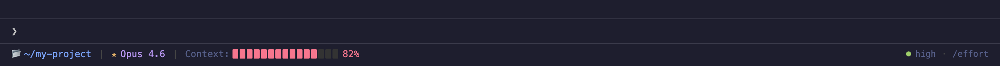

A few things you can customize on the progress bar:

- **Color thresholds:** Which percentages trigger each color. The thresholds above are what I use, but you can set your own - some people prefer a wider green zone, or a more aggressive red threshold.

- **Visual style:** Filled blocks, a thin line, dots - describe the look you want and Claude will adjust.

- **Token counts:** Show tokens sent and received alongside the percentage, if you want the raw numbers.

### **Track your spend or usage**

There are two ways to pay for Claude Code - API billing or a Max/Pro subscription - and what you'll want to track on your status line is different for each.

**If you're on API billing** \- you're paying per token, so what matters is how much the current session has cost:

> _"Add my session cost in USD to my status line with a money bag emoji, labeled 'Cost'. Test it and show me how it looks."_

**If you're on a Max or Pro plan** \- you're paying a monthly subscription, but you have rolling usage limits: a 5-hour window and a 7-day window. When you hit those limits, you get rate-limited. This puts those utilization percentages right on your status line so you can see how much of your allowance you've used at a glance.

**Mac users:**

> _"Add my Claude plan usage limits to my status line. Here's how to get the data:_
>
> _Query the endpoint https://api.anthropic.com/api/oauth/usage with a GET request. For authentication, get my OAuth token from the macOS keychain: run security find-generic-password -s 'Claude Code-credentials' -w and parse the JSON to get claudeAiOauth.accessToken. Include these headers: Authorization: Bearer <token>, anthropic-beta: oauth-2025-04-20, and Content-Type: application/json._
>
> _The response includes five\_hour.utilization and seven\_day.utilization - both are percentages from 0 to 100. Show them as color-coded bars - green under 50%, yellow 50-80%, red above 80%. Label them '5h' and '7d'. Cache the result so it only refreshes every 60 seconds, not on every status line update. Test it and show me how it looks."_

**Windows / Linux users:** (Windows users, remember to also tell Claude to update your Node.js script.)

> _"Add my Claude plan usage limits to my status line. Here's how to get the data:_
>
> _Query the endpoint https://api.anthropic.com/api/oauth/usage with a GET request. For authentication, get my OAuth token from ~/.claude/.credentials.json - parse claudeAiOauth.accessToken from that file. Include these headers: Authorization: Bearer <token>, anthropic-beta: oauth-2025-04-20, and Content-Type: application/json._
>
> _The response includes five\_hour.utilization and seven\_day.utilization - both are percentages from 0 to 100. Show them as color-coded bars - green under 50%, yellow 50-80%, red above 80%. Label them '5h' and '7d'. Cache the result so it only refreshes every 60 seconds, not on every status line update. Test it and show me how it looks."_

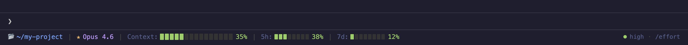

**Heads up:** The usage limits endpoint is not officially documented by Anthropic. It works today and is widely used by the community, but it could change without notice.

## **Part 2: Pull in everything else**

Everything in [Part 1](https://hannahstulberg.substack.com/i/190801933/part-1-your-core-dashboard) used data that Claude Code already has - your folder, your model, your context usage, your cost. Now we're going to pull in data from the web and services you've connected via an API, MCP, or CLI tool. This is where your status line goes from useful to indispensable.

You don't need to figure out which type of connection each piece of data requires. When you tell Claude what you want on your status line, Claude figures out how to get it and tells you if anything needs to be set up first.

Each integration below is independent. You don't need to do all of them, and you don't need to do them in order. Pick the ones that matter to you and skip the rest.

Two things that apply to all of them:

**Caching.** Your status line script runs every few seconds. That's fine for local data like your folder or git branch, but you don't want to hit a website or call an API that often. That's why the prompts below include refresh intervals (like "refreshing every 5 minutes") - this tells Claude to save the result and only fetch new data periodically. You can adjust the interval to whatever makes sense for each piece of data.

**Conditional display.** Your status line doesn't have to show everything all the time. You can tell Claude to show or hide segments based on time of day, whether something is happening, or any condition you can describe. Public transit info that only appears during your morning commute window. Sports scores that only show up when there's a game on. A countdown that disappears after the date passes. If you can describe the condition, Claude can apply it.

### **The easiest wins: data from the web**

The simplest external integrations - just pull from a website, no setup needed. These work out of the box because Claude is just checking a public website on your behalf. Here are some ideas to get you started.

**Stay comfortable:**

Weather:

> _"Add the current weather in Fahrenheit to my status line using wttr.in, refreshing every 15 minutes. Show it with a sun symbol and label it 'Weather'. Test it and show me how it looks."_

Air quality:

> _"Add the current air quality index for my location to my status line with a wind emoji, labeled 'AQI', refreshing every 30 minutes. Color-code it - green for good, yellow for moderate, red for unhealthy. Test it and show me how it looks."_

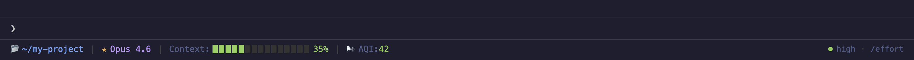

Sunrise and sunset:

> _"Add today's sunrise and sunset times to my status line with up arrow for sunrise and down arrow for sunset, refreshing every hour. Test it and show me how it looks."_

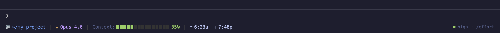

**Stay on schedule:**

Time in another timezone:

> _"Add the current time in Tokyo to my status line with a clock emoji, labeled 'Tokyo'. Test it and show me how it looks."_

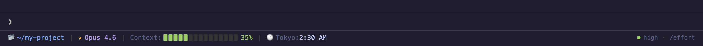

Countdown to a date:

> _"Add a countdown to March 15, 2026 on my status line with an hourglass symbol, labeled 'Launch'. Show days remaining. Test it and show me how it looks."_

Public transit:

> _"Add the next departure time for the F train at 2nd Ave to my status line with a metro emoji, labeled 'F Train', refreshing every 2 minutes. Only display it between 7:30 and 9:00 AM. Test it and show me how it looks."_

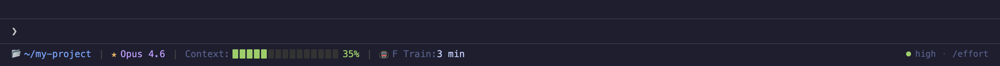

**Stay entertained:**

Stock price:

> _"Add the S&P 500 current price to my status line with a chart emoji, labeled 'S&P', refreshing every 15 minutes. Test it and show me how it looks."_

Sports scores:

> _"Add live Yankees scores to my status line with a baseball emoji, labeled 'NYY', refreshing every 5 minutes. Show the score whenever they're playing and hide it when they're not. Test it and show me how it looks."_

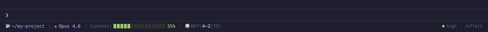

Moon phase:

> _"Add the current moon phase to my status line, labeled 'Moon', refreshing once a day. Use the matching moon phase emoji - new moon for new, waxing crescent for waxing crescent, full moon for full, etc. Test it and show me how it looks."_

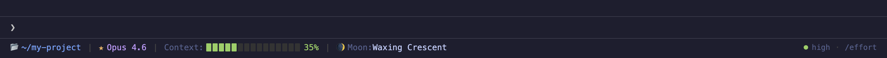

This is just a starting list. If there's something you check by opening a browser tab, there's a good chance you can put it on your status line instead.

### **Data from your tools and services**

Everything above pulls from the open web - no accounts or setup needed. The integrations below connect to tools and services you've installed or set up. Some work immediately if you already have the tool (like Git). Others require a one-time connection (like Google). Either way, the pattern is the same: tell Claude what you want to see.

#### Git and GitHub

If you use GitHub, critical GitHub information like your git branch, open pull requests, and the number of uncommitted files are super useful additions to your status line. My [GitHub 101 article](https://hannahstulberg.substack.com/p/tool-school-github-101) walks you through the full GitHub setup.

> _"Add my current git branch and number of uncommitted files to my status line with a branch emoji, labeled 'Branch'. Test it and show me how it looks."_

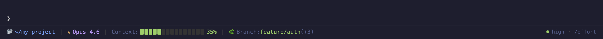

This one is especially useful if you work across multiple branches. Before this was on my status line, I'd sometimes start working and realize five minutes in that I was on the wrong branch. Now I glance down and know immediately.

> _"Add my open GitHub PR count to my status line, refreshing every 10 minutes. Show it with a merge emoji and label 'PR', and hide it when there are zero. Test it and show me how it looks."_

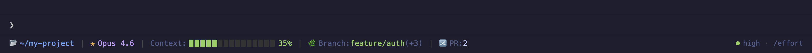

#### Connect your Google account (one-time setup)

The next two integrations - unread emails and your next calendar event - pull data from your Google account. To make that work, you need to connect Claude Code to Google Workspace through an MCP. If you've read [the Notion article](https://hannahstulberg.substack.com/p/claude-code-for-everything-draft-in-claude-code-collaborate-in-notion) in this series, it's the same concept - an MCP server that connects Claude Code to an external service. This time, it's Google instead of Notion.

It's a one-time setup. The whole process takes about 15 minutes, most of it spent clicking through Google's setup screens. Start by asking Claude:

> _"Help me set up the [Google Workspace MCP](https://github.com/taylorwilsdon/google_workspace_mcp) so I can access my Gmail and Google Calendar."_

Claude walks you through the full process. Here's the plan it lays out:

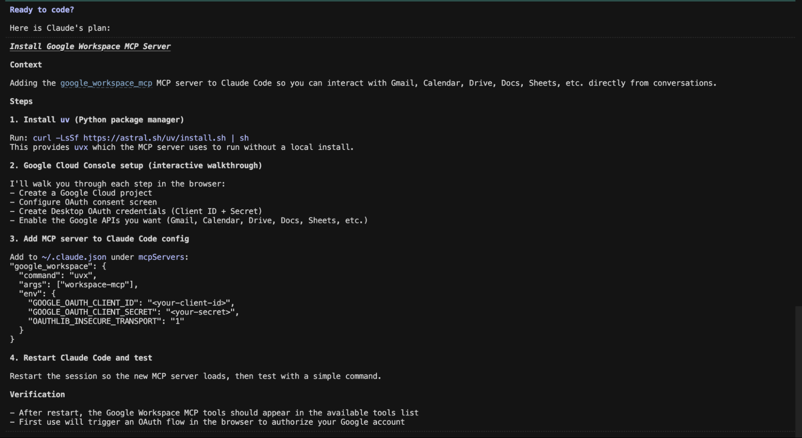

Here's what each step looks like so you know what to expect.

_Alternative:_ You can also leverage the [Google Workspace CLI](https://github.com/googleworkspace/cli) for to access data from your Google account. Both options work - use whichever you prefer.

**Step 1: Create a Google Cloud project**

Claude gives you a link to the [Google Cloud Console](https://console.cloud.google.com/). If you've never used it before, you'll see a welcome screen.

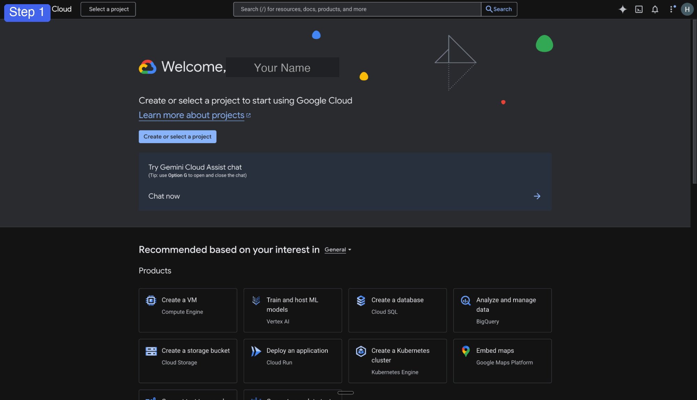

Click **Select a project** at the top of the page, then click **New project** in the upper right of the dialog that appears.

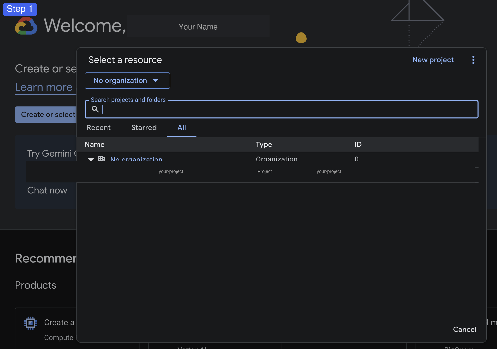

Give your project a name - something like "Google MCP Claude Code" so you remember what it's for. Leave everything else as-is and click **Create**.

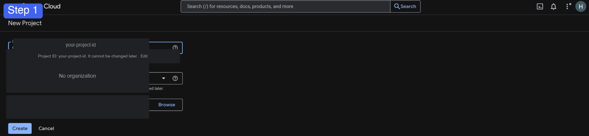

After a few seconds, you'll see a notification that your project was created. Click **Select Project** to switch to it. You'll land on the project dashboard.

**Step 2: Configure OAuth consent**

Now you need to tell Google what your app is and who can use it. In the left sidebar, find **APIs & Services** and expand it. Click **OAuth consent screen**.

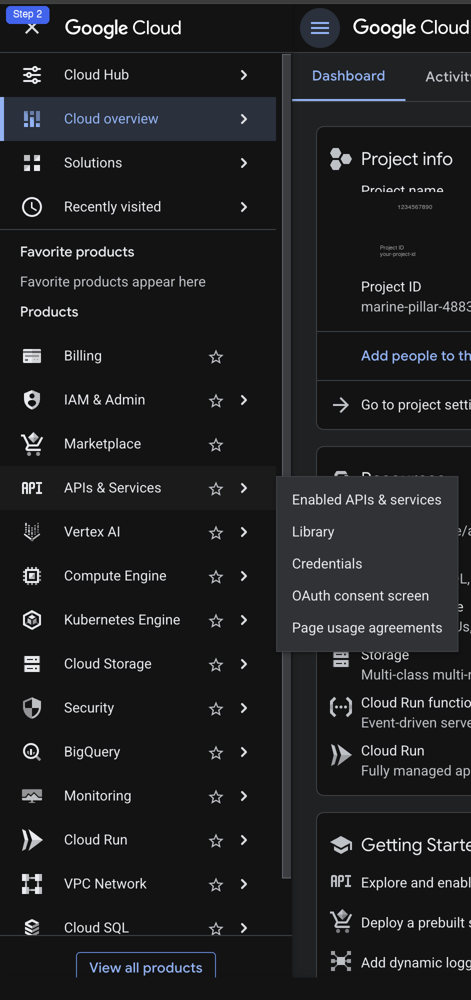

You'll see "Google Auth Platform not configured yet." Click **Get started**.

The Project Configuration wizard has four steps. For **App Information**, enter a name (like "Google MCP Claude Code") and select your email for user support. Click **Next**.

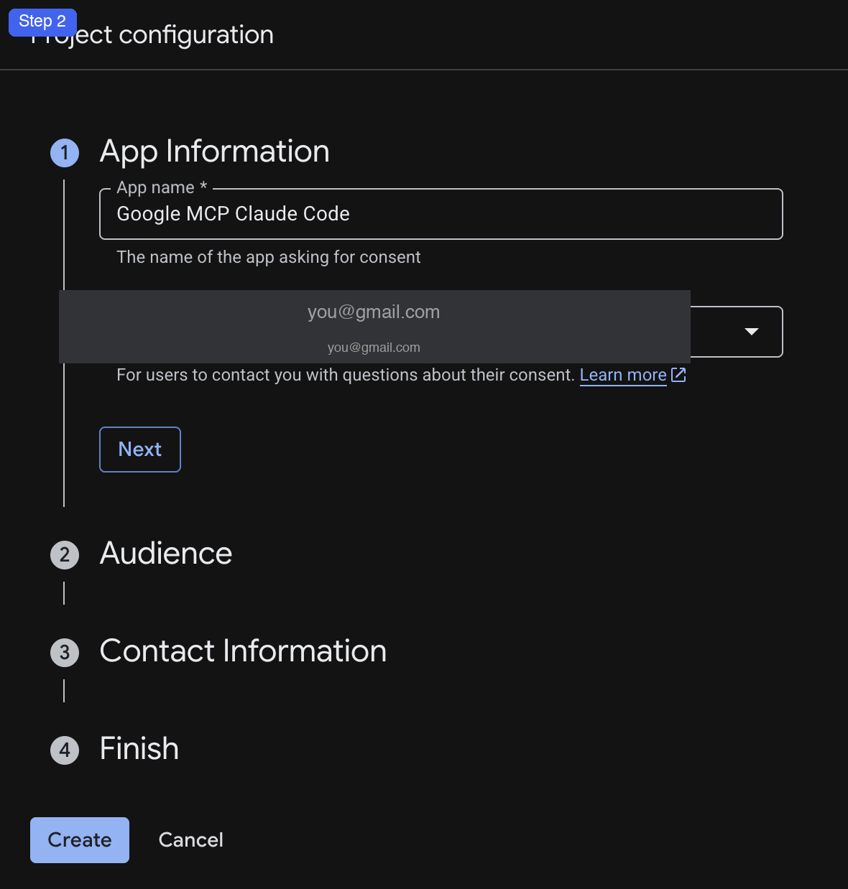

For **Audience**, leave it as "External" and click **Next**. For **Contact Information**, your email will already be filled in - click **Next** again. For **Finish**, check the box to agree to Google's terms, then click **Create**.

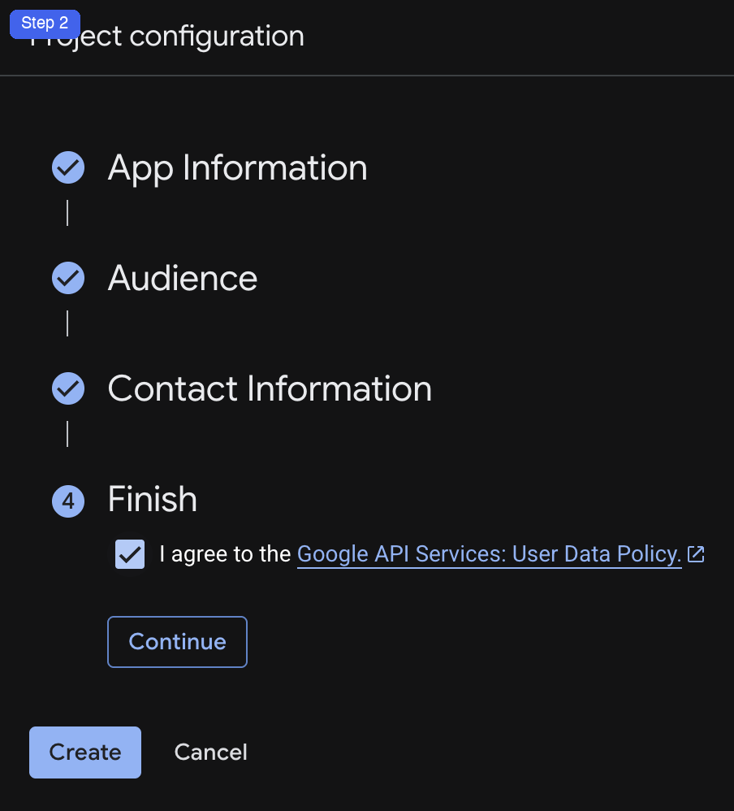

**Step 3: Create OAuth credentials**

After the consent screen is configured, you'll see the OAuth Overview page. Click **Create OAuth client**.

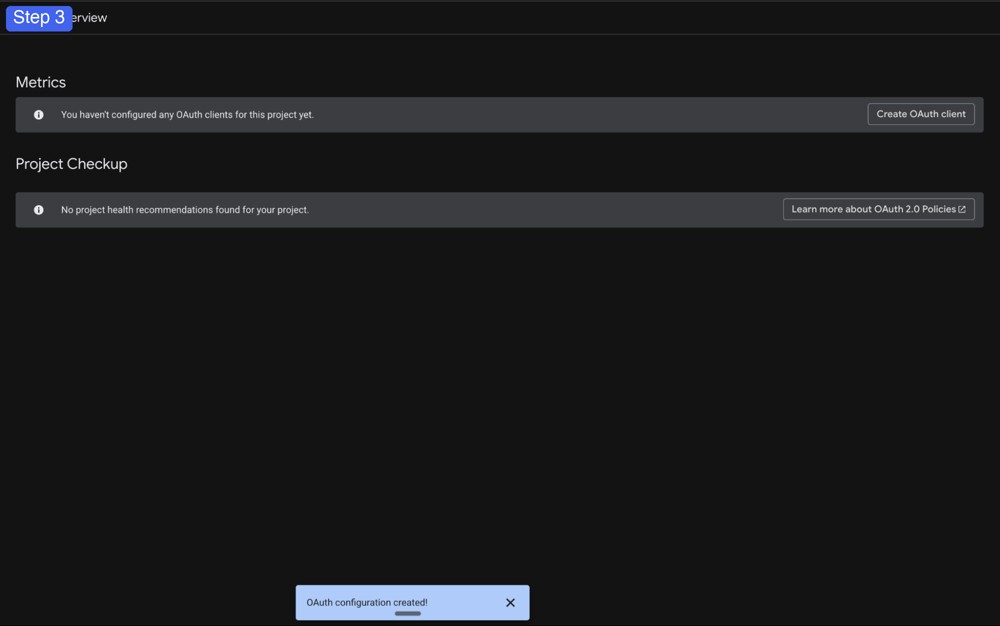

For the **Application type** dropdown, select **Desktop app** \- not "Web application." This is the type Claude Code needs.

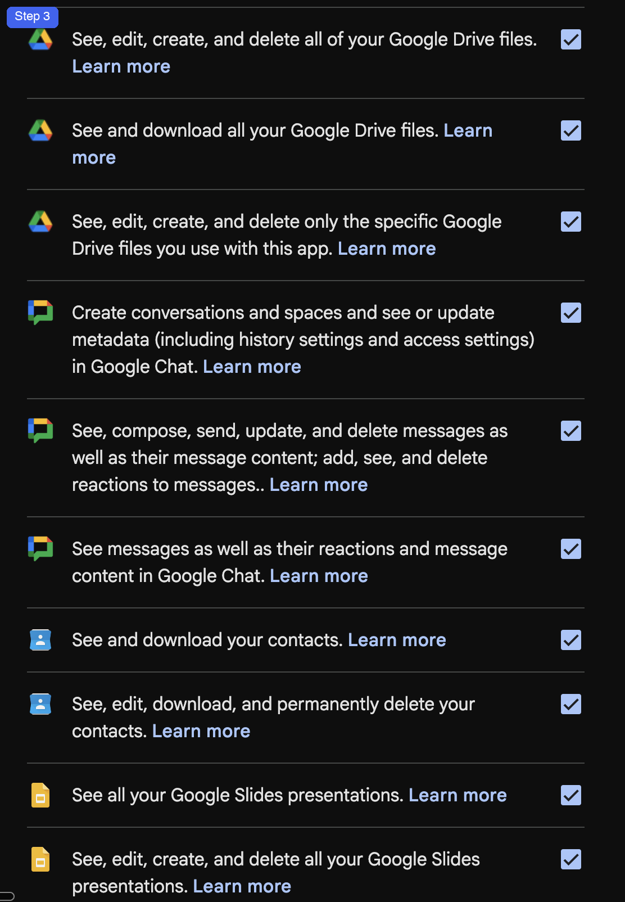

Give it a name (like "Google MCP Claude Code") and click **Create**.

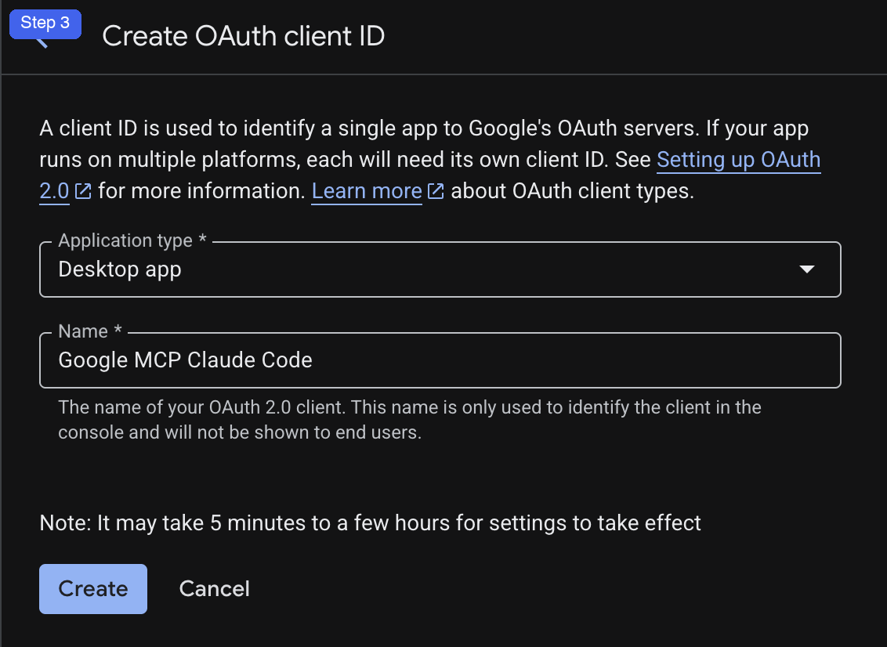

You'll see a confirmation dialog showing your **Client ID** and **Client secret**. This is the only time you'll see the client secret in this dialog - copy both values now, or click **Download JSON** to save them. You'll need these in a moment when Claude adds them to your configuration.

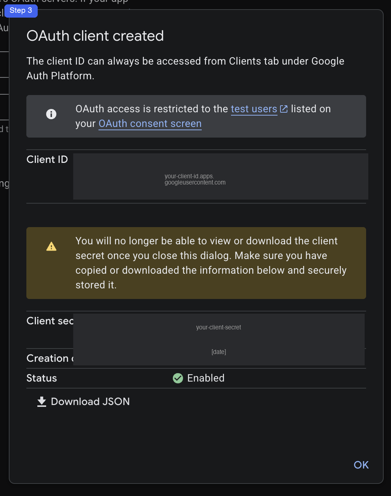

**Step 4: Add yourself as a test user**

Because your app is in "Testing" mode (which is fine - you're the only one using it), you need to add your Google account as a test user. Go to **Audience** in the left sidebar and click **\+ Add users**. Enter the Gmail address you want to connect and click **Save**.

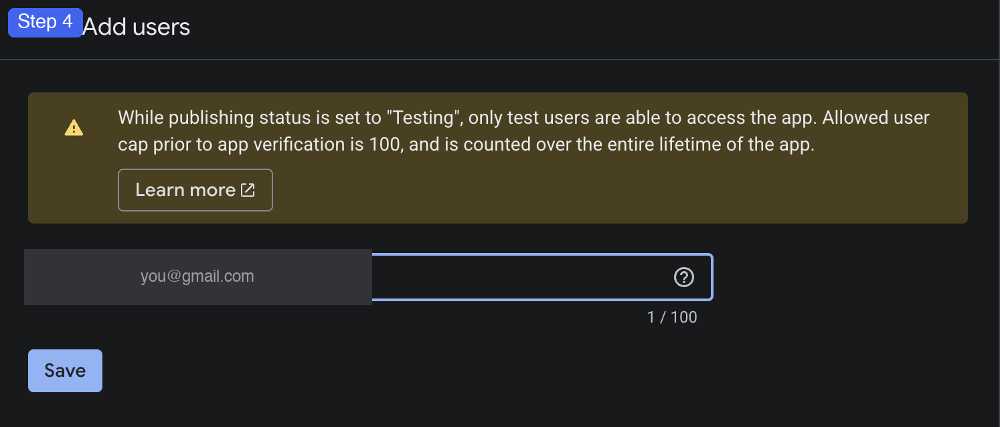

**Step 5: Enable Google APIs**

Claude will give you links to enable each API you need. Each link takes you to a page where you confirm the project and click **Enable**. You'll want to do this for Gmail, Calendar, Drive, Docs, Sheets, and Slides at minimum.

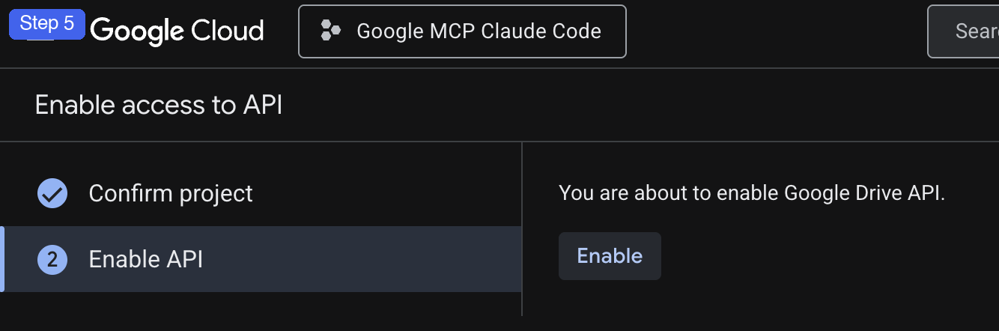

You're setting this up once, so turn everything on now even if you only need Gmail and Calendar today. You'll thank yourself later.

**Step 6: Add credentials to Claude Code**

Back in your terminal, Claude takes the Client ID and Client Secret you copied in Step 3 and adds them to your Claude Code configuration. Claude handles this part - just paste the values when asked.

**Step 7: Authenticate**

Claude gives you an authorization link. Click it, and a browser window opens with the familiar "Sign in with Google" flow.

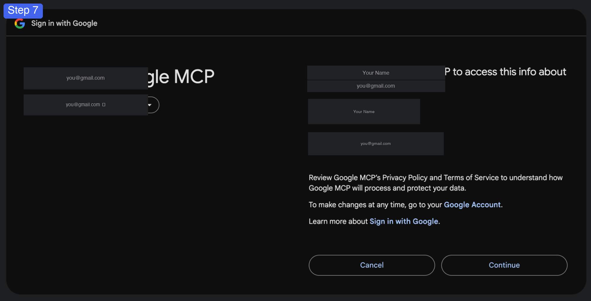

You might see a warning that says "Google hasn't verified this app." This is normal - you just created the app, so of course it isn't verified. Click **Continue** (not "Back to safety").

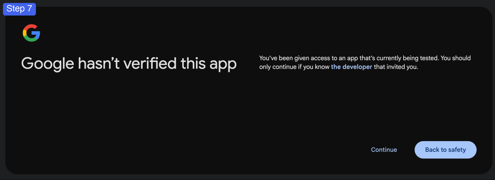

You'll see a list of permissions the app is requesting - things like reading your email, accessing your calendar, and managing your Drive files. Check the boxes and click **Continue**.

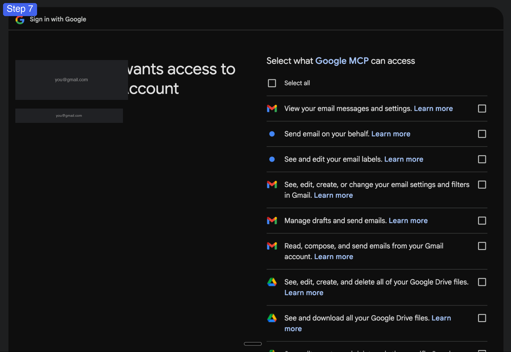

If everything worked, you'll see the success screen. You can close this browser window.

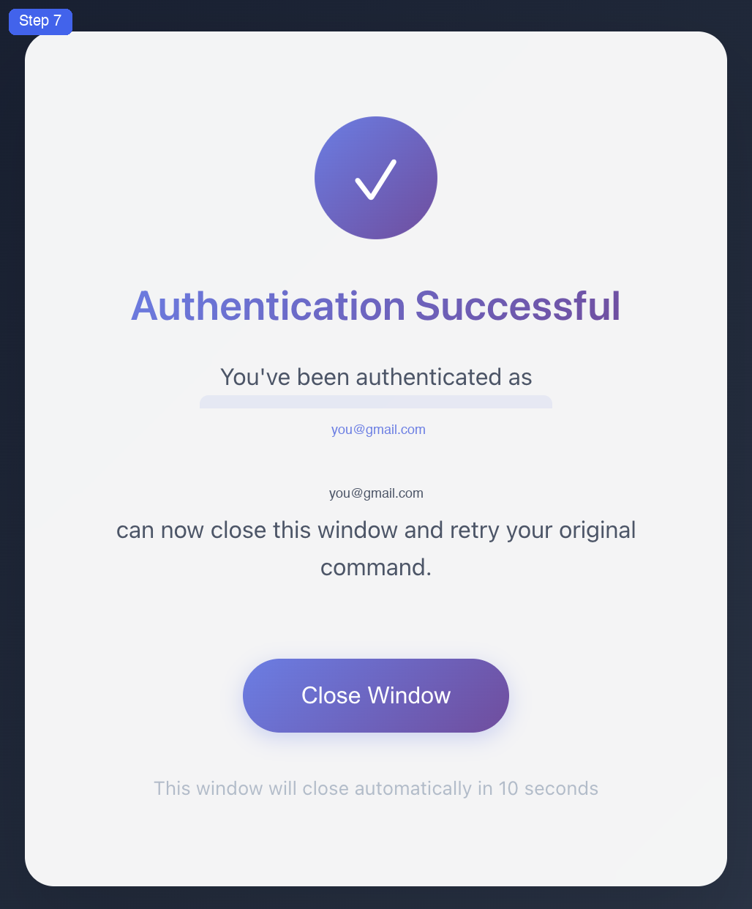

**Step 8: Restart Claude Code**

Exit and restart Claude Code (this is always required when installing a new MCP). Type `exit`, then `claude`.

That's it. Once it's done, your Google account is available to Claude Code - not just for your status line, but for anything you want to do with your email, calendar, documents, and files. I use it constantly: searching my inbox, checking my calendar, even drafting emails without leaving my terminal. We'll go much deeper into what you can do with this connection in future articles. For now, let's put it to work on your status line.

#### See your unread emails

Now that Google Workspace is connected, this just works.

> _"Add my unread Gmail count to my status line, refreshing every 5 minutes. Show it with an envelope symbol, labeled 'Mail', and hide it when there are zero unread. Test it and show me how it looks."_

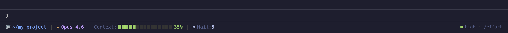

That's it. No additional setup, no new tools to install. The Google Workspace connection you just set up handles everything. The "hide it when there are zero" part is a nice touch - your status line stays clean when your inbox is clear, and the count only appears when there's something waiting for you.

#### See your next meeting

Same connection, different data. This one pulls your next upcoming event from Google Calendar and shows both what it is and how soon it starts.

> _"Add my next Google Calendar event to my status line with a calendar emoji, refreshing every 5 minutes. Show the event name and how long until it starts. Test it and show me how it looks."_

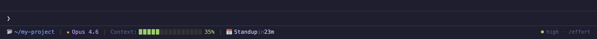

This is the one that changed how I manage my day. I used to keep a browser tab open to my calendar or set phone alarms for meetings. Now I just see it at the bottom of my terminal. When the countdown gets short, I know it's time to wrap up what I'm doing. No more "wait, when does that meeting start?" moments.

### **The world (status line) is your oyster**

These are just the examples I walked through. The possibilities don't stop here.

Want to see how many tickets are in your Linear inbox? Your Slack unread count? The number of open issues on a GitHub repo? Whether your deployment succeeded? How many days until your next vacation?

If the data is available on the web, through a CLI tool you have installed, via an MCP you've connected, or from an API you can call - you can put it on your status line. The pattern is always the same: tell Claude what you want to see, and Claude figures out how to get it. Sometimes it works immediately. Sometimes Claude needs you to install something or connect a service first. Either way, you describe the outcome and Claude handles the implementation.

_**Your status line is yours to customize for however you work.**_ Pick the data that matters to your day and arrange it the way that makes sense to you.

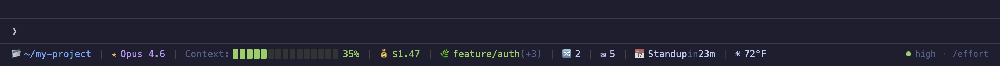

# **What you should have now**

If you've followed along, you now have a status line that keeps you oriented, focused, and in flow - configured to reflect how you actually work. And now that you know the pattern - tell Claude what you want to see, and Claude figures out how to get it - you can iterate on what's displayed as your workflow evolves.

I can't go back to working without my customized status line. The first time you glance down and see exactly what you need - without asking Claude, without switching apps, and without breaking your flow - you'll understand why.
