# Claude Code for Everything: Keeping Up with the Claude Code Treadmill (30 Claude Code Tips & Tricks)

**Subtitle:** *More tips and tricks after 1,500+ hours of use*

**Formatted Google Docs:**

- [v2 draft](https://docs.google.com/document/d/1lGxT5bBB2_Oe4vicOmYUTjaR1qXVbIOJPTAiSSYYIEU/edit)
- [v2 push 2026-04-29](https://docs.google.com/document/d/1dwQWONhgBIt1pZp_Aek2Zx_qOjl86oNh3By7ogL3q2w/edit)

---

*This is the seventh article in my series on Claude Code for Everything - work and life.*

1. *[First article](https://hannahstulberg.substack.com/p/claude-code-for-everything-finally) covers setup and installation.*
2. *[Second article](https://hannahstulberg.substack.com/p/claude-code-for-everything-how-the) covers the core workflow: plan mode, parallel sessions, and session management.*
3. *[Third article](https://hannahstulberg.substack.com/p/claude-code-for-everything-why-ai) covers context management - the key to maintaining great output quality over long conversations with Claude.*
4. *[Fourth article](https://hannahstulberg.substack.com/p/claude-code-for-everything-draft-in-claude-code-collaborate-in-notion) covers drafting in Claude Code and collaborating in Notion.*
5. *[Fifth article](https://hannahstulberg.substack.com/p/claude-code-for-everything-the-best-personal-assistant-remembers-everything-about-you) covers CLAUDE.md files - so Claude already knows how you work before you say a word.*
6. *[Sixth article](https://hannahstulberg.substack.com/p/claude-code-for-everything-your-status-line-is-empty) covers the status line - your always-visible dashboard at the bottom of your terminal.*
7. *Seventh article (this article) covers 30 more Claude Code tips - grouped by the job they help you get done.*

---

You've been using Claude Code for a while now. You've written a [CLAUDE.md file](https://hannahstulberg.substack.com/p/claude-code-for-everything-the-best-personal-assistant-remembers-everything-about-you) or two, you've set up your [status line](https://hannahstulberg.substack.com/p/claude-code-for-everything-your-status-line-is-empty), you know when to switch into [plan mode](https://hannahstulberg.substack.com/i/184381596/1-the-three-modes-and-when-to-use-each), and you work on multiple tasks at once using [parallel sessions](https://hannahstulberg.substack.com/i/184381596/2-run-parallel-sessions). You are, by most measures, a competent Claude Code user.

And yet.

> "I feel like I'm using 20% of what this tool can do."
>
> "Every time I look at Twitter or open LinkedIn, someone's doing something in Claude Code I've never even heard of."
>
> "There's got to be a better way to do this - but I don't have time to go hunt that down."

Sound familiar? The Claude Code treadmill is set to a faster pace than any single person can keep up with - except maybe [Sabastian Sawe](https://www.nbcsports.com/olympics/news/sabastian-sawe-marathon-world-record-london-two-hours), who just ran the first sub-2-hour marathon last week. Anthropic ships multiple new Claude Code features every week. The plugin, skill, and MCP ecosystems grow daily. Every content creator races to publish on each new release - usually after using the tool for 15 minutes and calling it a goldmine. Genuinely useful tips exist somewhere in that noise. You just can't tell which ones apply to your actual work without trying them yourself. And keeping up alone - reading the threads, scanning the releases, and deciding what's worth opening - can feel like a part-time job in and of itself. So you bookmark and you bookmark and you bookmark some more. What you end up with is a bookmark list a mile long, a workflow that hasn't changed, and the nagging sense that everyone else has figured out something you haven't.

You're drowning in tips. What you need is a filter.

This article is the filter. Yes, I see the irony - 30 tips is also a long list of things to try. The difference is that every one of these is something I've personally used and battle-tested across hundreds of Claude Code sessions and thousands of hours of real day-to-day work, in both my professional and personal Claude Code usage. Only the tips that outlasted the hype cycle and have genuinely improved my workflow made this list. Stop scanning Twitter for this week's latest-and-greatest and try these instead.

If you missed round one, start with [Skip the Terminal (And 8 Other Claude Code Tricks)](https://hannahstulberg.substack.com/p/skip-the-terminal-and-8-other-claude) - 9 small upgrades that will significantly improve your Claude Code quality of life. Then, come back here for the next 30 improvements.

**By the end of this article, you'll have:**

- **A Cursor setup that feels like yours:** Themes, workspaces, organized terminals, and an easier way to edit markdown files.
- **The ability to see what Claude is actually doing:** See Claude's live reasoning, watch what's filling your context window in both Claude Code and on claude.ai, and turn any GitHub repo into readable documentation in minutes.
- **Clean source material flowing into every prompt:** Google Docs, PDFs, Word files, and web pages all arriving as token-efficient markdown.
- **Claude Code connected to the web:** Three tools that let Claude see, control, and debug any webpage.
- **A visual side to Claude Code:** Flowcharts, diagrams, image edits, and HTML prototypes, all without leaving Claude.
- **Sessions that last longer and stay sharper:** Quicker typing and talking, conversations that use less of your context window, focused threads, and Claude that keeps working while you step away.
- **Claude Code wherever you are:** Mobile sessions and device handoffs that keep you working from anywhere.
- **A Claude that sounds like you:** Custom thinking verbs that earn their keep on the joy scoreboard, not the productivity one.

## Want your whole team working together in Claude Code?

This article focuses on how to get more out of individual Claude Code usage. The next step is upleveling how your whole team uses Claude Code (or other coding agents) together. I call this framework **Team OS**: a shared GitHub repo where all team members check-in their work - such as customer call summaries, metric definitions, strategy documents, and competitive research - structured so any coding agent can help any teammate with whatever they're working on. The teams that set up this system work together on a completely different level.

I walked through how my team at DoorDash uses our Team OS on Aakash Gupta's Product Growth podcast a few weeks ago. To learn more:

- 📖 [Read the deep dive](https://www.news.aakashg.com/p/claude-code-team-os) on the Product Growth newsletter
  - 💻 The full deep dive is also available as LLM-friendly markdown in the [In the Weeds learning repo](https://github.com/in-the-weeds-hannah-stulberg/substack-articles/tree/main/standalone/build-a-team-os-with-claude-code) so that Claude can help you design your own Team OS from the ground up
- 🎧 Listen on [Spotify](https://open.spotify.com/episode/76EZMxuTLXhG8MTmVGhmi1) or [YouTube](https://www.youtube.com/watch?v=0UArKLQ6bXA)
- 🧰 Check out the [example starter GitHub repo](https://github.com/in-the-weeds-hannah-stulberg/team-os-example-repo)

**Ready to build your Team OS in a hands-on workshop?** I'm teaming up with [Carl Vellotti](https://www.linkedin.com/in/carlvellotti/) (the mastermind behind [Claude Code for Product Managers](https://ccforpms.com/)) for a 3-hour live workshop where you'll walk away with a working Team OS designed around how your team actually operates. We'll cover repo architecture, CLAUDE.md files, importing context from Slack and Google Docs, and building shared skills and automations. No technical background required.

📆 **Sunday, 5/10, 10am - 1pm PT** · $200 · [Register here](https://maven.com/hannah-stulberg/how-to-build-your-teamos)

[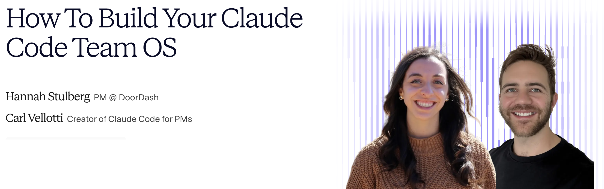](https://maven.com/hannah-stulberg/how-to-build-your-teamos)

---

## Every In the Weeds guide comes with an AI tutor

Every In the Weeds article is available as an LLM-friendly markdown file in my [In the Weeds GitHub repository](https://github.com/in-the-weeds-hannah-stulberg/substack-articles). Clone the repo, start a new session in your AI coding agent, and you have an instructor that knows every article I've written - ask questions, get answers grounded in specific sections, or have your agent read through the guides and tell you what to improve about your current setup.

The goal of this repository is to be able to access these articles where you're actually working - not in a browser tab you have to switch to, but right alongside you as you're building with Claude, Codex, Cursor, Gemini, or your agent of choice.

**If you haven't cloned the repo yet:**

1. Clone the [repo](https://github.com/in-the-weeds-hannah-stulberg/substack-articles). New to GitHub? Go from zero-to-confident with my [GitHub 101 guide](https://hannahstulberg.substack.com/p/tool-school-github-101).
2. Open the folder in Claude Code, Cursor, or your AI coding tool of choice.
3. Ask your first question.

**Already have the repo?** Open the folder in your terminal and run `git pull` to get the latest articles.

Star the repo on GitHub if you learn something new!

---

## The short version

*All 30 tips, distilled to one actionable sentence each.*

Below is the entire article in shorthand. The long version of each tip explains *why* it works, edge cases to watch out for, and installation steps. The short version is *what to do.* If a tip on this list is enough for you to act, run with it. If something's unclear or you want the depth, read on.

**Make Cursor feel like yours**

1. **Pick a Cursor theme that feels like yours:** Open the command palette (Cmd+Shift+P), type "Color Theme," browse the options, and pick whichever one you like best.
2. **Tame your terminal panel:** Rename each terminal tab to label it by purpose, drag tabs to reorder, and split the panel when you want side-by-side sessions.
3. **Read and edit markdown files more easily in Cursor:** Four options to ease the pain of reading and editing markdown files - each with pros and cons.
4. **Surface your `~/.claude/` folder in Cursor:** File → Open Folder, point at `~/.claude`, and add it to a workspace so you can edit your CLAUDE.md, commands, skills, and settings without leaving Cursor.
5. **Build a Cursor workspace for each kind of work you do:** File → Add Folder to Workspace to pin every folder you want available together (client repos, notes, side projects), then File → Save Workspace As. One Cursor window instead of cmd-tabbing between a dozen.

**See what Claude is actually doing**

6. **Toggle Ctrl+O to watch Claude work in real time:** This toggles a live stream of every file Claude opens, every tool Claude calls, and every reasoning step. Useful for both satisfying curiosity and spotting what to fix.
7. **Run `/context` to see what's filling your context window:** The output breaks usage down by category (system prompt, tools, memory files, MCPs, and messages) so you know exactly what to trim.
8. **Install claude-counter for live context usage on claude.ai:** A free Chrome extension that puts a usage bar under the prompt input on every claude.ai page, plus session and weekly usage limit tracking.
9. **Map any GitHub repo with DeepWiki:** Swap `github.com` for `deepwiki.com` in any GitHub URL and you get readable structured documentation plus auto-generated architecture diagrams.

**Give Claude cleaner source material**

10. **Install the `gws` CLI to pull Google Workspace files in as markdown:** A one-time auth setup gives Claude direct access to Google Docs, Sheets, Slides, Drive, Gmail, and Calendar without copy-pasting.
11. **Install `markitdown` to convert PDFs, Word docs, Excel, and PowerPoint into clean markdown:** Run `markitdown <file>` on anything and Claude reads markdown instead of fighting with binary formats.
12. **Install the Firecrawl MCP to pull any webpage into Claude:** Hand Claude a URL and Firecrawl returns the page as token-efficient markdown, ready to use.

**Connect Claude Code to the web**

13. **Install the Claude in Chrome extension:** So Claude can read and control any open tab. Useful when the work lives behind a login or in a SaaS app.
14. **Install the Playwright MCP:** So Claude can drive a fresh Chromium browser for tests, screenshots, and form fills, separate from your everyday Chrome session.
15. **Install the Chrome DevTools MCP:** So Claude can run performance audits, inspect network requests, and read the console on any page you're debugging.

**Use Claude for visual work**

16. **Generate images directly in Claude Code:** Use the built-in `/canvas-design` skill. Describe the diagram, poster, or visual you need and Claude saves the PNG to your project folder.
17. **Edit and batch-process existing images without leaving Claude:** Drag an image into the terminal and ask Claude to crop, watermark, label, or combine multiple files into a single PDF.
18. **Add editable Mermaid diagrams to any markdown file:** Ask Claude to write a Mermaid diagram in your markdown file and switch to the markdown preview to see a real flowchart, timeline, or sequence diagram render automatically.
19. **Spin up quick visual previews with a local HTML file:** Ask Claude to write a simple HTML file in your project folder, open it in your browser, and you have a working prototype in just a few minutes without needing to open any other tools.

**Get more out of every session**

20. **Master four built-in terminal shortcuts:** Option+arrow jumps one word, Ctrl+A and Ctrl+E jump to the start and end of a line, Option+Backspace deletes one word, and Cmd+K clears the visible terminal without touching Claude's context.
21. **Fork your session with `/branch`:** Spawn parallel sub-sessions that all inherit the context you've already built up. No rebuilding from scratch.
22. **Ask side questions with `/btw`:** So quick lookups don't pollute your main session's thread.
23. **Use Caveman mode to cut Claude's output bloat:** Tell Claude to write like a caveman (no articles, no hedging, and no filler), and you get terse responses that don't burn through your context window.
24. **Use RTK to cut Claude's input bloat:** RTK compresses long command outputs (logs, file lists, search results) before they enter Claude's context window.
25. **Talk to Claude with `/voice` (or [Wispr Flow](https://ref.wisprflow.ai/hannah-stulberg)) instead of typing:** Voice input keeps up with how you actually think and lets you brain-dump in seconds.
26. **Trigger Claude on an interval with `/loop`:** Run the same prompt every N minutes. Great for "wait for CI to pass, then merge and post to Slack" or any other watch-and-act task.

**Take Claude Code off your laptop**

27. **Use the Claude mobile app to start a cloud session from your phone:** Any task that fits in a GitHub repo can be executed from your phone while you're at a coffee shop or a doctor's waiting room.
28. **Move sessions between devices with `/teleport` and `/remote-control`:** `/teleport` pulls a cloud session down to your laptop. `/remote-control` lets you drive your laptop's running session from your phone.
29. **Text Claude from anywhere with Claude Code Channels:** Set up the Telegram or Discord plugin and you can message a running laptop session by chat.

**Just for fun**

30. **Change Claude's thinking verbs:** Append your own list to the defaults or replace them entirely.

## Make Cursor feel like yours

Cursor is my IDE of choice for Claude Code (my [previous article](https://hannahstulberg.substack.com/i/184061644/step-1-choose-and-install-your-ide) covers how to set this up) and therefore has become my home base for all work across my professional and personal life - from drafting strategy docs to researching my next vacation. While the Cursor default set-up works decently enough, software is always more enjoyable to use when it's customized to how *you* like to work.

The next 5 tips help you customize your Cursor color scheme, keep your terminals organized, more easily read markdown files, and set up workspaces that group your folders the way you actually use them:

1. **Pick a Cursor theme that's actually yours:** Three ways to change your color scheme - built-in themes, community themes from the marketplace, or a fully custom theme Claude builds for you.
2. **Tame your terminal panel:** Name, color-code, split, and rearrange your terminals so that you can actually keep track of what you're doing across those twenty parallel Claude Code sessions.
3. **Pick the right markdown editor for Cursor:** Walk through four ways to edit markdown in a formatted reading view - three Cursor extensions plus Cursor's built-in preview - and find the one that matches your workflow.
4. **Easily view your** `~/.claude/` **folder:** Keep your global skills, agents, and CLAUDE.md always visible so that you can peek at your user-level settings without breaking flow.
5. **Build custom Cursor workspaces:** See several folders or repositories in one view instead of needing to flip between eighteen different Cursor windows.

### 1. Pick a Cursor theme that's actually yours

If you're a Claude Code warrior like me, you likely spend more hours in Cursor than in any other app on your computer - more than your inbox, your calendar, and your browser. That's a lot of time to be staring at a boring, default black theme. Building with AI is genuinely fun - the tools you use to build should be too!

This tip walks through three different ways to change your Cursor color scheme - from a 30-second swap to a fully custom theme Claude designs and installs for you.

**Option 1: Browse Cursor's built-in themes (30 seconds).** From the Cursor menu in the top-left, go to Settings → Themes → Color Theme (or hit Cmd+K then Cmd+T to jump straight there). Cursor opens a dropdown with all pre-built themes - Light, Dark, Solarized, Monokai, plus a few more. Click any theme name and Cursor previews it live, then click outside the dropdown to lock in your choice. If you don't love any of the options, hit Esc to revert and move to Option 2.

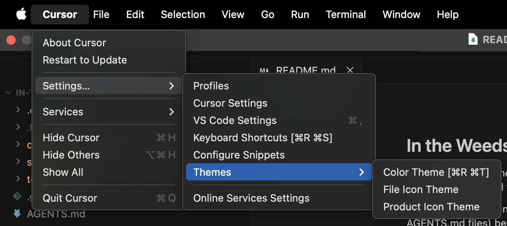

*Cursor's built-in Color Theme picker, reached from Settings → Themes → Color Theme*

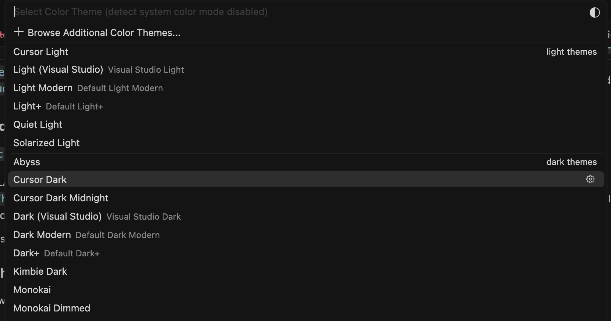

*The dropdown that opens when you click Color Theme, listing all pre-built themes grouped by light and dark*

**Option 2: Install a community theme from the marketplace (2 minutes).** Open the Extensions panel (Cmd + Shift + X), type "theme" in the search bar, and you'll see a few hundred themes built by other users. Some popular ones are **One Dark Pro** (the most-installed dark theme on the marketplace), **GitHub Theme** (clean, light, low contrast), **Dracula Official** (purple-leaning dark with a cult following), and **Night Owl** (designed for low-light coding). Click Install on any one of them, then go back to Cursor → Settings → Themes → Color Theme. The new theme will be in the dropdown alongside the built-ins. Click any theme name and Cursor previews it live, then click outside the dropdown to lock in your choice.

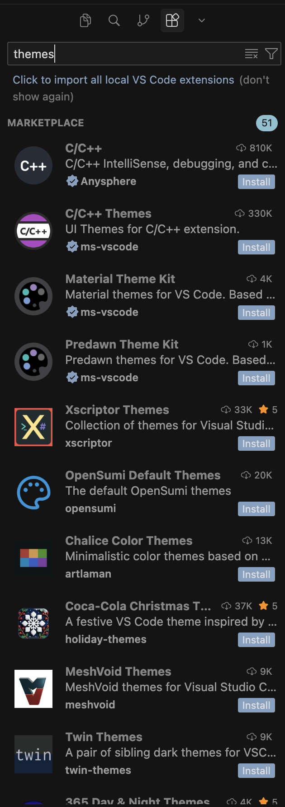

*The Extensions panel filtered for "theme," where any one you install shows up in your theme picker*

**Option 3: Have Claude build you a fully custom theme (10 minutes).** This is the fun one. Start a new Claude Code session and tell Claude exactly what you want:

> "Build me a custom Cursor color theme. I want soft pink backgrounds, deep magenta keywords, and warm cream text. Generate it as a VS Code theme extension I can install locally and walk me through installing it."

Claude scaffolds the extension, picks color tokens, writes the manifest, and tells you exactly which commands to run to install the theme in Cursor. Ten minutes later, your editor looks exactly the way you described it. Mine is pink. Yours can be whatever you want.

Take ten minutes to customize your Cursor theme before reading on! Playing around with the remaining tips in this article will be even more enjoyable when Cursor already looks the way you want.

### 2. Tame your terminal panel

You know that panicked feeling when you have 100+ Chrome tabs open and you're frantically hunting for the one article you swear you had open ten minutes ago - clicking through every single tab because the tabs have shrunk down to tiny slivers and you can't read what any of them say? Once you're running 20 parallel Claude Code sessions ([Skip the Terminal, Trick #5](https://hannahstulberg.substack.com/i/184381596/2-run-parallel-sessions)), you're doing that same hunt in your terminal panel - except worse. In Chrome, the tabs at least *have* different titles you could read if you hovered. Cursor's terminal tabs are all labeled "zsh." Identical. Hovering doesn't help. So when you know your article research session is open somewhere and you need to go looking for it, finding it means clicking through "zsh," "zsh," "zsh," and then reading the prompt history of each terminal one at a time until you spot the right one. And the next time you need to switch tasks? This painful search process starts all over again.

With just a few minutes of organization, you'll never be on the terminal hunt again. Cursor gives you six ways to organize your terminals. The first three (rename, color, and icon) help to organize your sessions so that you can spot the right one without an in-depth hunt. The last three (reorder, split, and drag) help arrange your labeled terminals so that you can work efficiently.

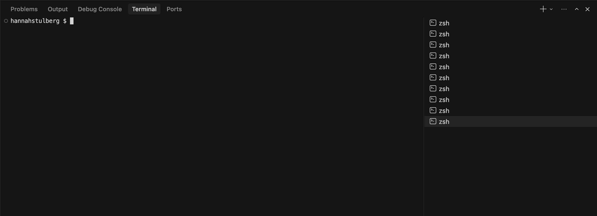

*The default terminal panel, every tab labeled "zsh" with no way to tell them apart*

**1. Rename.** Right-click any terminal tab, select Rename, and give it a name that matches the task - "Article Draft," "Strategy Doc," and "Q1 Plan." Glance at the panel and you immediately know which session is which.

**2. Color-code.** Right-click a terminal tab, select Change Color, and pick a color. *Recommended:* pick a color *system,* not random colors. Mine: green for docs, yellow for research, and blue for one-off tasks. You'll start finding terminals by color, not name.

**3. Add an icon.** Right-click and select Change Icon. Cursor opens a picker with hundreds of small symbols - pencil, wrench, sparkle, heart, and more. *Recommended:* match the icon to the work type the same way you matched the color. Pencil for docs, magnifying glass for research, chat bubble for Slack messages. No more clicking through "zsh," "zsh," "zsh" to find the right session.

**4. Drag to reorder.** Click and drag a terminal tab up or down to rearrange the order. Put your most active session at the top. Group related sessions next to each other.

**5. Split a terminal into two panes.** Click the split icon at the top of the terminal panel (or right-click the tab and select Split Terminal). The terminal splits into two panes inside the same view. Useful when you want to run a long Claude task in one pane (drafting a multi-page strategy doc, researching a competitor) and start a quick one in the other while you wait (a fast meeting summary, a Slack reply you need help phrasing, or a quick fact check). Both terminals are visible at once, letting you knock out quick tasks while waiting for the long-running work to complete.

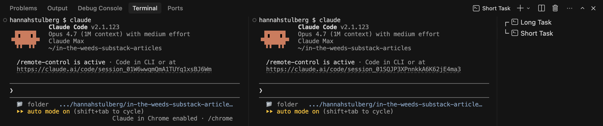

*Two terminals side by side in one split pane*

**6. Drag a terminal up into the editor area.** Click the title bar of any terminal, drag it up into the main editor area (the same space where your files open), and release. The terminal becomes a full editor pane - so you can see a Claude session side by side with the document Claude is editing, or stack two Claude sessions vertically and watch both work at once. Drag the tab back down to the terminal panel to undo.

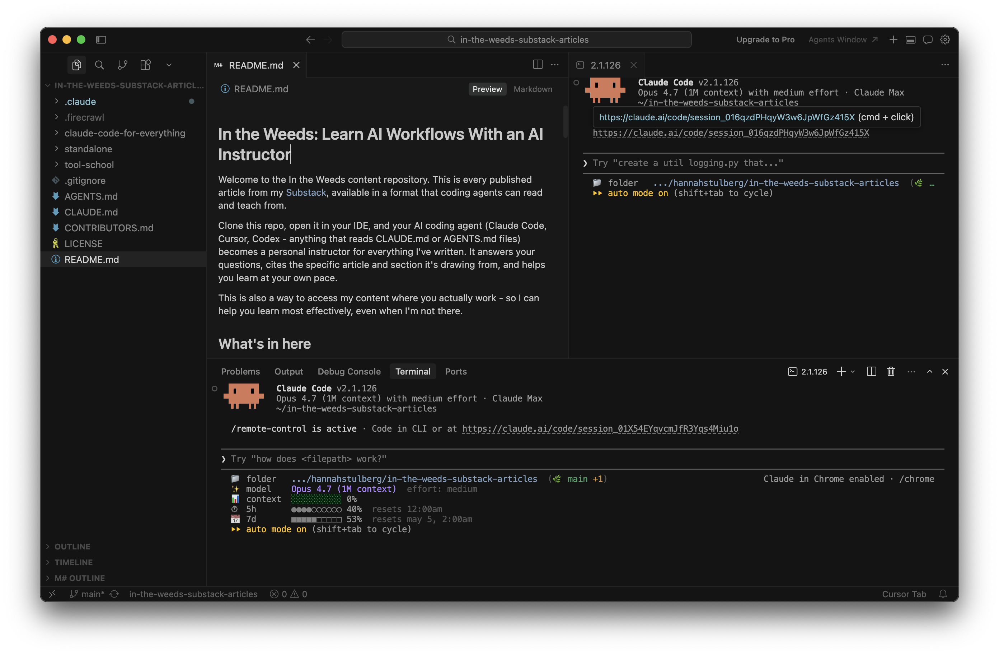

*A terminal dragged up into the editor area, side by side with a file*

When you're managing twenty sessions across twenty tasks, a panel of named, color-coded, well-arranged terminals is the difference between a system you're running and a system that's running you.

### 3. Install a markdown editor extension to work with markdown files like a Google doc

By now you know that using Claude Code [involves living in markdown](https://hannahstulberg.substack.com/i/184061644/why-does-claude-code-use-markdown) - skills, CLAUDE.md files, drafts, notes, meeting transcripts. The problem: raw markdown is hard to read. Headers cluttered with `##` symbols, bold words wrapped in `**` markers, and links spelled out as `[link text](url)` mid-sentence - trying to actually read the content with that much symbol clutter is exhausting.

Cursor's built-in fix - right-click any `.md` file and pick "Open Preview" - solves the reading half by opening a rendered version next to your file ([Skip the Terminal, Tip #1](https://hannahstulberg.substack.com/i/184381596/1-split-your-editor-markdown-on-the-left-preview-on-the-right) covers the setup). But the moment you want to fix a typo, you have to flip to raw markdown, edit, then flip back to read the result. Every flip breaks your flow and you'll do dozens when editing a document.

To enable a more focused workflow, I went looking for a markdown editor extension that enables reading and editing in Preview mode without the need to work with raw markdown syntax. Unfortunately, despite all the software advances that 2026 has given us, there is still not a perfect WYSIWYG solution that enables Google-doc-like editing of markdown files in Cursor. There are a variety of imperfect options to choose from - here's the tradeoff matrix so you can pick your poison.

**Option A: [Mark Sharp](https://marketplace.visualstudio.com/items?itemName=jonathan-yeung.mark-sharp) - the Google Docs feel, but deletes images on save.** Mark Sharp lets you edit directly in Preview. Click anywhere in the styled view and type. No flipping. Mark Sharp makes `.md` files behave like Google Docs - styled formatting you can read and edit in the same view.

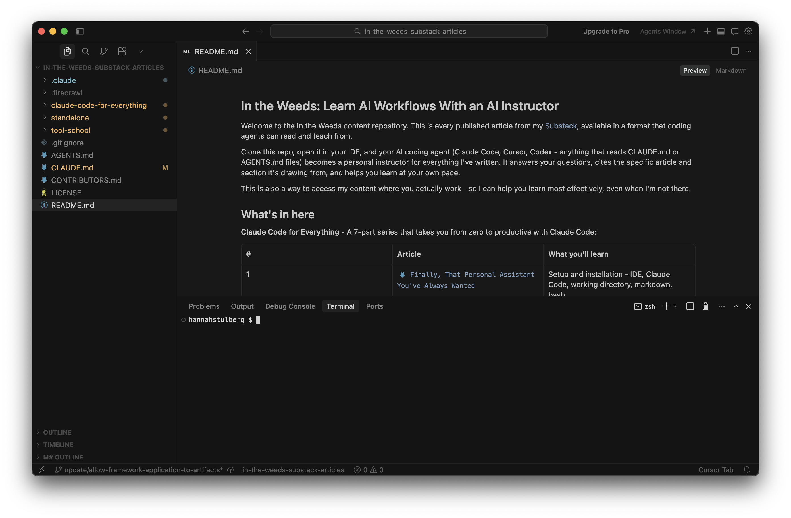

*A markdown file rendered in Mark Sharp's preview view*

**Install it.** Open Extensions (Cmd + Shift + X), paste `jonathan-yeung.mark-sharp` into the search box, and install. Open any `.md` file and you'll see the Markdown / Preview toggle at the top right.

*Mark Sharp in the Cursor Extensions panel*

**Warning:** Mark Sharp silently deletes your in-line images if you edit in Preview mode. There's been [a multi-month open issue on the Mark Sharp repo](https://github.com/jonathanyeung/mark-sharp/issues/84) regarding this problem. As long as your files don't contain images, Mark Sharp is an excellent solution.

**Option B: [Markdown Live Editor](https://marketplace.visualstudio.com/items?itemName=jishii1204.markdown-live-editor) - keeps your images, mangles your markdown file.** Markdown Live Editor gives you the same Google-Docs-style editing as Mark Sharp without deleting your in-line images upon save. The catch: every save quietly rewrites the underlying markdown into a uglier version of itself. A line you wrote as one tidy bolded sentence - `**Type your folder name in Cursor settings.**` - comes back after one save as `**Type your** **folder name** **in Cursor** **settings.**`. Same bold sentence on screen. Three times more `**` symbols crammed into the file behind it. Multiply that across every save you make, and a clean markdown file slowly turns into a thicket of stray symbols.

So if you (or Claude) ever opens the raw markdown to read or fix a typo, the source has been fragmented into something noisy. For files Claude operates on (which is most of your Claude Code workflow), this matters - you want clean markdown so Claude parses your intent reliably.

The other downside: Markdown Live Editor doesn't give you a quick toggle between Markdown and Preview the way Mark Sharp does. Every time you want the styled view, you have to right-click the file → "Open With…" → pick Markdown Live Editor. No quick flip back and forth.

**Install it.** Open Extensions (Cmd + Shift + X), paste `jishii1204.markdown-live-editor` into the search box, and install.

*Markdown Live Editor in the Cursor Extensions panel*

**Option C: [Markdown Inline Editor](https://marketplace.visualstudio.com/items?itemName=CodeSmith.markdown-inline-editor-vscode) - cleaner way to read markdown files, but no rendered images.** Markdown Inline Editor doesn't try to be Google Docs. The extension changes how Cursor *displays* your raw markdown file. The `**` around bold words turns light gray, the `##` in front of headers shrinks, and links show as just the styled link text instead of `[text](url)`. This makes the markdown view much easier to read.

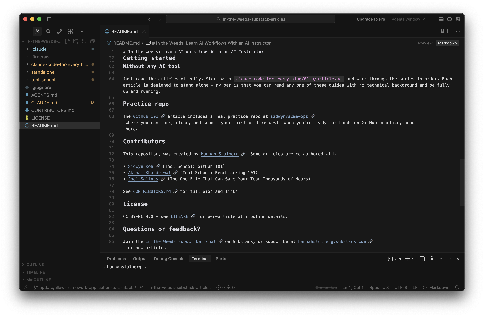

*A README.md file with Markdown Inline Editor on*

The catch: images don't render inline (you see the alt text and a broken-link icon, not the actual image). And it's not a true Google Docs experience - you still type `**bold**`, `# heading`, and `[text](url)` by hand. Decorations only fade clutter while reading. For pure prose drafts where you don't need to see images, this is the cleanest option.

**Install it.** Open Extensions (Cmd + Shift + X), paste `CodeSmith.markdown-inline-editor-vscode`, and install. Decorations activate automatically on any `.md` file in the normal text editor - no "Open With…" needed.

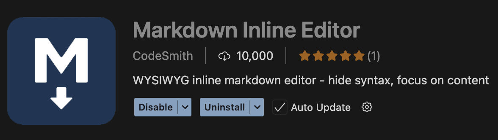

**Option D: Cursor's built-in preview.** No install needed - already part of Cursor. Hit **Cmd+K V** on any `.md` file (or right-click → "Open Preview") and Cursor opens a styled preview pane next to your raw markdown. You type on the left and watch the styled version update on the right, with images rendering in the Preview mode view. 

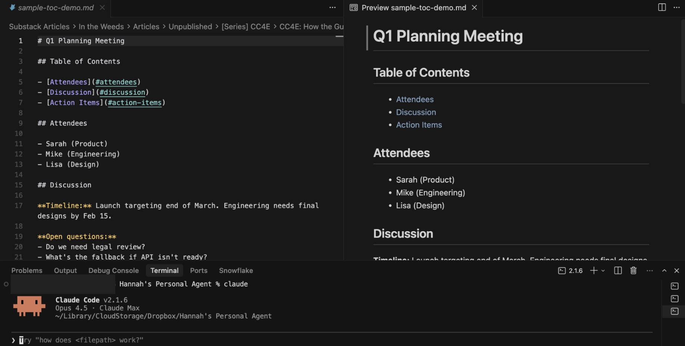

*Cursor's built-in preview pane: raw markdown on the left, styled preview on the right*

*Two catches:* you're still typing raw markdown by hand (no Google Docs feel) and the left and right sides don't always scroll together. Scroll a few hundred lines down on the raw markdown side and the preview can drift out of position, so you end upn needing to re-align them manually.

**Wait, is there a better tool somewhere else?** Yes. [Obsidian](https://obsidian.md/) handles WYSIWYG markdown beautifully - true Google Docs feel, no source-mangling, and images render perfectly. *But Obsidian doesn't have a built-in terminal.* Which means if you switched to Obsidian for editing, you'd have to keep your terminal windows open separately to run Claude Code. I've personally found this set-up challenging given the number of parallel Claude Code sessions I run at once. The whole point of using Cursor as your IDE for Claude Code is having everything in one place - your file system, terminals, and editor, all in one window. Obsidian breaks that.

**What I do today.** I haven't yet found the perfect solution here and tend to flip between a combination of all of the above options. Candidly, it's a bit of a mess. I hope that knowing the tradeoffs lets you make the choice deliberately. If you know of a better solution, *please* give a shout in the comments!

[BUTTON: comment - Leave a comment]

### 4. Make sure you can see your `~/.claude/` folder

Your `~/.claude/` folder holds your user-level skills, commands, agents, and CLAUDE.md. Claude Code has access to your user-level configuration every session, regardless of which project folder you're working in. ([my CLAUDE.md deep dive](https://hannahstulberg.substack.com/i/187471997/your-folders-control-what-claude-knows) covers how user-level config relates to project-level config.)

The problem: `~/.claude/` is hidden by default (the leading `.` makes it a hidden folder on macOS) and lives outside your project folders. Even though this folder holds critical skills, commands, agents, and your CLAUDE.md that applies to every session, it's hard to remember what's actually there because you can't see it.

**Add `~/.claude/` to your Cursor workspace.** Go to File → Add Folder to Workspace. Because `.claude` starts with a dot, the folder is hidden by default and the file picker won't show it.

- *Mac:* Once the picker opens, hit **Cmd+Shift+G** to bring up the "Go to Folder" prompt, type `~/.claude`, and hit return. The picker jumps straight to the folder; click Open. (Alternative: hit **Cmd+Shift+.** in any Finder window to toggle hidden files on permanently.)
- *Windows:* Once the picker opens, click into the address bar at the top of the dialog and type `%USERPROFILE%\.claude`, then hit Enter. Click Open. (Alternative: in File Explorer, click the **View** tab and check **Hidden items** to show all dot-folders permanently.)

Once added, the folder appears as a permanent entry in your file system, alongside your project folders.

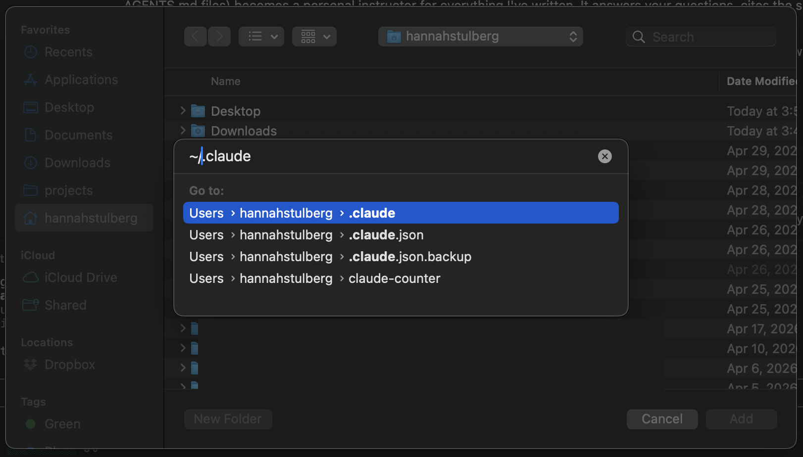

*Search for ~/.claude in the Go to Folder prompt after hitting Cmd+Shift+G*

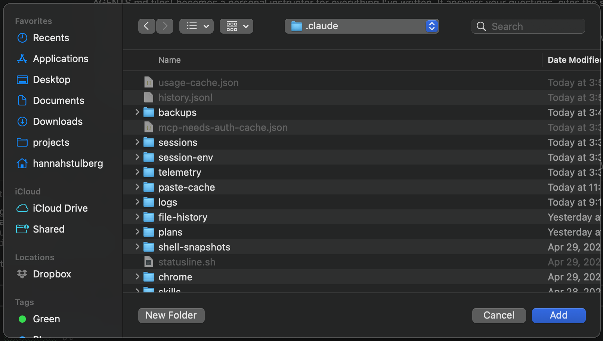

*The .claude folder, finally visible, with your user-level skills, commands, agents, and CLAUDE.md*

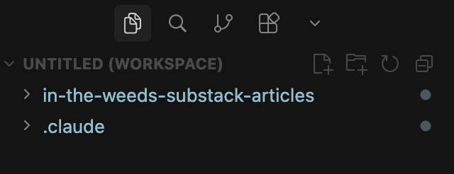

*The .claude folder pinned in your Cursor workspace alongside your project folder, always one click away*

Now you can see exactly what's there - click into any skill to remind yourself what it does or open your CLAUDE.md to read what Claude already knows about you. No more guessing what your config holds.

### 5. Build a Cursor workspace for each kind of work you do

Folder structure matters for Claude Code. Where each project lives - and what folders sit alongside it - shapes which CLAUDE.md files Claude reads on session start, which shapes the context Claude operates with ([my CLAUDE.md deep dive](https://hannahstulberg.substack.com/i/187471997/your-folders-control-what-claude-knows) covers exactly how this works). The cleanest setup is one folder per project, kept structurally separate from your other work.

In reality, you'll work across multiple projects in a given day. You might hop between two different client projects, your research notes for an upcoming launch, this week's meeting summaries, and a side project you're prototyping. Each one is its own project, with its own files and its own context, so each one belongs in its own folder. And any Git repo *has* to be its own folder - you can't nest one repo inside another, so separate coding projects are forced into separate folders ([Tool School: GitHub 101 - When Things Go Wrong](https://hannahstulberg.substack.com/i/189320562/when-things-go-wrong) covers why). So you end up with five, ten, twenty folders that should each be opened on their own. Default Cursor leaves you two bad options. Open every project in its own Cursor window and cmd-tab between a dozen of them all day. Or smush everything under one master folder so Cursor sees it all - except Git won't let you do that for code repos, and for everything else, mixing unrelated work into one folder mixes the context Claude pulls. Claude reads the CLAUDE.md hierarchy from whatever folder you launch a session in. Smush five projects together and every session loads context from all of them at once, blurring work that has nothing to do with each other. Separation of concerns matters for context management as much as it does for keeping your files organized. Neither option works.

A Cursor workspace is a saved combination of folders that open together in one Cursor window. Instead of opening a single project folder (the default) or jumping between separate Cursor windows for each project, a workspace lets you stitch any set of folders together into one view. Two client project repos, a research folder for an upcoming launch, a doc folder with this quarter's strategy memos, a meeting-notes folder that spans projects - all visible in one file system, no window-switching required to move between them. Each folder is still its own project to Claude (clean per-folder context, its own CLAUDE.md), but you see them all in one Cursor window.

**How to build a workspace.** Open Cursor. Go to File → Add Folder to Workspace and pick any folder, anywhere on your machine. Repeat for every folder you want in this combination. When you've added them all, go to File → Save Workspace As. The standard Save dialog appears - type a name (like "client-a-product" or "article-writing"), pick where on your computer to save it, and click Save. Your workspace is now saved on your machine like any other file.

**How to open it again later.** Open Cursor. Go to File → Open... and pick the saved workspace, just like you'd pick any project folder. The whole combination loads in one window - same sidebar, same setup as last time. (Even faster: double-click the saved workspace from Finder.)

Build a workspace for each of your common folder combinations. For example, I have one that combines the common code repos that I use at work alongside my [Team OS](https://www.news.aakashg.com/p/claude-code-team-os) repo, enabling me to look across five repositories in one view. Now, you'll never flip between a dozen Cursor windows again.

---

## See what Claude is actually doing

Most people treat Claude like magic. The people who get the most out of Claude are curious about how Claude works. They want to observe what Claude does so they can learn how to work better with Claude. Every time you peek inside - at what Claude is doing right now, what's filling Claude's memory, or what's inside a GitHub repo you're working with - you learn something that makes the next prompt sharper.

These next 4 tips give you four different views: what Claude is doing in real time, what's filling Claude's memory, how much usage you've spent across your Claude surfaces, and structured documentation with diagrams for any GitHub repo you want to learn from.

1. **Watch Claude think in real time with Ctrl+O:** See the live stream of files Claude is opening, tools Claude is calling, and reasoning Claude is working through.
2. **Run `/context` to see what's eating your context window:** Find out which CLAUDE.md, agent, or skill is bloating your window so you know what to trim.
3. **Track context usage on claude.ai (Claude on the web) with claude-counter:** A status line for the browser when you work with Claude outside the terminal.
4. **Map any GitHub repo in minutes with DeepWiki:** Turn any codebase into structured documentation with architecture diagrams.

### 6. Watch Claude think in real time with Ctrl+O

Ctrl+O toggles a live view of what Claude is doing. Toggle on while Claude is working and the conversation switches to a raw stream: every file Claude opens, every tool Claude calls, and every reasoning step Claude takes. Hit Ctrl+O again to switch back to the clean view.

Beyond satisfying curiosity, this is one of the best ways to learn how Claude thinks - how Claude reads files, how Claude organizes information, what confuses Claude, and what Claude prioritizes. Watching Claude work shows you the gap between what you thought you asked for and what Claude actually does. Leave Ctrl+O on while Claude works. When you spot something you don't understand - a search that came up empty, a file Claude opened that you didn't expect, or a tool call you don't recognize - pause and ask Claude to explain what just happened. Then, use Claude's guidance to adjust how and you and Claude work together - either by updating your `CLAUDE.md`, reorganizing your folder structure, iterating on your prompting strategy or other improvement strategies suggested by Claude. [Anthropic's research](https://www.anthropic.com/research/economic-index-march-2026-report) found that more experienced Claude users have a 10% higher conversation success rate than newer users - this watch-and-adjust loop is one way to help build your Claude intuition.

Ctrl+O is also the fastest way to [check the context that survived after `/compact](https://hannahstulberg.substack.com/i/185143249/how-to-compact-manually)`. When Claude compresses your conversation to free up space, you don't always know what made it through. Toggle Ctrl+O after compaction and you'll see the exact context that Claude is now operating with, so you can re-add anything important that got dropped.

### 7. Run `/context` to see what's eating your context window

Once you've [set up your status line](https://hannahstulberg.substack.com/i/190801933/the-one-id-call-essential) with the context progress bar, you'll see how much of your context window is full at any moment. When the bar climbs and you want to know *what* is filling it, type `/context` in Claude Code. You'll get a breakdown by category - system prompt, system tools, memory files, MCPs, and messages - with the exact size of each.

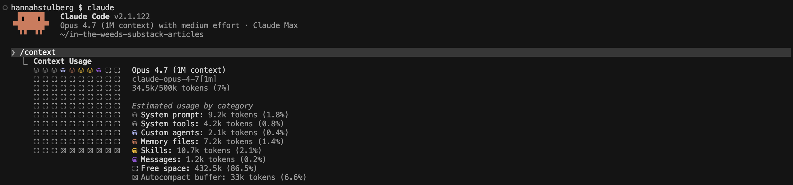

*The `/context` breakdown by category, with the size of each: system prompt, tools, memory files, MCPs, and messages*

Your CLAUDE.md files, agents, and skills can all eat into your context window. `/context` shows you exactly which category is the culprit. A CLAUDE.md file can quietly balloon to 300+ lines as you keep adding "one more thing." A single long skill can take up 10% of your context the moment it loads. Once you spot the heaviest category, ask Claude to read through the offending file and propose where it can be trimmed down. Optimizing your context usage will improve Claude's performance in long sessions and also help reduce the rate at which you hit usage limits on consumer subscription plans.

`/context` also lists every MCP, skill, agent, and plugin currently available to your session. Useful when you forget what's wired up - a quick `/context` and you can see exactly what tools Claude has at its disposal right now.

### 8. Track context usage claude.ai (Claude on the web) with claude-counter

Your [status line](https://hannahstulberg.substack.com/i/190801933/the-one-id-call-essential) shows context usage when you work in Claude Code in the terminal. [claude-counter](https://github.com/she-llac/claude-counter) is the equivalent for when you use Claude's web-based chat: a free, open-source browser extension that puts a live context usage bar under the prompt input on every claude.ai page. (It also tracks your 5-hour session and 7-day weekly limits in the same view.)

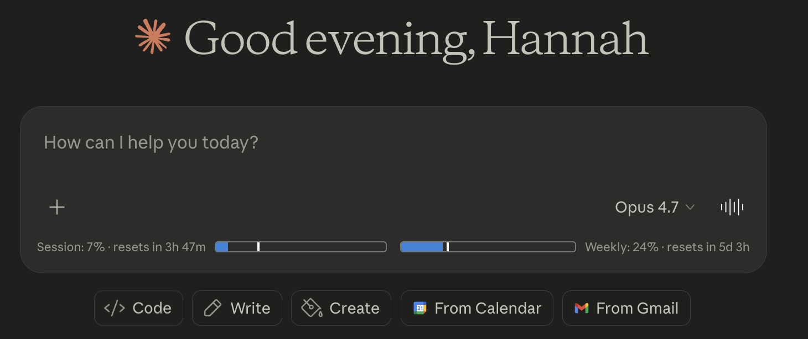

*claude-counter's session and weekly usage bars*

**Install on Chrome (or any Chromium browser):**

1. Clone the repo: `git clone https://github.com/she-llac/claude-counter ~/claude-counter`
2. Open `chrome://extensions`.
3. Toggle **Developer mode** on (top-right of the page).
4. Click **Load unpacked** and select your `~/claude-counter` folder.

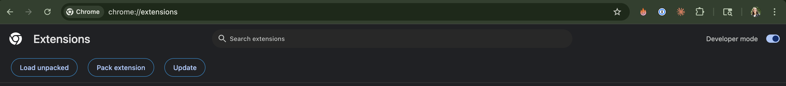

Refresh any open claude.ai tab and the bars show up under the prompt input. (Firefox: download the XPI from the [releases page](https://github.com/she-llac/claude-counter/releases) and drag it into any Firefox window.)

**One known gap: Claude Code on the web (`claude.ai/code`) isn't supported yet.** I [filed an issue](https://github.com/she-llac/claude-counter/issues/13) asking the maintainer to add support. If you'd like to see this fixed, the fastest way to help is to open that issue and react with a thumbs-up or leave a comment - the more people who weigh in, the more likely it gets prioritized.

For the Claude mobile app, I haven't found an equivalent extension or workaround. If you know one, drop a comment - I'd love to add it here.

### 9. Map any GitHub repo in minutes with DeepWiki

Sometimes someone sends you a GitHub repo and you want to understand what's actually in it. [DeepWiki](https://deepwiki.com) is the fastest way to do that. Take the GitHub URL and swap `github.com` for `deepwiki.com`. The same repo loads as structured documentation: what the project does, how the folders are organized, how the pieces talk to each other, and a generated architecture diagram.

For a real example, here's the [DeepWiki of my In the Weeds learning repo](https://deepwiki.com/in-the-weeds-hannah-stulberg/substack-articles) - the public repo with all my published articles.

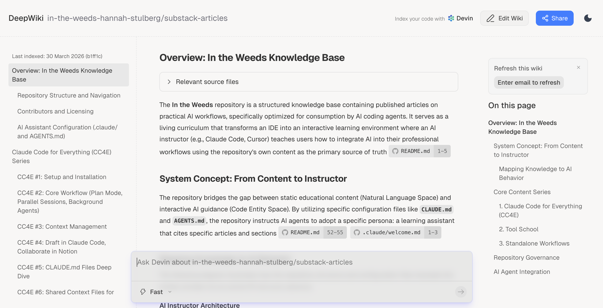

*DeepWiki's structured view of my [In the Weeds learning repo](https://github.com/in-the-weeds-hannah-stulberg/substack-articles)*

**Pair DeepWiki with Claude Code.** DeepWiki gets you oriented. Claude Code handles the questions that come up after: parts of the DeepWiki you don't understand and specific questions about how the code actually works. Two prompts that work well:

> "I just read the DeepWiki at `https://deepwiki.com/[org]/[repo]`. Can you explain [the section or term you didn't understand] in plain language?"

> "Clone `https://github.com/[org]/[repo]` and walk me through how [the feature you want to understand] actually works. The DeepWiki at `https://deepwiki.com/[org]/[repo]` has the high-level structure."

In about 20 minutes you can go from "someone linked me a repo" to actually being able to use it. Skim the DeepWiki, ask Claude the specific questions that come up, and repeat until you've got what you need.

---

## Give Claude cleaner source material

Claude's output is highly dependent on the provided context. And [the format you feed Claude that context](https://hannahstulberg.substack.com/i/184061644/why-does-claude-code-use-markdown) matters more than you'd think.

Markdown wins on token efficiency. PDFs, Word docs, Excel sheets, and PowerPoint decks carry hidden formatting codes - fonts, layouts, and styling - that Claude can't read but still take up tokens in your context window. Markdown is plain text - same content, often one-third to one-half the token count.

Markdown also wins on output quality. When you and Claude are looking at the same source material, Claude's output gets sharper. Hidden-formatting files force Claude to guess at structure - what's a header, what's a caption, or what's a footnote. Markdown spells the structure out, so what you see and what Claude sees are the same thing.

These next 3 tips help you get any source - Google Workspace files, local documents, or web pages - into Claude Code as clean markdown:

1. **Pull Google Workspace files in as markdown:** Download Docs, Slides, Forms, and Sheets manually or via the `gws` CLI.
2. **Convert PDFs, Word docs, and more with markitdown:** Microsoft's open-source tool turns almost any file type into clean markdown.
3. **Pull any webpage into Claude Code with Firecrawl:** Scrape a URL, crawl a site, map a site, or run deep research.

### 10. Pull Google Workspace files in as Markdown

Google Workspace - Docs, Slides, Forms, and Sheets - is where a lot of your pre-Claude Code era work probably lives. Getting this information into Claude Code as clean markdown is one of the biggest unlocks for providing business context to Claude.

Two ways to import: manual (good for one-off pulls) or via the [gws CLI](https://github.com/googleworkspace/cli) (good for regular use).

**Manual approach**

**Step 1: Enable markdown rendering in Google Docs.** Tools → Preferences → check "Enable Markdown." Do this once. Now Google Docs renders pasted markdown as styled text and exports docs as clean markdown downloads.

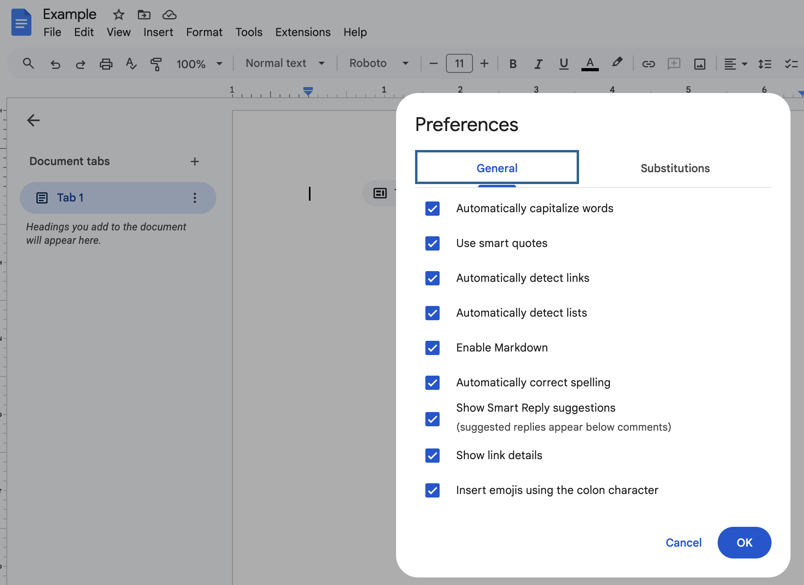

*Tools → Preferences → Enable Markdown in Google Docs*

**Step 2: Pull a Doc into Claude Code.** Open the file → File → Download → Markdown (.md). Drop the file into your project folder.

**Step 3: Paste Claude's markdown output back into a Doc.** Copy markdown from Claude Code, then in Google Docs go to Edit → Paste as Markdown. The Doc renders the markdown as styled text.

*Note: this manual approach only works for Google Docs. Sheets, Slides, and Forms don't have a markdown export option, which is why the CLI is usually the better all-purpose choice.*

**Automated approach: the gws CLI**

A CLI is one of the [main ways Claude Code can pull in external data](https://hannahstulberg.substack.com/i/190801933/where-the-data-comes-from). The [gws CLI](https://github.com/googleworkspace/cli) is Google's official open-source CLI for Google Workspace and pulls Docs, Slides, Forms, and Sheets as markdown straight from the terminal, without leaving Claude Code. Use this when you're pulling several files at once or doing regularly importing context from Google Workspace.

**Install via Claude Code.** Give Claude this prompt:

> "Install the gws CLI on my machine. The repo is at [https://github.com/googleworkspace/cli](https://github.com/googleworkspace/cli) - pick the right install path for my setup, walk me through any auth or OAuth steps required, and confirm it's working by pulling a sample Doc as markdown."

Once installed, ask Claude to pull any doc, slide, form, or sheet by URL or filename and Claude will import as markdown for you.

### 11. Convert PDFs, Word docs, and more with markitdown

*Thanks to [Carl Vellotti](https://www.linkedin.com/in/carlvellotti/) for teaching me about markitdown.*

Most of the files you want to feed Claude don't start as markdown. You've got a PDF someone emailed you, a Word doc from a colleague, a PowerPoint deck, or an Excel spreadsheet. [markitdown](https://github.com/microsoft/markitdown) is Microsoft's open-source tool that converts almost any file type into clean markdown. PDFs, Word docs (`.docx`), PowerPoints (`.pptx`), Excel files (`.xlsx`), images with text, HTML pages, even audio files with transcription.

**Install markitdown via Claude Code.** Give Claude this prompt:

> "Install markitdown on my machine. The repo is at [https://github.com/microsoft/markitdown](https://github.com/microsoft/markitdown) - pick the right install path for my setup (uv, pipx, or pip) and walk me through it."

Claude picks the install method that matches your system, runs the install, and confirms it worked.

**Convert a single file.** Drop a file into your project folder and tell Claude:

> "Convert this PDF to markdown with markitdown."

You get a clean markdown file dropped right next to the original.

**Convert multiple files in bulk.** A folder of quarterly reports, a stack of meeting PDFs, and a pile of interview transcripts in Word - markitdown can handle the whole batch in one run. Tell Claude:

> "I have a folder of quarterly reports at [path]. Use markitdown to convert every file to markdown and save the markdown files in a parallel folder."

You end up with a matching folder of markdown files ready to search, summarize, or feed into the next task.

### 12. Pull any webpage into Claude Code with Firecrawl

You want to provide Claude with a webpage's content without copy-pasting from your browser. Claude Code has a built-in WebFetch tool. But WebFetch isn't what you want here. WebFetch grabs the page, runs it through a small, fast model with whatever question you've asked, and returns the model's summary rather than the actual page content. Fine for "what's the headline of this article?" Useless when what you actually need is the full text of the webpage.

[Firecrawl](https://www.firecrawl.dev) is what you want. Instead of the summary returned by WebFetch, Firecrawl returns the actual page content as clean markdown.

Firecrawl is a CLI tool with a free tier (500 pages, one-time) and [paid plans](https://www.firecrawl.dev/pricing) starting at **Hobby ($16/month, 3,000 pages/month)** for occasional use and **Standard ($83/month, 100,000 pages/month)** for regular use.

**When to use Firecrawl.** Any time you need the actual content of a webpage, not a summary.

**Install via Claude Code.** Give Claude this prompt:

> "Install the Firecrawl CLI on my machine by running `npx -y firecrawl-cli@latest init --all --browser`. The install auto-detects my AI tools and opens a browser that walks me through creating a free Firecrawl account (or signing in if I already have one) and grabs my API key in one step. After the install finishes, walk me through restarting Claude Code and confirm Firecrawl is working by scraping a sample URL."

**What Firecrawl can do.**

- **Scrape a single URL.** "Pull this competitor's pricing page and save it to my project folder." "Grab this Wikipedia entry as markdown so I can quote from it." "Save this research source to my notes folder."
- **Crawl an entire site.** Point Firecrawl at a documentation site or a blog and get every page back as one structured set. Great for content audits, saving down API docs, or building reference material for Claude to pull from later.
- **Map a site.** Get a list of every URL on a site without pulling the page content. Useful when you want to know what's there before deciding what to scrape - for example, you can ask for a list of every blog post someone has published, then tell Claude which 5 to actually pull and read.
- **Deep research.** Give Firecrawl a research question and Firecrawl finds relevant pages itself, follows links across multiple sites, and synthesizes across all of them. Reach for this when your research needs full-text content from many sources - like building a competitive analysis from 20 product pages, or pulling exact pricing across a whole category. For lighter research where top-line facts are enough, just ask Claude to research it directly.

---

## Connect Claude Code to the web

A lot of what you do every day happens on websites, dashboards, and online apps you're signed into - not in files on your computer. Claude Code can't see any of that out of the box.

Connecting Claude Code to your browser makes a huge difference for the half of your workflow that lives outside your terminal. Once Claude can see a browser tab, you can hand off time-consuming multi-step web routines to Claude. For example, Claude can fill out inquiry forms across 10 different vendor websites, submit expense reports via your company's portal, or apply to a list of jobs across different company sites on your behalf. Being connected to your browser also allows Claude to debug web apps. For example, Claude can test a signup flow end-to-end, debug a slow page, or verify a UI change against a Figma mock.

Three tools allow Claude to access the web, each with a different sweet spot.

### 13. Install the Claude in Chrome extension

The [Claude in Chrome extension](https://chromewebstore.google.com/detail/claude/fcoeoabgfenejglbffodgkkbkcdhcgfn) is Anthropic's official browser extension for Claude Code (currently in beta - features and capabilities may evolve). The extension enables Claude to open new tabs, click buttons, fill forms, read console errors, extract structured data, and record GIFs of whatever it does. This extension lets Claude access your real Chrome session, so Claude inherits your login state on every site you're signed into - Gmail, Notion, Sheets, Google Docs, Linear, Figma, and any other site you've logged into in Chrome.

**Install:**

1. Install the [Claude in Chrome extension](https://chromewebstore.google.com/detail/claude/fcoeoabgfenejglbffodgkkbkcdhcgfn) from the Chrome Web Store. Works in Chrome and Microsoft Edge.
2. Run `claude --chrome` in your terminal to start a Claude Code session with the extension connected. Or run `/chrome` inside an existing Claude Code session.
3. Optional: to enable Chrome by default for every Claude Code session, run `/chrome` and select "Enabled by default." That way you don't have to pass `--chrome` every time.

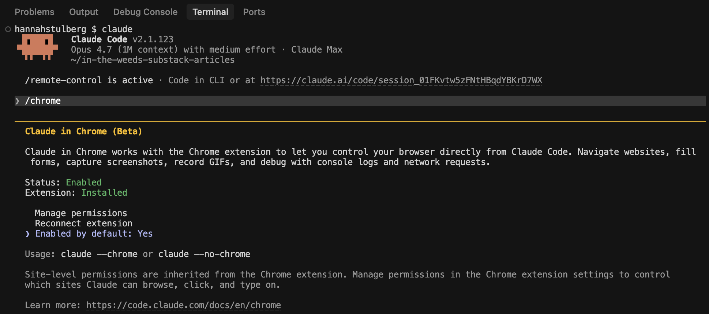

*The Claude in Chrome extension running in a Chrome window, ready to drive the browser for you*

**Example prompts:**

> "Submit the expense report I drafted in expenses.md to my company's portal at expenses.acme.com."

> "Open competitor.com/signup and click through their signup flow with throwaway test data. Tell me what's good and what's bad about the experience compared to standard signup-flow best practices."

**Working in a non-Claude coding agent?** If you're using Codex or another AI coding tool, Playwright MCP or Chrome DevTools MCP (covered in the next tips) gives any AI coding agent the same browser-control capabilities the Chrome extension gives Claude.

### 14. Install the Playwright MCP

[Playwright](https://github.com/microsoft/playwright-mcp) is Microsoft's open-source browser automation framework that supports Chromium, Firefox, and WebKit. The Playwright MCP lets Claude launch its own fresh browser, with no inherited login state and no shared cookies, then click, fill forms, take screenshots, and run multi-step flows.

**When to reach for Playwright instead of the Claude Code Chrome extension:**

- You want a clean session every time (testing a flow, scripting something repeatable).
- You need cross-browser checks (does this work in Firefox? in Safari?).
- You're using a non-Claude coding agent

**Install via Claude Code.** Give Claude this prompt:

> "Install the Playwright MCP server by running `claude mcp add playwright npx @playwright/mcp@latest`. Once it's installed, tell me to restart Claude Code. After I restart and come back, confirm Playwright is working by navigating to [https://example.com](https://example.com) and reporting the page title back to me."

**Example prompt:**

> "Open my company's signup page in a fresh browser, fill out the form with test data, submit it, and tell me where the flow breaks."

### 15. Install the Chrome DevTools MCP

[Chrome DevTools MCP](https://github.com/ChromeDevTools/chrome-devtools-mcp) is Google's official MCP server for Chrome. While the Chrome extension and Playwright MCP are built for *acting* on a webpage (clicking, typing, filling forms), Chrome DevTools MCP is built for *inspecting* what's happening under the hood. Claude gets access to the same performance traces, network request inspection, and console error logs you'd get from opening Chrome's DevTools panel yourself.

**When to reach for Chrome DevTools MCP.** When the question isn't "does this work" but "why is this slow" or "what's failing under the hood." Specific use cases:

- "Why is this dashboard taking 8 seconds to load?"
- "Show me every network request this page makes and which ones are failing."
- "Walk me through every console error on this signed-in page."

**Install:**

1. Install the MCP via Claude. Give Claude this prompt:

> "Install the Chrome DevTools MCP server by running `claude mcp add chrome-devtools -- npx chrome-devtools-mcp@latest --autoConnect --no-usage-statistics`. Once it's installed, tell me to restart Claude Code."

2. Open a new Chrome window. Paste `chrome://inspect/#remote-debugging` into the URL bar. Check the "Allow remote debugging for this browser instance" checkbox. Chrome 146+ handles this with the checkbox - no command-line flags needed.

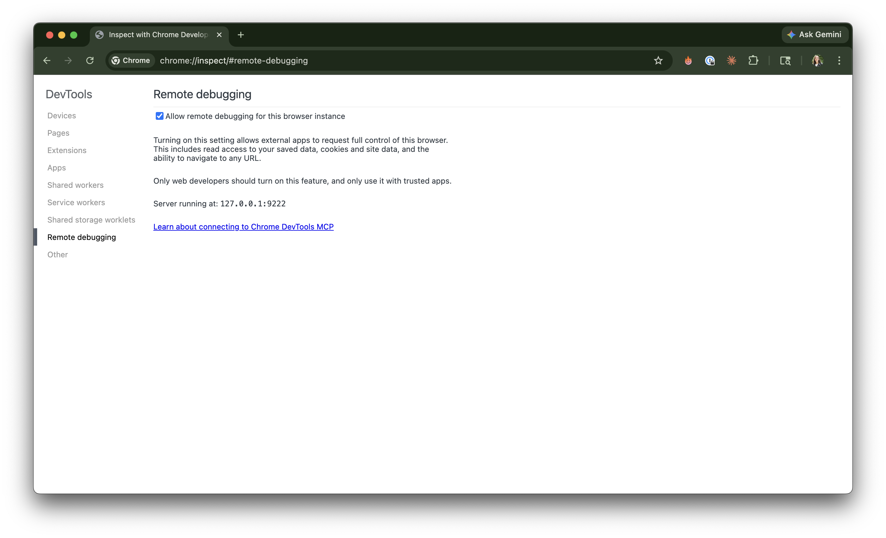

3. Confirm Claude is connected by asking Claude to list your open Chrome tabs.

**Example prompt:**

> "Open my dashboard at app.example.com, profile the page's load time, and tell me the top 3 things slowing it down."

---

*Quick note: you might see Puppeteer referenced in older tutorials and tools. Puppeteer is the older sibling of Playwright. You should be using one of the three tools above instead.*

**Web control vs web content.** These three tools give Claude **control** over your browser - clicks, forms, multi-step flows, debugging. [Firecrawl (Tip 12)](#) gives Claude **content** from a webpage - the raw text as markdown. Use these when you need Claude to *do something* in a browser. Use Firecrawl when you just need the page content to work with.

---

## Use Claude for visual work

Diagrams, image edits, flowcharts, and lightweight layout previews can all happen inside Claude Code - no Figma, Photoshop, or other design tool needed.

These next 4 tips cover the visual work Claude handles well:

1. **Generate images directly in Claude Code:** Create flowcharts, architecture diagrams, posters, and quick visuals without leaving the terminal.
2. **Edit and batch-process images:** Resize, crop, redact, label, convert formats, watermark, bulk-rename, annotate, and combine images into PDFs.
3. **Add editable diagrams to any markdown file with Mermaid:** Generate flowcharts and other diagrams in seconds using Claude's full context of your project.
4. **Spin up quick visual previews with a local HTML file:** Layouts, font tests, image grids, interactive demos, and quick prototypes that open in any browser.

### 16. Generate images directly in Claude Code

Need a diagram to visualize a process but don't want to go through the painstaking process of making it manually? Just ask Claude Code. Because Claude already has the full context of what you're working on, Claude knows exactly what to generate.

Claude Code has a built-in skill called `/canvas-design` that creates images as PNG files - flowcharts, architecture diagrams, data models, even posters and event graphics. No special syntax. Just describe what you want visually, the same way you'd describe to a colleague.

**What you can ask for:**

- **Technical diagrams:** Architecture diagrams, data models, flowcharts.
- **Design-forward visuals:** Posters, abstract art, event graphics.
- **Explanatory visuals:** Concepts that are easier to show than describe.

For more complex or artistic images, dedicated tools like [Google's Nanobanana](https://nanobanana.com) or [ChatGPT Images 2.0](https://openai.com/index/introducing-chatgpt-images-2-0/) will still do a better job. But for quick diagrams and technical visuals when you're already working in context, Claude Code is hard to beat. The key advantage is that Claude already understands the related project you're working on - you don't have to re-explain everything just to get a diagram.

### 17. Edit and batch-process images without leaving Claude

Along with reading and generating images, Claude can also edit existing images. Anything you'd normally do in Photoshop, Preview, or another image tool, Claude can handle in a single prompt. That covers the basics (resize, crop, convert formats, batch rename) and the more involved edits (add watermarks, adjust brightness and contrast, composite multiple images together, add text overlays, annotate with arrows and callouts, and combine images into a single PDF).

**Edit a single image.** Drag an image into the terminal and say "add a watermark to the bottom-right corner" or "add a 'Step 3' label to the top-left corner." Claude reads the image, identifies where the text is, and makes the edit.

**Batch-process images.** A few real examples:

- Hundreds of receipts and bills for an insurance claim, each cropped and rotated to fit a consistent layout, then combined into a single submission-ready PDF
- 30 product onboarding screenshots, each cropped to the same size, labeled with a step number in matching font and position, then combined into one walkthrough PDF
- A folder of contract scans, each watermarked "DRAFT" and renumbered sequentially, then combined into one signing-ready PDF

For each, describe what you want done. Claude executes. The next time you have a stack of images that all need the same treatment, ask Claude to handle the whole batch in one prompt instead of formatting by hand.

### 18. Add editable diagrams to any markdown file with Mermaid

*Special thanks to [Carl Vellotti](https://www.linkedin.com/in/carlvellotti/) for teaching me about Mermaid diagrams.*

[Mermaid](https://mermaid.js.org) is an open-source diagramming language that lets you generate flowcharts, sequence diagrams, org charts, timelines, and user journeys directly inside any markdown file. Diagrams are written as text blocks using Mermaid syntax and then any renderer that supports Mermaid (such as your IDE and GitHub) turns that text into a visual diagram. 

Claude is fluent in Mermaid. Tell Claude what you want to diagram and Claude writes the Mermaid block into your markdown for you. The block looks like a chunk of text when you're editing the markdown, but switch to the markdown preview and the same block renders as a visual diagram.

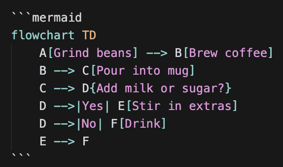

*The Mermaid block as raw text in your markdown file*

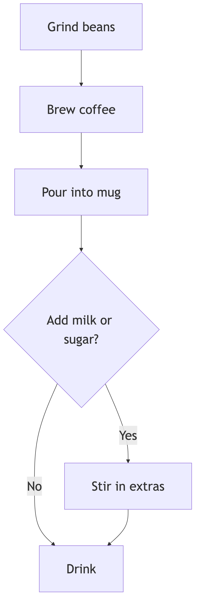

*The same block rendered as a visual diagram in markdown preview*

**Install:**

Install the **Markdown Preview Mermaid Support** extension via Cursor's Extensions panel (Cmd + Shift + X, search "Mermaid"). Without an extension, Mermaid blocks just look like text in your markdown.

**How to make diagrams:**

Tell Claude what you want to diagram. A few example prompts to try:

> "Add a Mermaid flowchart to this markdown file showing the steps of making a cup of coffee, from grinding the beans to pouring the final cup."

> "Add a Mermaid sequence diagram to my project plan at project-plan.md showing the user flow from signup to first activation."

> "Add a Mermaid Gantt chart to my Q1 roadmap at q1-roadmap.md based on the milestones and dates already in the doc."

Claude writes the Mermaid block. Hit Cmd + Shift + V to open the markdown preview and the block renders as a visual diagram.

**How to update diagrams:**

When the underlying flow changes, just ask Claude to update the Mermaid block. The diagram updates automatically using the available context. No more manually updating flowcharts every time a flow changes.

**How to share diagrams:**

Sometimes your final destination (such as a Google Doc, Slack message, slide deck, or email) doesn't render Mermaid. The [mermaid-cli](https://github.com/mermaid-js/mermaid-cli) converts a Mermaid block into a PNG. Install it once with this prompt:

> "Install mermaid-cli on my machine. The repo is at [https://github.com/mermaid-js/mermaid-cli](https://github.com/mermaid-js/mermaid-cli) - pick the right install path for my setup and walk me through it."

Once installed, ask Claude to convert any Mermaid block in your markdown files into a PNG, then paste the PNG wherever you need it.

**When to use Mermaid vs Claude's image generation (Tip 16).** Honestly, I almost always reach for Mermaid over image generation when I need a diagram. The output is cleaner, the diagram updates as my work updates, and the result lives inside the markdown file alongside the rest of the doc. Image generation (Tip 16) wins when the visual isn't really a diagram - a poster, a marketing illustration, an artistic graphic. For everything else, Mermaid first.

The next time you need to generate a diagram, turn to Mermaid instead of a manual process.

### 19. Spin up quick visual previews with a local HTML file

For lightweight visual work that doesn't justify opening Figma or another design tool (or deploying a real web app, which requires servers, hosting, and a bunch of extra setup), a local HTML file is the fastest path from "I have an idea" to "I can see it." If "local HTML file" doesn't mean anything to you yet: think of it like saving a webpage to your laptop. The file lives on your hard drive instead of on the internet, but you open it with Chrome (or any browser) and it loads like a real website. No server, no hosting, no account - just one file you can refresh to see your latest changes.

Ask Claude Code to build you a local HTML file and you've got a visual sandbox you can open by double-clicking the file or by asking Claude to open it in your browser. For especially polished output, ask Claude to use the [`/frontend-design:frontend-design`](https://github.com/anthropics/skills/tree/main/skills/frontend-design) skill - Anthropic's official skill tuned for production-grade frontend design.

**What you can spin up in a local HTML file.** Each example below includes a starter prompt template that you can adapt for your own use case.

- **Layout prototypes.** A landing page, a dashboard mockup, an internal tool UI.
  > "Build me a single HTML file mocking up a landing page for a productivity SaaS. Use the brand colors and fonts from @brand-assets.md. Include a hero section, a pricing table, and a CTA."
- **Font and color testing.** Preview headlines across multiple fonts, or see how brand colors look next to each other at real size.
  > "Build me a single HTML file showing my three headline options across five different sans-serif fonts, side by side, at the size they'd appear in a hero section."
- **Pretty markdown views.** Render a plain markdown doc as a styled HTML reading view with real typography, proper line height, and margins that don't hurt your eyes.
  > "Render the article draft at drafts/article.md as a styled HTML reading view. Use a serif body font, generous line height, and a max-width of 700px. Save the result as drafts/article.html."
- **Image grids and moodboards.** Drop a folder of images into an HTML page with captions, arranged in a grid.
  > "Build me a moodboard HTML file using all the images in references/. Two columns, with the filename as a caption under each image."
- **Interactive demos.** Anything you want to click around and play with before deciding. A before/after slider that swaps two website mockups, a toggle to switch between light and dark mode versions of a layout, a dropdown that filters a chart by region.
  > "Build me an interactive HTML file with a before/after slider that lets me drag back and forth between two homepage hero designs. Make the left side a navy header with a coral CTA, and the right side an off-white header with a navy CTA."
- **Small data visualizations.** A chart, a timeline, or a table with conditional formatting.
  > "Build me an HTML file with a simple bar chart of the data in metrics.csv. Use my brand colors. Make it readable at a glance."

**Pair the local HTML file with the Claude Code Chrome extension (Tip 13) so Claude can verify its own work.** The Chrome extension lets Claude see the rendered file in a browser and check whether the output actually matches what you asked for. Instead of you opening the file, comparing it against your prompt, and writing "no, the headline is too small / the colors are off / fix the spacing," Claude does that loop itself.

One prompt to try:

> "Build a landing page HTML file for a productivity SaaS called Tasky. Use a clean modern design with a coral CTA button, soft cream background, and a sans-serif font. Include a hero section, a pricing table, and a CTA. Then open the file in Chrome via the extension, look at the rendered result, and verify it matches what I asked for. If anything looks off, fix it and recheck. When you're confident, ping me to review."

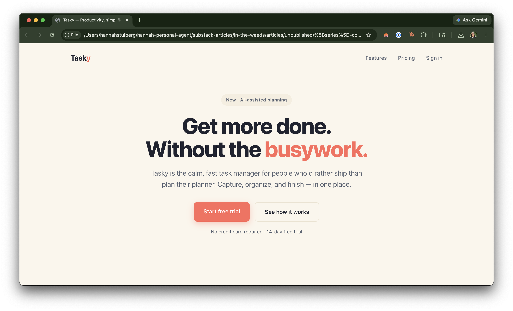

*Local HTML prototype of Tasky, rendered in Chrome from a single Claude Code prompt*

By the time you look at the file, the layout already matches what you asked for. You can iterate on a layout this way 10 times in 10 minutes without ever opening a design tool.

The next time you need to compare a few headline options, mock up a quick layout, or test new brand colors in a real layout, ask Claude for a local HTML file instead of opening a design tool.

---

## Get more out of every session

Working with Claude Code involves a hundred tiny points of friction - rebuilding context you already had, typing out a long prompt, asking a side question in the wrong thread, and watching Opus 4.7's polite yet verbose prose rapidly consume your usage limits. The longer the session runs, the more those frictions compound: your context window fills up and you hit usage limits faster or watch your API bill skyrocket.

These next 7 tips help you make a single Claude Code conversation last longer, hold more information, and stay sharper:

1. **Master the built-in terminal shortcuts:** Four built-in terminal shortcuts that turn long-text navigation from painful to instant.
2. **Fork the session with `/branch`:** Spawn parallel sub-sessions that share your built-up context.
3. **Ask side questions with `/btw`:** Keep quick side questions out of your main session's thread.
4. **Cut Claude's output bloat with Caveman mode:** Compress what Claude writes back to you.
5. **Cut Claude's input bloat with RTK:** Compress the command outputs Claude reads in.
6. **Talk to Claude with `/voice`:** Let your input keep up with how you actually think.
7. **Trigger Claude on an interval with `/loop`:** Set Claude in motion on a schedule and let work complete itself while you step away from your keyboard.

### 20. Master the built-in terminal shortcuts

Navigating long text in the terminal is annoying and time-consuming if you don't know the shortcuts. Holding the arrow key while the cursor crawls one character at a time. Hammering backspace to delete a single word. Scrolling all the way back to the start of a long prompt every time you want to edit something near the beginning.

Four built-in shortcuts cover everything you need to move around the terminal like someone who's been doing this for years.

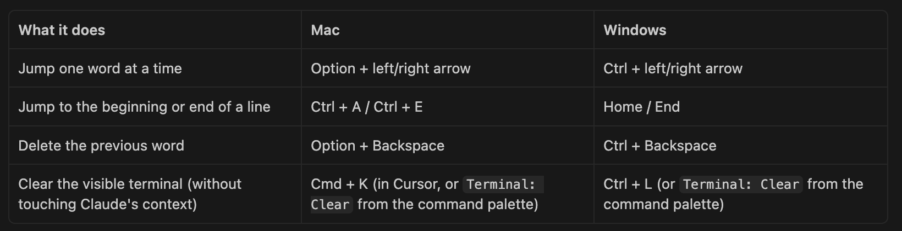

The first three save you from holding arrow keys and hammering backspace - pair Option/Ctrl + arrow with Ctrl+A/E or Home/End and you can land anywhere in a 200-character prompt in two keystrokes. The clear-terminal one (Cmd+K / Ctrl+L) is its own kind of save: long Claude Code sessions print a lot of output and the terminal eventually starts fighting you (scroll position resets, cursor lags, screen glitches). Clearing wipes the slate without touching Claude's memory of your conversation - Claude still remembers everything; you just get a fresh, responsive terminal.

These four shortcuts will immediately reduce your time spent navigating long blocks of text in the terminal. Every long prompt you edit, every typo you fix, and every glitchy screen you reset is faster by an order of magnitude once these are muscle memory.

### 21. Fork your session with `/branch`

[Parallel sessions](https://hannahstulberg.substack.com/i/185143249/3-parallel-sessions-separate-tasks-separate-drawers) are how you keep separate tasks in separate Claude conversations - each session starts fresh without context contamination between tasks. But sometimes the tasks you want to split into parallel sessions all build on shared groundwork that you and Claude have already done together inside one session - a project plan you mapped out with Claude, a doc you outlined together, or a long debugging conversation that surfaced three follow-up tasks. Starting each new parallel session from zero means rebuilding that shared context layer multiple times.

`/branch` is parallel sessions with shared starter context. It lets you take everything you've built up in one session and spin off a new conversation that starts with all of that context already loaded - so you can work two (or three, or five) downstream tasks in parallel without each one starting from zero.

*Note: `/branch` used to be called `/fork` and has since been renamed. Both names work - type either and Claude Code runs the same command.*

**What actually happens when you branch.** Picture two sessions: the original (where you've been working) and the new branch.

- **The original** stays exactly where it is - same conversation history, same context, untouched. It's still in your sessions list, still resumable later.
- **The branch** is a fresh conversation that inherits the original's full history up to the branch point. From there, it diverges: anything you say in the branch only lives in the branch. Anything you later say in the original only lives in the original.

The catch: the branch becomes the *active* conversation in whatever terminal you ran `/branch` in. The original isn't open in that terminal anymore - it's saved, but you have to navigate back to it (covered below).

**How to branch:**

1. **Name the original session first, before branching.** Inside the original session, type `/rename task-name`. That gives the session a readable name in your sessions list, so you'll be able to find it later instead of trying to remember the session's UUID like `b0c3984d-c315-4f94-840c-e4d76c060391`.
2. **Run `/branch <name>` - always with a name.** Type `/branch my-side-task-name` (replace `my-side-task-name` with whatever describes the side-task) inside the original session. Claude creates the branch and switches you into it.
3. **Work in the branch.** Your terminal is now in the branch session. Anything you type happens here, not in the original. Branch as many times as you want from this point - each `/branch <another-name>` creates another sibling.

**How to switch between the original, the branch, and other branches.** This is where your earlier naming pays off. Two paths, depending on where you're starting from:

- **Inside any Claude Code session:** type `/resume`. A picker opens listing all your recent sessions - and because you named them in steps 1 and 2 (`original-research`, `my-side-task-name`, etc.), they show up by those names. Start typing the name and the picker filters as you type. Arrow to the one you want, hit Enter, and you're in.
- **At a fresh terminal prompt:** run `claude --resume` from the project folder to open the same picker. Same names, same search-and-Enter. Or run `claude --continue` if you just want the most recent session in this folder, no picker.

So a typical workflow looks like: you're in the branch (`my-side-task-name`), you finish the side-task, type `/resume`, type "original" in the picker to filter, find `original-research`, hit Enter, and you're back in the original session as if you never left.

**Heads up: you can't `claude --resume <name>` from the CLI.** Names only work inside the picker - they're for searching, not for direct CLI resumption. To skip the picker, you need the UUID: `claude --resume b0c3984d-c315-4f94-840c-e4d76c060391`. Most of the time, the picker is faster anyway because you're typing 4–5 letters of a name instead of pasting a 36-character UUID.

**Want to fork an old session without opening it first?** Run `claude --resume <session-id> --fork-session` from your terminal. Useful when you remember exactly which past session you want to branch from but don't want to open it just to type `/branch` and then leave.

The next time you've spent real time building up context with Claude and want to use that context across more than one thread of work, use `/branch` instead of starting from scratch.

### 22. Ask side questions with `/btw` - don't derail your main task

You're in the middle of a long Claude Code session - say, drafting a doc that pulls from notes across three different meetings, with Claude tracking the structure and citing the source files as you go. Halfway through, a side thought hits you: *wait, what's actually the difference between SUM and SUMIF in Sheets?* You don't really want to spin up a brand new Claude Code session just to ask one quick question. But you're a smart Claude Code user who knows you shouldn't contaminate your main session's context with random questions that have nothing to do with the task Claude is in the middle of.

That's what `/btw` is for. Type `/btw` followed by your side question, and Claude answers it on a side thread without touching the main task. The SUM-vs-SUMIF answer lands without ever touching the doc context Claude has been holding - no contamination of the main thread, no new session to spin up just for a one-off question.

The next time a side thought hits you mid-session, type `/btw` before you reach for a new session.

### 23. Cut Claude's output bloat with Caveman mode

Claude's default voice is friendly and thorough. Lovely in conversation. Terrible for your context window and not hitting your usage limits. *"Certainly! I'd be happy to help you with that"* takes tokens. So does *"Just to clarify,"* *"Basically,"* *"As you can see,"* and every other polite connective phrase Claude sprinkles into replies. Over a long session, that politeness eats the same context space your actual work needs and burns through your usage limits faster.

Caveman mode rewrites Claude's replies in short, fragment-style English. Articles ("a", "an", "the"), filler words, pleasantries, and hedging are all dropped without impacting technical substance. Code blocks, errors, and security warnings stay written normally. Everything else gets compressed.

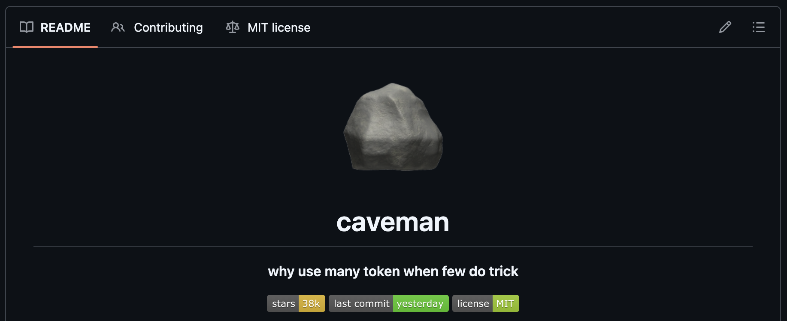

**What Caveman looks like.** Instead of:

> "Sure! I'd be happy to help you with that. The issue you're experiencing is likely caused by an outdated dependency. Let me walk you through the fix..."

You get:

> "Outdated dependency. Run `npm install` then retry."

Same information, but only uses a quarter of the tokens.

**How to install:**

1. Install the Caveman skill ([github.com/juliusbrussee/caveman](https://github.com/juliusbrussee/caveman)). Give Claude this prompt:

> "Install the Caveman skill from github.com/juliusbrussee/caveman by following the install instructions in the README. Once it's installed, tell me to restart Claude Code."

1. Turn Caveman on with `/caveman`. Pick an intensity: `lite` (drops articles and pleasantries, sentences intact), `full` (default - fragments fine, short synonyms, max compression while still readable), or `ultra` (most aggressive). I generally use `full` or `ultra`.
2. Turn Caveman off with "stop caveman" or "normal mode" any time you want polite Claude back.

**Heads up: turn Caveman off when you're using Claude to write.** Caveman works by stripping the things that make English flow - articles, connective phrases, varied sentence structure, natural hedging. That's exactly what you want gone when Claude is summarizing a bug or planning a refactor, but it's exactly what you *don't* want gone when Claude is helping you draft a doc, edit your prose, brainstorm copy, or write anything a human is going to read. Caveman-mode Claude writes in fragments. Run "stop caveman" before you ask Claude to write, and turn Caveman back on for all other work.

On a long working session, Caveman is the difference between hitting your usage limit at hour two versus hour four.

### 24. Cut Claude's input bloat with RTK

Caveman compresses what Claude writes back to you. RTK compresses what Claude reads in.

Every time Claude runs a command in your terminal - looking at your git history, listing files in a folder, reading a long file, running a test - the full output of that command gets pulled into Claude's working memory. A `git log` can be 2,000 tokens. Reading a long doc can be 40,000. Stack those across a session and your context window fills up with raw command noise instead of your actual work.

[RTK](https://github.com/rtk-ai/rtk) (short for Rust Token Killer) is a transparent middleman. RTK silently intercepts those commands, compresses the output by 60-90%, and hands the compact version to Claude.

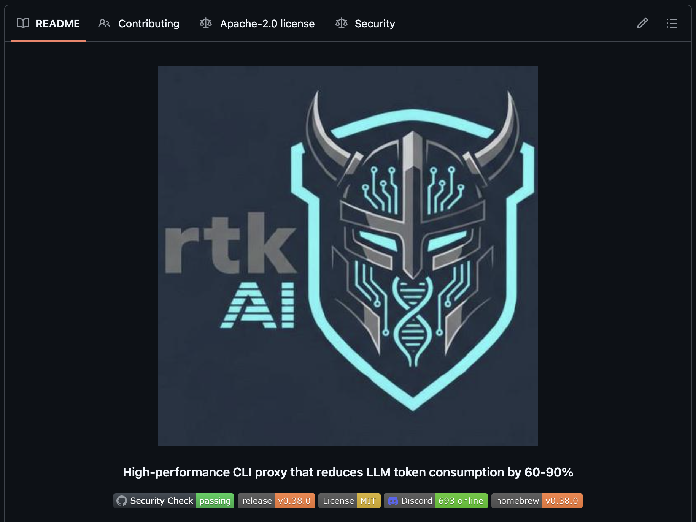

**What RTK compresses.** `ls` and `tree`, file reads, `grep`, `git status` and `git log` and `git diff`, test runners (Jest, Pytest, Cargo test), and linters (ESLint, TypeScript, Ruff). The boring command outputs that pile up in any real session.

**How to install:**

1. Install RTK and configure the Claude Code hook. Give Claude this prompt:

> "Install RTK by running `brew install rtk`, then run `rtk init -g` to configure the Claude Code hook globally. Once it's installed, tell me to restart Claude Code. After I restart and come back, confirm RTK is working by running `rtk gain` and reporting the token savings stats back to me."

That's the whole setup. RTK runs invisibly from then on - no flag to toggle and no command to remember.

**Pair RTK with Caveman.** Caveman shrinks Claude's output. RTK shrinks Claude's input. Stack them both and you get two compounding wins: any one session fits more real work before its context window fills up and across all your sessions you burn through fewer tokens against your usage limits. Install both today and you'll get noticeably more usage out of Claude.

### 25. Talk to Claude with `/voice` (or Wispr Flow) instead of typing

If you've ever had a long thought that felt faster to say out loud than to type, voice input is for you. Three options, depending on where you're working.

**Option 1: `/voice` inside Claude Code.** Run `/voice` in your terminal and hold the space bar to dictate your prompt. Let go, and Claude takes over. Built into Claude Code, no extra setup.

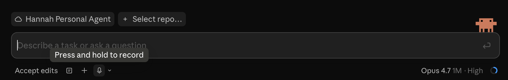

**Option 2: Voice button in Claude Desktop and the iOS app.** The Claude Desktop app and Claude mobile app both have a voice button right in the message input. Press, speak, send.

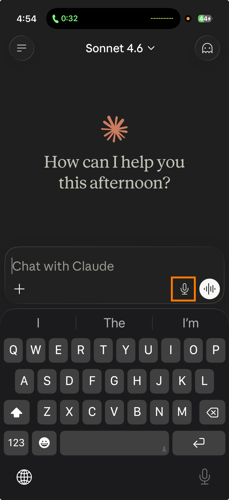

**Option 3: [Wispr Flow](https://wisprflow.ai) for system-wide dictation.** Wispr Flow is a paid dictation app that works across every app on your computer, not just Claude. Set up a custom keyboard shortcut and you can dictate into any text field anywhere. I have a custom button on my keyboard mapped to Wispr Flow, so I can talk to Claude, Slack, email, and Notion without ever lifting my hands to type.

[BUTTON: wispr-flow-button.png - Hannah's custom Wispr Flow button]

[Voice input](https://hannahstulberg.substack.com/p/stop-typing-start-talking-how-dictation) isn't just faster for long prompts - voice changes *how* you prompt. People tend to be more natural, more detailed, and more clear when speaking to Claude than when typing. You include the context you'd normally leave out. You catch yourself mid-sentence and course-correct the framing. The end result is usually a better prompt than the one you'd have typed.

If typing slows you down, or you do your best thinking out loud, give voice a try.

### 26. Trigger Claude on an interval with `/loop`

Most of the time, working with Claude looks like a back-and-forth: you prompt, Claude responds, you read, you prompt again. `/loop` changes that. `/loop` reruns a prompt on a schedule - same prompt, fired again every X minutes (or self-paced, with Claude picking the cadence). You hand Claude one instruction and Claude keeps running that instruction over and over until you stop the loop.

Reach for `/loop` when you want Claude to keep working on a task on its own, or wait for something to happen and then act, without you sitting at your keyboard typing the same prompt every few minutes.

**Loop on a long plan so Claude actually finishes it.** Claude has a habit of pausing mid-plan to ask "want me to keep going?" - especially on long, multi-step work where Claude has been at it for a while. `/loop 10m keep going on the plan we mapped out` answers that question for you on a schedule. Every ten minutes, Claude reads the plan, picks up where Claude left off, and pushes forward. Useful any time you've handed Claude a long brief (a research project, a multi-page doc, a 20-step inbox triage) and want to make sure Claude crosses the finish line instead of stalling out in the middle.

**Loop until a condition is met, then act.** My favorite use of `/loop` is waiting on something to finish, then doing the next step the second the condition flips:

> "/loop 5m wait for CI to pass on my open PR. Once CI is green, merge the PR and post a Slack message to my team channel with the PR link."

Claude polls every five minutes, and the moment CI goes green, the merge fires and the Slack message goes out. I can step away from my keyboard and go do something else - the chain of work still completes itself.

**Self-paced loops.** `/loop` with no interval lets Claude pick the cadence after each iteration - anywhere from 1 minute to 1 hour, based on what Claude just observed. Useful when the right interval is genuinely variable: a build that might finish in 3 minutes or 30, a deploy you want to babysit until it's done, a long-running data export that could finish anytime in the next two hours. After each iteration, Claude prints the next delay and the reason - something like "checking again in 4m - build at 80%" vs "checking again in 45m - no movement on the export yet."

Note: each iteration's output - the status check, any work Claude did, and the "checking again in Xm" line - appears in the terminal session where you started the loop. Check that terminal to see what's happening.

The next time you've got long-running work or a "wait for X then do Y" task on your plate, `/loop` it instead of staying at your keyboard to nudge Claude.

---

## Take Claude Code off your laptop

Your best ideas don't always hit when you're at your desk. Being able to kick off work from your phone, check on a running task from the couch, or hand off a session between devices means momentum doesn't stop when your laptop closes.

Once you've gotten the hang of Claude Code at your laptop, you'll want Claude Code with you everywhere - on your phone in line for coffee, on your iPad on the couch, in a chat app on your walk. There are a few different surfaces for working with Claude Code when you're away from your laptop, each with its own pros and cons.

The trade-offs come down to one big question: which of the tools Claude usually has access to come along when you leave your laptop? When Claude runs on your laptop, Claude has your full toolbox - the MCPs you've installed, the CLIs you've set up, and any skills you've added. When Claude runs in the cloud (more on that in Tip 27), the toolbox shrinks.

- **Available in the cloud:** Hosted MCPs (such as Linear, GitHub, and hosted Slack), plus any information inside the GitHub repo in which you're working (project-level skills and agents, your project's `CLAUDE.md`).
- **Only available on laptop:** Local MCPs (small programs running on your laptop - Granola for meeting notes, claude-in-chrome for controlling Chrome, Playwright for browser automation), local CLIs (CLI tools you've installed such as the `gws` CLI or `mermaid-cli`), and user-level skills and agents that live outside your project repo.

The difference matters because different functionality is available in different interaction paradigms.

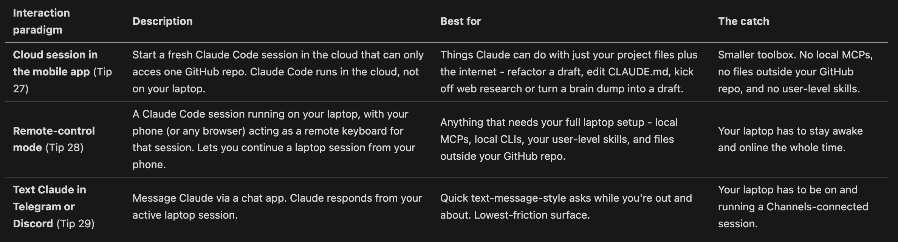

### 27. Use the Claude mobile app to work from your phone

The Claude mobile app is how you take Claude Code with you when you leave your laptop. Inside the app, the **Code** tab is where you start and continue cloud-hosted Claude Code sessions, so anything Claude can do with just your GitHub repo and the internet - kick off new work, jump back into a cloud session you started earlier, read through what Claude produced while you were away, queue follow-up tasks - can also happen from your phone.

**Prerequisite: your project files have to live in GitHub.** The mobile app works on cloud-hosted sessions that read from a GitHub repo - it can't see your laptop's local file system. If your Claude Code work is still stored in Google Drive or Dropbox, you'll need to move to GitHub if you want to use Claude Code on the mobile app. Not on GitHub yet? My [GitHub 101](https://hannahstulberg.substack.com/p/tool-school-github-101) article will take you from zero to confident and help you easily make the switch (trust me, you won't go back!).

**When I reach for the mobile app:**

- Kicking off a research task during my commute
- Brain-dumping a meeting takeaway into Claude on my walk back to my desk so Claude turns the brain dump into a real doc by the time I sit down
- Editing a doc that already lives in my GitHub repo - asking Claude to add a new paragraph, fix typos, or restructure a section.

**Getting your work back to your laptop.** When a cloud session edits files in your repo, those edits don't automatically save back to GitHub. The cloud session keeps the edits on a temporary [branch](https://hannahstulberg.substack.com/i/189320562/part-3-the-daily-github-workflow) in the cloud sandbox until you push them to `main`. The full workflow:

1. Claude makes edits inside the cloud session.
2. From the mobile app, ask Claude (or click the button in the app's UI) to push the changes to GitHub. Claude pushes the edits to a new branch and opens a [pull request](https://hannahstulberg.substack.com/i/189320562/part-3-the-daily-github-workflow) (PR).
3. [Merge the PR](https://hannahstulberg.substack.com/i/189320562/part-3-the-daily-github-workflow). You can do this from GitHub in the browser or back at your laptop using Claude Code and the [GitHub CLI](https://hannahstulberg.substack.com/i/189320562/part-1-setup-and-installation) or [GitHub MCP](https://hannahstulberg.substack.com/i/189320562/part-1-setup-and-installation).
4. Once the PR is merged into `main`, run `git pull origin main` on your laptop to bring the merged changes onto your machine.

If "branch," "pull," and "PR" don't ring a bell yet, [Tool School: GitHub 101](https://hannahstulberg.substack.com/i/189320562/part-3-the-daily-github-workflow) walks through the daily push-pull-PR rhythm step by step.

**A few things won't work in a cloud session.** Local MCPs (such as Granola for meeting notes or claude-in-chrome for controlling Chrome) won't work in a cloud session because they live on your laptop, not in the cloud. The same goes for any CLIs (such as the `gws` CLI). User-level skills and agents are also not available - Claude can only access the project-level skills and agents in the current repo. For work that needs your laptop's full setup, you'll need Tip 28.

### 28. Move sessions between devices with `/teleport` and `/remote-control`

The mobile app gives you access to Claude Code on your phone; `/teleport` and `/remote-control` give you the *same* Claude Code session, jumping between your laptop and your phone in the middle of the work. Started a doc on your laptop in the morning and want to keep working on it on the train? Started a research thread on your phone over coffee and want to finish it on your laptop at your desk? That's what these two commands are for.

**`/teleport` - move a cloud session into your terminal.** When you're back at your laptop and ready to keep working there, run `claude --teleport` from a terminal (or type `/teleport` inside an active session). The cloud session moves down to your laptop - same files, same context, same history. The big difference: now Claude can reach all the local MCPs, custom commands, and files on your laptop that the cloud session couldn't see.

> **Example:** You're on the bus and kick off a research task in the mobile app's cloud session - "pull together everything in my repo about Q3 launches and summarize." Claude finishes by the time you're at your desk. Now, you want Claude to also email the summary to your team via your `gws` Gmail tool. `gws` is a local MCP, which the cloud session can't access. You `/teleport` the cloud session onto your laptop and Claude now has access to `gws` and can draft and send email.

**`/remote-control` - make your laptop session reachable from your phone or browser.** Run `/remote-control` from a Claude Code session running on your laptop. After that, your phone (or any browser) becomes a remote keyboard for that laptop session. Important: the work still happens on your laptop - your phone is just for typing prompts and reading replies. Your laptop has to stay awake and online the whole time, because that's where Claude is actually running.

**Keep your laptop awake while you remote-control it.** Since the work runs on your laptop, your laptop needs to stay awake (and online) the whole time you're driving Claude from somewhere else. If your laptop goes to sleep mid-session, the remote-control session dies. Pick the option that matches your machine - you only need *one* of these, not all of them.

- **Mac: start your Claude Code session with `caffeinate -dims`.** From your terminal, run `caffeinate -dims claude` instead of plain `claude`. The `-dims` flags tell macOS to keep the display awake (`d`), prevent idle sleep (`i`), keep the disk awake (`m`), and prevent system sleep on AC power (`s`). As long as that Claude Code session is running, your Mac stays fully awake. Stop the session, and your sleep settings go back to normal.
- **Windows: install [PowerToys](https://learn.microsoft.com/en-us/windows/powertoys/) and turn on the Awake utility.** PowerToys is Microsoft's free utility suite. The Awake utility overrides Windows' sleep settings while it's enabled. Toggle "Keep awake indefinitely" before you leave your laptop, then start your Claude Code session as usual.

If you lose internet connection for more than ~10 minutes, the remote-control session will time out and you'll need to start a new one. Make sure the laptop is somewhere with stable wifi.

> **Example.** You ask Claude to triage your overnight email through your local `gws` Gmail integration - "read everything that came in last night, flag the ones that need a real reply, and draft three options for each." Claude starts working through the inbox on your laptop. You need to leave for a coffee but want to keep nudging Claude as drafts come back - approving some, asking Claude to make others shorter, or redirecting on tone. You run `/remote-control` on the laptop session. From the coffee shop, you open the Claude mobile app, see the laptop session in your sessions list, and can keep revving on the emails with Claude. Claude is still doing the work on your laptop (using `gws`, which only exists there) - your phone is just the keyboard.

**Make `/remote-control` the default for every session.** You don't want to remember to type `/remote-control` every time. Run `/config` inside Claude Code, go to the **Remote Control** section, and turn on "Enable Remote Control for all sessions." Every session you start after that is reachable from your phone or browser without you having to opt in each time.

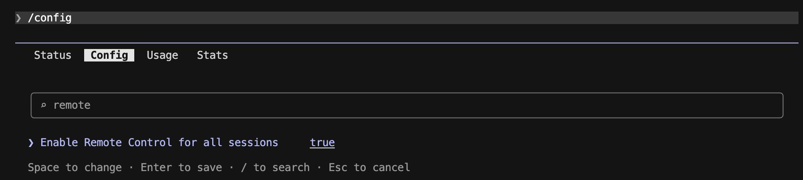

`/teleport` and `/remote-control` together mean your Claude Code session moves with you, instead of staying anchored to whatever device you happened to start on.

### 29. Text Claude from anywhere with Claude Code Channels

[Claude Code Channels](https://code.claude.com/docs/en/channels) are Anthropic's Telegram and Discord integrations for Claude Code. Once Channels is set up, you can text Claude from your phone (or any device with Telegram or Discord installed) and Claude responds from your active laptop session - Claude reads the message, does the work on your laptop, and replies right back in the chat. No app to open, no session to log into - just message Claude the way you'd message a friend.

**Only one Claude Code session can be connected to Channels at a time.** When you text Claude from Telegram or Discord, the message goes to whichever single laptop session is running with `--channels` active. If you start a second `--channels` session, it takes over and the previous one stops listening. No need to pick which session you're texting - there's only ever one.

[VIDEO EMBED: [https://x.com/trq212/status/2034761016320696565](https://x.com/trq212/status/2034761016320696565) - demo of Claude Code Channels in action]

**How to install (Telegram):**

1. Set up the Telegram channel via Claude. Give Claude this prompt:

> "Set up Claude Code Channels for me. Walk me through installing the channels plugin from [https://code.claude.com/docs/en/channels](https://code.claude.com/docs/en/channels) and connecting it to Telegram. I want to text Claude from my phone and have Claude reply from this laptop's session."

1. Run a Claude Code session that stays connected to Telegram. From your terminal:

`caffeinate -dims claude --dangerously-skip-permissions --channels plugin:telegram@claude-plugins-official`

`caffeinate -dims` keeps your Mac fully awake while Claude is running (same flags as Tip 28, so the Channels session stays reachable even if you walk away from your laptop). The `--channels` flag connects Claude to Telegram. Leave your laptop open and Claude is reachable from your phone as long as the session is active.

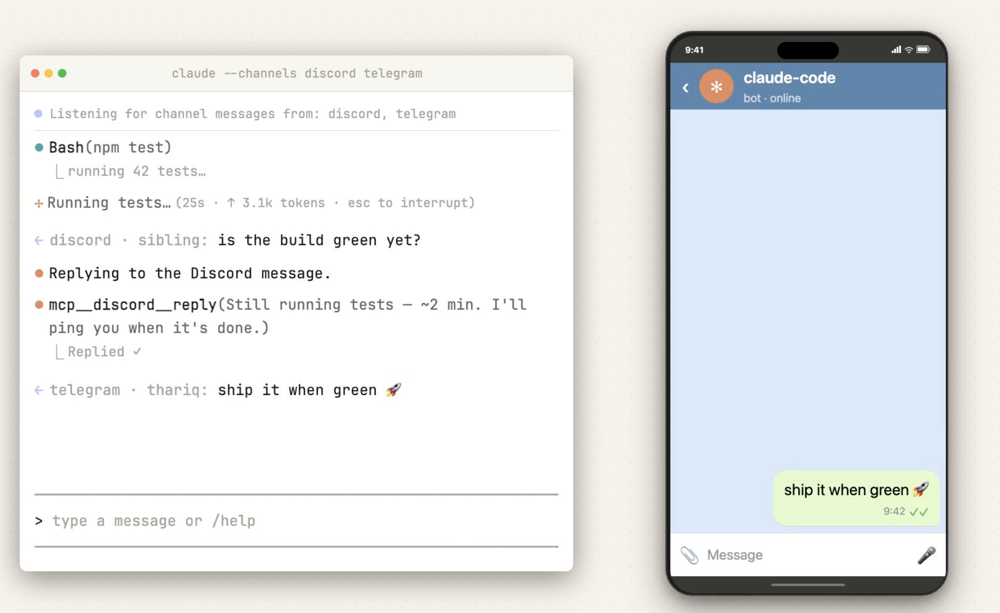

*[Claude Code channels launch announcement](https://x.com/trq212/status/2034761016320696565)*

3. Open Telegram on your phone, find the Claude bot you just connected, and message Claude. Claude responds from your active laptop session.

**How to install (Discord):**

1. Set up the Discord channel via Claude. Give Claude this prompt:

> "Set up Claude Code Channels for me. Walk me through installing the channels plugin from [https://code.claude.com/docs/en/channels](https://code.claude.com/docs/en/channels) and connecting it to Discord. I want to message Claude from any device that has Discord and have Claude reply from this laptop's session."

1. Run a Claude Code session that stays connected to Discord. From your terminal:

`caffeinate -dims claude --dangerously-skip-permissions --channels plugin:discord@claude-plugins-official`

3. Open Discord, find the Claude bot you just connected (in your DMs or the server to which you connected it), and message Claude.

**Why we're starting with `--dangerously-skip-permissions`.** When Claude Code wants to run a tool that needs your approval (writing a file, running a Bash command, etc.), Claude normally pauses and asks for permission. There's no good way to answer those prompts from Telegram or Discord, so a Channels session that hits a permission prompt just hangs. The `--dangerously-skip-permissions` flag tells Claude to act without asking. Use Channels only for tasks where you're comfortable with Claude acting autonomously.

The mobile app, `/remote-control`, and Channels all solve the same problem from different angles: keeping Claude reachable when you're not at your laptop. Pick whichever surface fits the moment - the cloud session for self-contained work against your GitHub repo, `/remote-control` for anything that needs your laptop's full setup, or Channels for quick text-message asks while you're on the move. Now, you never need to be separated from Claude Code.

---

## Just for fun

Every tip on this list has earned its keep on the productivity or quality of life scoreboard. This final tip comes with zero efficiency improvements and is here simply because I think it's adorable and I make the rules.

### 30. Change Claude's thinking verbs to your own

While Claude works, it cycles through a rotating thinking word. "Pondering..." "Synthesizing..." "Cogitating..." Claude Code ships with around 185 of them, and the [full list lives in this community-maintained dictionary on GitHub](https://github.com/claude-code-book/spinner-verbs-dictionary).

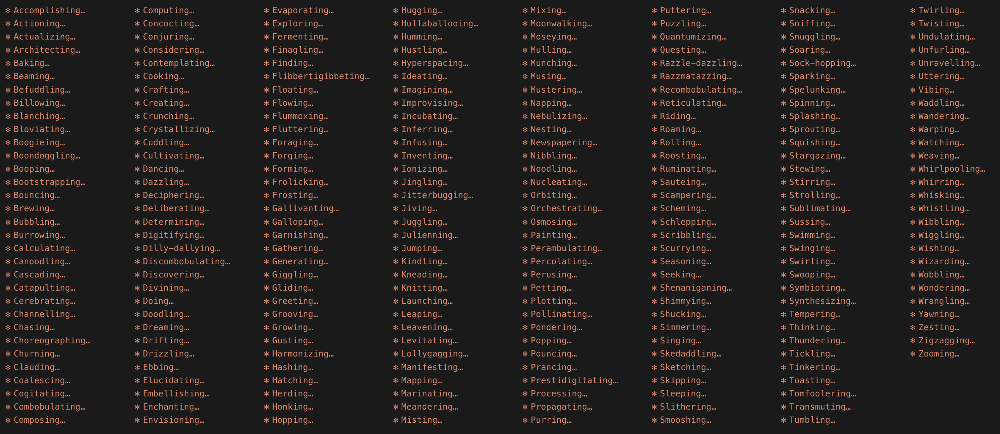

*The full rotation of Claude Code's thinking verbs*

Honestly, I think these are really cute and you don't need to change them. I just wanted to let you know that you can.

The verb list lives in your `~/.claude/settings.json` file under a key called `spinnerVerbs`. You can edit the list in one of two ways:

- **Append mode:** Keep Claude's defaults and add your verbs to the rotation. You'll still see "Pondering" sometimes, but you'll also see your custom ones mixed in.
- **Replace mode:** Swaps the defaults out entirely. Claude only shows the verbs you've added.

You don't need to edit `settings.json` by hand. Claude can make the updates!

**Append your verbs to Claude's defaults:**

> "Add a `spinnerVerbs` block to my `~/.claude/settings.json` in append mode with these verbs: [your list]. Show me the file before and after."

**Replace Claude's defaults with your own list:**

> "Add a `spinnerVerbs` block to my `~/.claude/settings.json` in replace mode with these verbs: [your list]. Show me the file before and after."

After Claude makes the edit, restart your session and your verbs show up in the rotation.

The fun part is picking what you actually want to see. A few directions to spark ideas:

- **Your company values as verbs:** Turn the values posted in your office (or buried in your onboarding deck) into the words Claude flashes while it works. "Customer-obsessing...", "Operating-at-the-lowest-level-of-detail...", "Making-room-at-the-table..."
- **PM-flavored:** "Roadmapping...", "Stakeholder-managing...", "Synthesizing customer feedback...", "Prioritizing..."
- **Designer-flavored:** "Composing...", "Critiquing...", "Wireframing..."
- **On-brand for whatever work you actually do all day:** Pick the verbs that sound like the way you'd describe your job to a friend.

If you've made it this far in a Claude Code article, you've earned the right to be a little silly with your tools. Productivity isn't the only point. Sometimes the point is that working with Claude makes you smile in the middle of a Tuesday afternoon. Consider this your hall pass.

---

## What you should have now

If you've worked through this guide, you now have:

- **A Cursor setup that feels like yours:** Themes, workspaces, organized terminals, and an easier way to edit markdown files.
- **The ability to see what Claude is actually doing:** See Claude's live reasoning, watch what's filling your context window in both Claude Code and on claude.ai, and turn any GitHub repo into readable documentation in minutes.
- **Clean source material flowing into every prompt:** Google Docs, PDFs, Word files, and web pages all arriving as token-efficient markdown.
- **Claude Code connected to the web:** Three tools that let Claude see, control, and debug any webpage.
- **A visual side to Claude Code:** Flowcharts, diagrams, image edits, and HTML prototypes, all without leaving Claude.
- **Sessions that last longer and stay sharper:** Quicker typing and talking, conversations that use less of your context window, focused threads, and Claude that keeps working while you step away.
- **Claude Code wherever you are:** Mobile sessions and device handoffs that keep you working from anywhere.
- **A Claude that sounds like you:** Custom thinking verbs that earn their keep on the joy scoreboard, not the productivity one.

## The bottom line

While I was writing this article, Claude Code popped this tip card into one of my sessions:

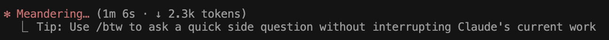

*Claude Code's in-product tip card, surfaced mid-session*

Cute, right? Anthropic has started teaching people about Claude Code one in-product tip at a time, surfacing them mid-session as you work. I genuinely love this as a way to introduce features in context. But at one tip per session, you're going to learn about `/btw` somewhere around 2027.

Consider this article your cheat sheet: 30 tips in one sitting instead of waiting for the stars to align between in-product education and your actual pain points. You don't need to set up all 30 today. Pick the two or three that solve a problem you're actually feeling right now (Claude pausing every 7 minutes while executing a long plan, the terminal panel full of tabs labeled "zsh, zsh, zsh", the markdown file with `##` and `**bold**` symbols cluttering every line you're trying to read), set those up this afternoon, and come back for the rest the next time something in Claude Code feels harder than it should.

Next time Claude pops a tip card into your session, the surprise will be how few of them are new to you.
