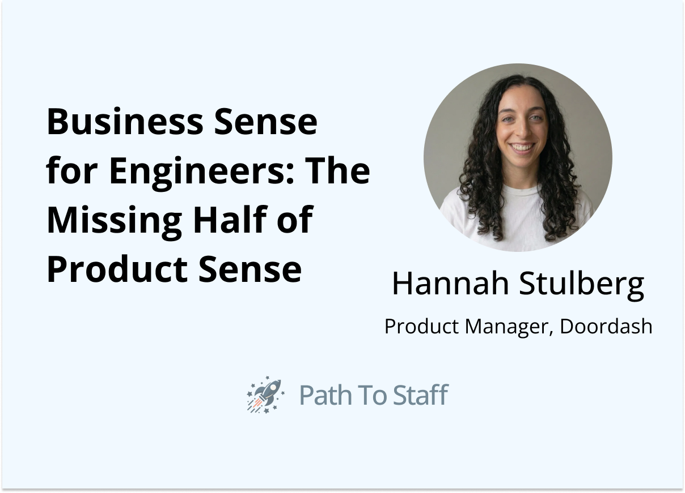
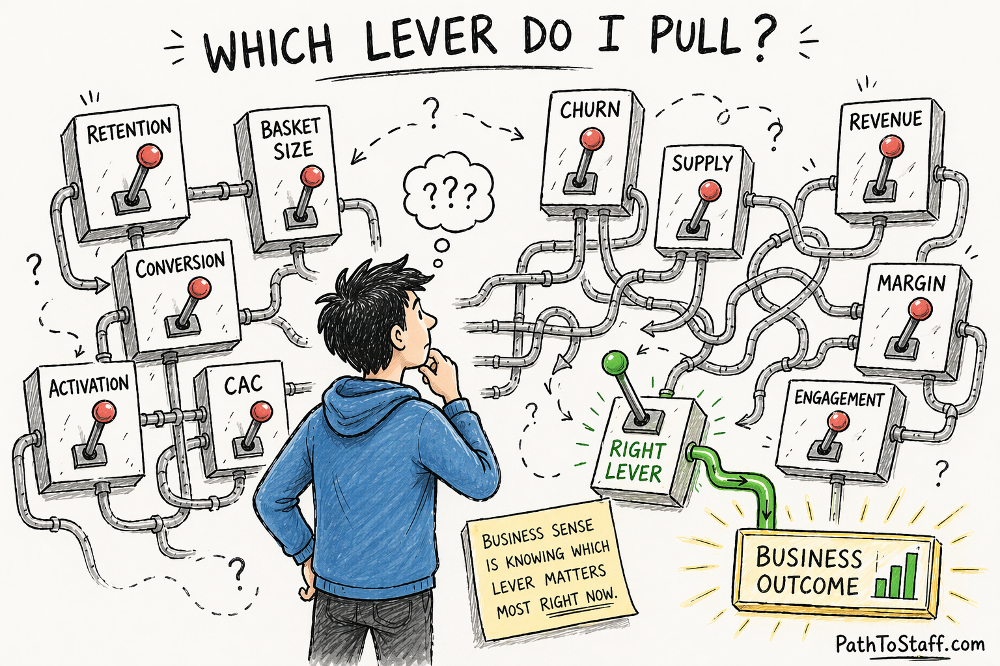
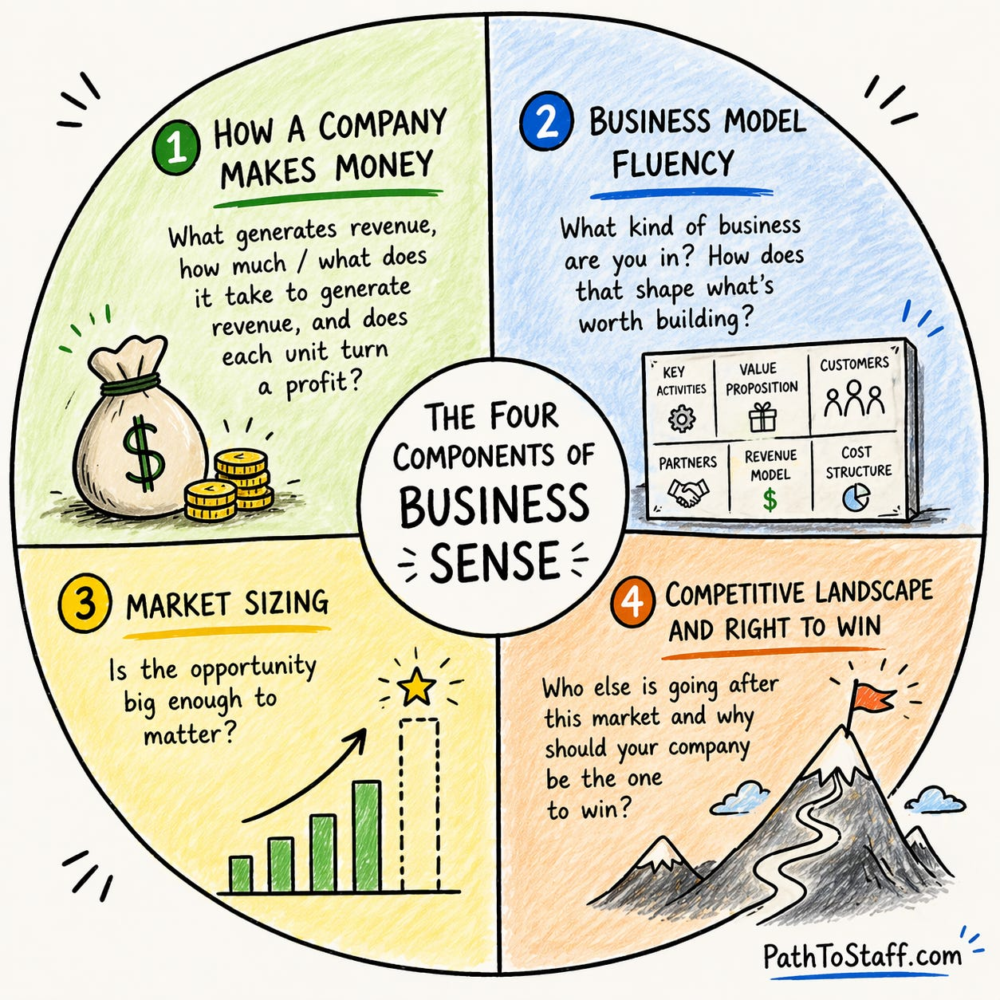
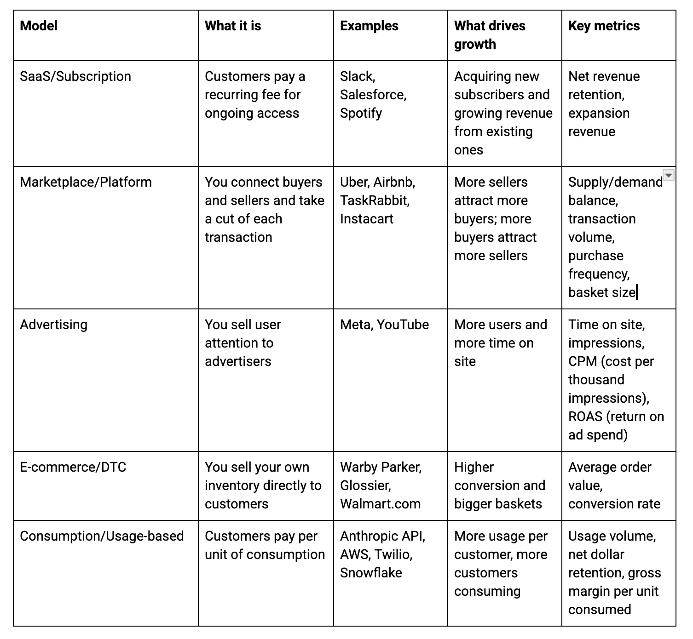
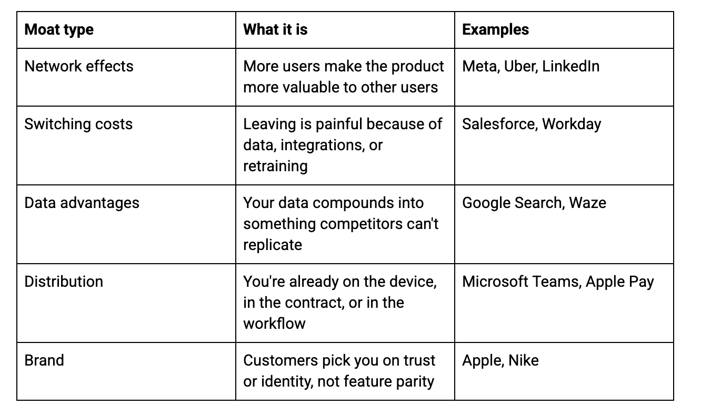
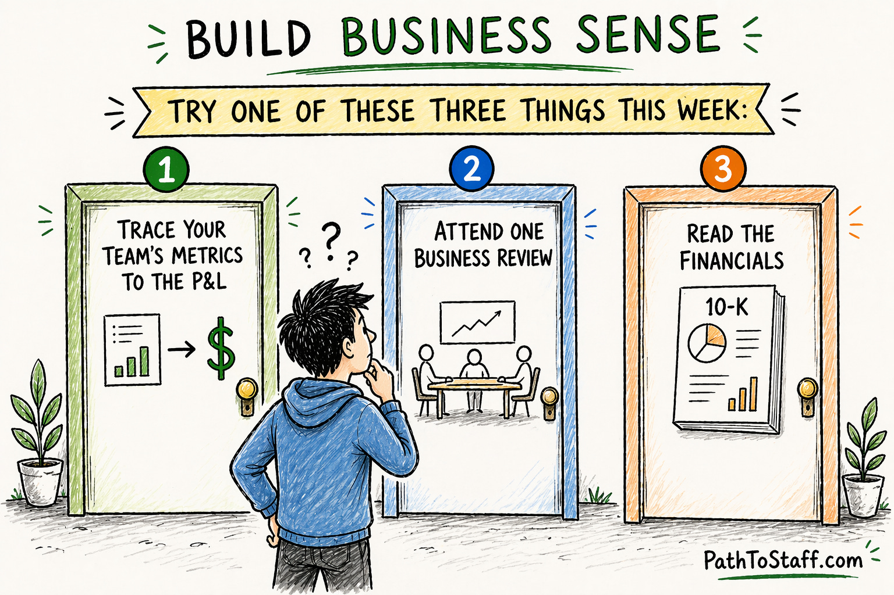

Welcome back to Path to Staff. With AI making it easier for engineers to build, you start to see "product sense" everywhere. It appears in every framework, every career thread, every promotion guide.

But product sense alone won't get you to Staff. The engineers I've seen get promoted understand something most frameworks skip entirely: Business Sense - how the business actually works.

This week, we have [Hannah Stulberg](https://open.substack.com/users/4630983-hannah-stulberg?utm_source=mentions) sharing more about business sense. Hannah leads AI-powered new bets at DoorDash and is the creator of [In the Weeds](https://hannahstulberg.substack.com/), a newsletter that helps non-technical professionals build AI fluency and adopt AI-native workflows. Her flagship series, [Claude Code for Everything](https://hannahstulberg.substack.com/p/claude-code-for-everything-finally), has helped more than 90,000 people get up and running with Claude Code. If you haven't checked it out, do so!

Without further ado, here's Hannah.

# Product sense won't help you if you don't understand the business

In my experience as a PM, the engineers who deliver the most impact aren't just good at product thinking. They also deeply understand how the business works - the business model and current business priorities, what the competitive landscape looks like, and which metrics matter at the current point in time. That's **business sense** - a skill engineers need now more than ever.

The demand for business sense is already visible in the PM job market. [Lenny Rachitsky's data](https://www.lennysnewsletter.com/p/the-pm-job-market) shows 6,000+ open PM roles globally, with the hiring bar rising and junior roles declining fastest. Companies are hiring aggressively for seasoned product leaders who can both identify the right business problems to solve and bring productized solutions to these problems to market. However, given the pace at which engineers are now able to build and ship product, there is not enough available PM supply to meet the demand for this skillset.

Anthropic, Cursor, and OpenAI already run with _higher_ engineer-to-PM ratios than comparably-sized tech companies did a decade ago. As a result, decisions that used to sit squarely with PMs now need to be able to be made within engineering. As engineers take end-to-end ownership of product development, the ability to identify the most critical problems to solve for the business becomes a key differentiator and a way for engineers to create leverage both for themselves and for the business.

[Shreyas Doshi](https://shreyasdoshi.com/), a product leader formerly at Stripe and Twitter, wrote a [widely-read piece](https://shreyasdoshi.substack.com/p/why-product-sense-is-the-only-product) arguing that product sense is the defining skill of the AI age. He breaks product sense into five components: empathy, domain knowledge, product thinking, taste, and strategic thinking. But I'd argue engineers need more than just product sense. Engineers need business sense. Product sense is about _what_ to build. Business sense is about _why_ it matters to the business.

Without the why, the what is just good taste without generating leverage for the business. You can have strong product intuition - such as spotting good UX, sensing when a flow feels off, or identifying confusing interaction patterns - without understanding how your company makes money, what the unit economics look like, or who you're competing against. Strategic thinking, the fifth component in Shreyas's framework, actually **requires deep business sense**.

The best engineers I've worked with start with the business problem.

> What lever are we trying to move and why is this the particular lever we're targeting out of all potential levers?

What makes these engineers' inputs unique is that they can spot the highest-leverage directions _and_ the fastest path to get there. They suggest a scrappier version of the idea that ships in a quarter instead of a year or an implementation sequencing that front-loads the work required to derisk a business hypothesis. This unique combination of business sense paired with technical sense is one of the fastest ways to move a business forward, and propels an engineer to be most sought after in today's market.

# Business Sense 101

Every company operates in a constantly changing environment - competitors launch, customer behavior shifts, and operating costs move up or down. The moves that made sense a quarter ago can quietly become the wrong bets today.

Business sense allows you to use the changing business landscape to inform the right product investments to make at a given point in time.

The four components of business sense are:

1. **How a company makes money:** What generates revenue, how much / what does it take to generate revenue, and does each unit turn a profit?

2. **Business model fluency:** What kind of business are you in? How does that shape what's worth building?

3. **Market sizing:** Is the opportunity big enough to matter?

4. **Competitive landscape and right to win:** Who else is going after this market and why should your company be the one to win?

## How a company makes money: Know what moves the needle

A company's P&L (profit and loss statement) shows how money flows through the business - revenue in, cost out, and profit left over. Underneath the P&L, unit economics measure revenue and costs per unit of your business. Common units include customers, orders, or transactions. Unit economics also measure the profitability of a unit - whether each unit generates more revenue than it costs to produce or serve.

The metrics you'll see most often in subscription, marketplace, and transaction-based businesses are:

- **CLV (Customer Lifetime Value):** The total profit a customer generates over their full relationship with the company - revenue minus the cost to serve them.

- **CAC (Customer Acquisition Cost):** The cost to acquire one new customer - marketing spend, sales effort, onboarding - divided by new customers acquired.

- **Payback period:** How long it takes to earn back the CAC from a new customer.

- **ARPU (Average Revenue Per User):** How much revenue each active user generates in a given period. Useful for comparing segments or tracking monetization over time.

- **Churn rate:** The percentage of customers who leave in a given period. Churn is often the biggest single input into CLV - a small change in churn can dramatically change lifetime value.

Let's do an example.

> Say you're on a product team at Instacart debating between two features: one that improves shopper retention and one that increases average basket size. Both have the potential to be great features that delight shoppers and consumers. The question isn't whether these are good feature ideas but rather _which idea is the best investment for Instacart right now_. Answering this question requires understanding how Instacart makes money. By sizing out the projected revenue from each feature net of costs, one feature will ultimately come out ahead.

From my experience, there are always more good products that exist than any team has time to build (even on the most AI-pilled teams) and business sense is the skill of picking the one that will actually move the business.

## Business model fluency: Your business model shapes what you build

Once you understand how your company makes money, the next layer of business sense is knowing what kind of business you're in. Different business models create different incentives and constraints, which shape what's worth building in the first place. The five models you'll see most often in tech:

Pricing models are conceptually different from business models. Freemium, tiered plans, and usage-based pricing often get called business models but they're not. A business model answers _how does the company fundamentally make money?_ A pricing model answers _how do we charge customers for it?_

> Spotify is a subscription business with a freemium pricing model for customer acquisition. Slack is a SaaS business with usage-based overages on seats. Strip the pricing mechanics away and the underlying model is unchanged - Spotify still sells recurring access to music, Slack still sells seats with software access.

The business model determines how to measure success for a given feature. A recommendation engine in a SaaS product optimizes for stickiness and reduced churn. The same engine in an advertising business drives time on site. In a marketplace, the same engine drives transaction volume. If you don't know how your business makes money, you'll optimize for the wrong outcome.

## Market sizing: Identifying opportunities worth investing in

Market sizing is how you figure out if an opportunity merits investment. The basic math: **how many customers could we sell this to and how much would they pay?** Sizing isn't only for whole markets.

The same discipline applies to prioritizing product features on a roadmap and to pitching technical investments like a platform rewrite or an infra migration. Every sizing exercise comes back to the same question: **how much return does this investment generate, relative to the alternatives and relative to what the business cares about right now?**

The biggest version of sizing is at the market level - should a company invest in this market at all? A famous example is Uber.

> In 2009, UberCab's seed pitch estimated a $4B TAM (Total Addressable Market) based on the existing black car and taxi market. Uber investor Bill Gurley argued this number was off by 75x - when you materially improve an offering (sub-5-minute pickups, cashless payments, suburban coverage), you expand the market rather than just compete in the existing one. He estimated the real TAM at $300B+ after including the potential for car ownership displacement in the evaluation. The question changed from "should we build a luxury dispatch app?" to "should we invest in displacing car ownership?" While the original pitch sized the existing taxi and black car market, the ultimate investment decision sized the expanded market of car ownership displacement.

In practice, you'll rarely be sizing entire markets. Instead, you'll more often see sizing applied to product features and technical investments your team is weighing for the product roadmap. At this level, the goal of sizing is to understand which bets are most likely to deliver against the current business priorities.

**The sequence matters.** Business priorities (set by what's happening in the landscape) tell you which problems need investment this quarter. Sizing then tells you which candidate solutions are the best bets against those problems.

> Imagine you're on Uber's product team in 2018 and are getting ready for quarterly planning. Pretend the most pressing business problem is that Uber is losing drivers to Lyft, creating a driver supply shortage. The team brainstorms every way to grow driver supply: a driver-onboarding redesign, faster payouts, referral bonuses, retention incentives, and shift-flexibility features. Each gets sized - how much new supply it adds, at what cost, relative to the alternatives. The features that are sized highest get funded. Features that don't move driver supply, e.g. rider retention notifications, surge-pricing tweaks, are left behind.

Priority tells you which problem areas matter right now and require investment to solve (and need various shots-on-goal to be sized). Sizing tells you the expected return on a given investment.

## Competitive landscape: You need to know how your company wins

Your competitive landscape is the set of companies chasing the same customer dollar you are. Understanding the competitive landscape means you can answer the following questions:

1. **Who are our real competitors** - direct, indirect, and the alternatives customers use to avoid buying the product at all?

2. **What is each competitor actually good at and what are they investing in next?**

3. **When a customer picks us over them (or them over us), what's the deciding factor?**

4. **Where are we winning? Where are we losing ground?**

5. **What's our moat - the thing competitors can't easily copy?**

6. **Where is the market moving and who's positioned for where it's going?**

Your competitive landscape is another input into what your team should build. The landscape tells you what kind of problem you're actually facing - whether you're losing on price, distribution, a feature gap, or a market shift. That diagnosis determines which investments matter. Without it, product investments land in the wrong place - polishing strengths instead of shoring up where you're losing or doubling down on today's position when the market is shifting.

Understanding your moat is one of the most important inputs into product strategy. Your moat is a structural advantage in winning customers or keeping them - the thing competitors can't easily copy. Good product strategy either reinforces the moat you have or builds new ones. Most companies win on one of five common moats:

Using your moat to shape your product strategy helps your company win. Stripe and Microsoft each won a market by anchoring product strategy to a particular moat. Stripe won based on switching costs and Microsoft Teams won based on distribution.

> **Switching costs: Stripe.** When Stripe launched in 2011, the incumbent payment processors had working products and massive distribution. What they didn't have was developer experience. Stripe diagnosed developer experience as the unguarded flank. That moat shaped the product strategy: clean APIs, beautiful docs, and integration in hours instead of weeks. Switching costs built up in developer habit. Once a team shipped on Stripe, rewriting an integration for a legacy processor was unthinkable.
>
> **Distribution: Microsoft Teams.** When Microsoft launched Teams in 2016, Slack was the dominant workplace messaging tool with a genuinely better product. Microsoft played to the moat it already had - distribution. That moat shaped Teams' product strategy. Teams shipped bundled free with Microsoft 365, which already sat on 345 million existing seats. Product investment doubled down on the moat: deep Office 365 integrations, admin-friendly deployment, and compliance controls that made Teams the default for enterprise IT. By 2020, Teams had 320 million daily active users (DAUs) vs. Slack's 42 million.

In each case, the moat shaped the product strategy. **The product strategy won the market.**

# How to actually build business sense

You don't need an MBA, a class, or a certification to build business sense. Try one of these three things this week:

**1. Trace your team's metrics to the P&L.** Look at your team's OKRs or success metrics and follow the thread to a business outcome - revenue, retention, or cost reduction. If you get stuck, ask your PM or an ops partner to help you connect the dots.

**2. Attend one business review.** Just listen. Jot down any term or metric you don't recognize, then look it up or ask someone who was in the room. _(Sidwyn's pro-tip: Ask to be invited to leadership review to be a "fly on the wall", stating that you are just there to learn. More often than not, you'll be welcome.)_

**3. Read the financials.** If you work at a public company, you're in luck. A 10-K is the annual report a public company files with the SEC, laying out revenue, costs, risks, and strategy in plain English. Find yours on the investor relations page of the company website or on SEC.gov. At a private company, ask someone in a business-facing role - finance, strategy, ops, or sales - for 30 minutes to walk you through the P&L. In my experience, business partners are happy to give a P&L walkthrough to partner engineering teams.

_**Pro tip:** Drop a 10-K or earnings call transcript into NotebookLM (Google's AI research assistant) and have it generate a podcast. Listen on your commute - way easier than reading financials at your desk._

## Apply the framework to one company

Run this exercise on your own product and company or a company you're curious about. Answer four questions:

1. **How does this company make money?**

2. **What's the business model? What are the key levers?**

3. **How big is the market?**

4. **Who are the competitors? What's the right to win?**

## Want to go deeper?

This article covers the four components of business sense you'll use in most engineering decisions. If you want to keep going, the resources below are worth reading, organized by topic.

**Revenue & financials:**

- [SEC's How to Read a 10-K](https://www.investor.gov/introduction-investing/getting-started/researching-investments/how-read-10-k): The SEC's own walkthrough. Plain English. Start here if you've never opened a 10-K.

- [Professor Damodaran's 10-K video](https://people.stern.nyu.edu/adamodar/podcasts/Webcasts/Reading10Knew.mp4): 43-minute video walkthrough of Procter & Gamble's actual 10-K. If you watch one walkthrough, make it this one.

- [Public.com's earnings call guide](https://public.com/learn/what-is-an-earnings-call): The most beginner-friendly explainer I've found. Good for the first earnings call you try to follow along with.

**Market sizing:**

- [Bill Gurley, "How to Miss By a Mile"](https://abovethecrowd.com/2014/07/11/how-to-miss-by-a-mile-an-alternative-look-at-ubers-potential-market-size/): The Uber TAM rebuttal. The famous argument that sizing a market correctly can turn a $4B idea into a $300B one.

- [Sequoia, "The Market Curve"](https://medium.com/sequoia-capital/the-market-curve-44097b626f6d): A simple quantitative framework with real company examples mapped onto a curve. Cuts through TAM hand-waving.

**Competitive landscape:**

- [Gibson Biddle, "The DHM Model"](https://gibsonbiddle.medium.com/2-the-dhm-model-6ea5dfd80792): "Delight customers in Hard-to-copy, Margin-enhancing ways." Uses Netflix as a running case study.

- [Cascade, "Porter's Five Forces"](https://www.cascade.app/blog/porters-5-forces): 15-minute read with tech examples throughout. Good if you want the framework without the 15-week MBA version.
