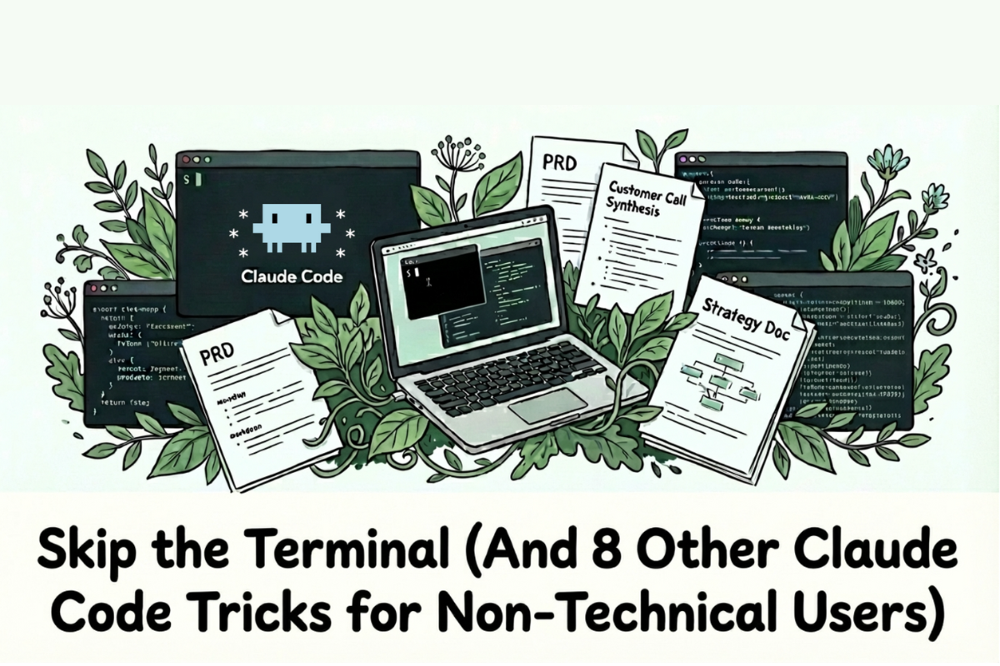

# Skip the Terminal (And 8 Other Claude Code Tricks for Non-Technical Users)

### Tips and tricks after 350+ hours of use

_This is a precursor to my series on Claude Code for Everything._

1. _[First article](https://hannahstulberg.substack.com/p/claude-code-for-everything-finally) covers setup and installation._

2. _[Second article](https://hannahstulberg.substack.com/p/claude-code-for-everything-how-the) covers the core workflow: plan mode, parallel sessions, and session management._

3. _[Third article](https://hannahstulberg.substack.com/p/claude-code-for-everything-why-ai) covers context management - the key to maintaining great output quality over long conversations with Claude._

4. _[Fourth article](https://hannahstulberg.substack.com/p/claude-code-for-everything-draft-in-claude-code-collaborate-in-notion) covers drafting in Claude Code and collaborating in Notion._

5. _[Fifth article](https://hannahstulberg.substack.com/p/claude-code-for-everything-the-best-personal-assistant-remembers-everything-about-you) covers CLAUDE.md files - so Claude already knows how you work before you say a word._

The problem with most AI tools isn't the AI - it's the time-consuming exercise of providing enough context so that the AI can be effective. The AI doesn't know who you are, your role, how you write, what projects you're working on, your team structure, or any of your business context. You spend more time explaining your project and the related context than actually getting help. After all this effort, the output sounds like it was written by AI - generic, not in your voice. Then, the moment you close the chat, all context is lost.

Earlier this year, I hit this wall hard. I'm a PM at DoorDash, and context is everything in my job. I wanted AI to help me draft PRDs, write strategy docs, and synthesize customer research. So I tried. I spent hours gathering, downloading, and uploading context docs - sometimes 20+ documents - trying to give ChatGPT enough context to actually be useful. I felt like I was moving mountains, but the output continued to fall flat. So I gave up - it felt faster to just do the work myself.

Then, this past October, I watched [Carl Velotti's Claude Code tutorial](https://www.youtube.com/watch?v=4nthc76rSl8) on [Aakash Gupta's YouTube channel](https://www.youtube.com/@growproduct) \- and everything changed.

[Claude Code](https://code.claude.com/docs/en/overview) is AI that lives in your file system. It can read your documents, create new ones, organize your research, and remember context across sessions. For knowledge workers - anyone who lives in documents, slides, and spreadsheets - it's less "chatbot" and more "second brain that actually does things."

I went from giving up on using AI at work to working in Claude Code 7+ hours a day.

Following the tutorial, I took Carl's full course ["Claude Code for PMs"](https://ccforpms.com/) (which I _highly_ recommend - the fundamentals apply to any knowledge work, not just PM), played around with other tutorials and read mountains of documentation. But after months of almost daily use, I've found that most courses don't cover the smaller workflow optimizations - things that are second nature to developers but non-obvious to the rest of us.

Here are 9 tricks I discovered that took Claude Code from "this is cool" to "I can't work without this."

# **1\. The terminal is a black box - stop using it**

The standalone terminal has always felt like a black box to me. I have a degree in computer science, and I still find it intimidating. You can't see your file structure. You can't preview documents. You're just typing into a void, hoping Claude is doing the right thing somewhere you can't see.

_This is not how developers work._ They use something called an IDE.

An IDE (Integrated Development Environment) gives you a file browser, text editor, and terminal all in one window. [Carl's course](https://ccforpms.com/fundamentals/visualizing-files) covers the benefits of using Claude Code within an IDE incredibly well - here are a few key reasons why it matters:

**See your file structure.** When you're using Claude Code as a "second brain" - storing notes, research, meeting transcripts, project docs - you need to see what you have. The terminal gives you nothing. An IDE shows your entire folder structure in a sidebar, so you can navigate to any file instantly and know what's available to reference.

**See your files as real documents.** When you ask Claude Code to save notes, write documents, or organize your research, it creates Markdown files - a simple text format that uses symbols like # for headers and \*\* for bold text. In the terminal, you only see the raw text with all those formatting symbols cluttering the page. An IDE lets you "preview" these files, rendering them as clean, formatted documents - the way they're meant to be read.

**Review changes more easily.** When Claude finishes editing a file, the terminal shows you a list of changes - but it's hard to interpret what actually changed. In an IDE, you can have the document open in preview mode right above the terminal. Instead of parsing a change list, you just look at the document and see exactly what Claude produced.

**Access your Claude Code configuration.** Claude Code stores its settings in a hidden .claude/ folder - this is where your custom commands, skills, and agents live, along with your CLAUDE.md file (which gives Claude context about your project). In an IDE, you can see this folder in your sidebar and edit these files while you work. More on this in Trick 3.

I use [Cursor](https://cursor.com/) (more on _why_ I chose Cursor in the next section), but VS Code, Windsurf, or any other IDE will work too. The specific IDE choice doesn't matter too much - what matters is getting out of the terminal black box.

# **2\. Using Cursor as your IDE lets you pick the best model for the job**

While I generally use Claude Code for most of my work, I don't want to be locked into a single model. Other models are sometimes better for certain tasks, and the AI landscape moves fast - which model performs best changes constantly, and new models drop every few months.

Cursor has a built-in chat feature that lets you run prompts against different models. I haven't done a deep dive on whether other IDEs offer this, but I knew Cursor had it - and that's a big reason I chose it.

Cursor currently supports Claude Opus 4.5, Claude Sonnet 4.5, GPT-5.2, GPT-5.1 Codex, Gemini 3 Flash, and Grok - with more being added regularly. If I'm not happy with Claude's output on a particular task, I can quickly test the same prompt in another model, see if I like that result better, and then feed it back into Claude Code to keep going.

# **3\. Make sure you can see hidden files**

Claude Code stores its configuration in hidden files and folders - most importantly the .claude/ folder. If your IDE hides these by default, you won't be able to see or edit them.

**Why this matters:** The .claude/ folder is where Claude Code keeps everything that makes it _yours_:

- **Skills:** Markdown files that teach Claude specialized knowledge. Claude automatically decides when to use them based on what you're asking for - you don't have to remember to invoke them.

- **Commands:** Shortcuts you trigger by typing a slash followed by the command name. Unlike skills, you have to explicitly type the command to use it.

- **Agents:** Specialized AI personalities that Claude can delegate tasks to. Each agent works in its own isolated context, so it doesn't clutter your main conversation.

- **CLAUDE.md:** The file that gives Claude context about your project, your preferences, and how you want it to work.

If you can't see this folder in your file sidebar, you can't browse what you've built, edit existing configurations, or reference them while you're working.

**Cursor** shows hidden folders out of the box - you should see the .claude/ folder in your sidebar without changing anything.

Some IDEs may hide the .claude/ folder by default. To fix this, you can actually use Claude Code to guide you through the process of making this folder visible in your IDE of choice (definitely a bit meta - using Claude Code to make Claude Code work better!).

# **4\. Drag and drop files into the terminal to share them with Claude**

Want Claude Code to look at an image or document? Just drag and drop it directly into the command line from the folder in which it lives. Claude Code can access and analyze it from there.

Most of the time, these files don't need to be saved long-term. You're just showing Claude a screenshot for context or a doc for reference. Only save files into your project directory if you actually want to keep them around.

# **5\. Run tasks in parallel to move faster**

Why run one Claude Code session when you can run three?

You can open multiple terminal instances within your IDE to run separate Claude Code sessions in parallel (to do this in Cursor, just hit the + button!). While one session writes your PRD, another can synthesize customer call transcripts, and a third can do competitive research.

This isn't just about speed - it's about keeping context focused. Each Claude Code session has its own context window, and you want that context dedicated to one task. If you try to write a PRD and synthesize customer calls in the same session, Claude is juggling unrelated information and the output suffers. Separate sessions mean each task gets Claude's full attention.

_Pro tip:_ Right-click the terminal name to rename it. I label mine by task ("\[Project Name\] PRD," "\[Customer Name\] Call Synthesis," "\[Market\] Competitive Research"). When you're juggling multiple sessions, you need to know which is which.

_Note:_ This is different from running agents in parallel to complete a single task faster - [Carl's course covers that well](https://ccforpms.com/fundamentals/agents).

# **6\. Split your terminals so you know when tasks finish**

Create split terminal views so you can monitor 2 - 3 Claude Code sessions at once. This way, you see immediately when a task finishes - no more switching back and forth wondering if a session is done.

It sounds minor. It's not. The cognitive load of flipping between multiple tabs adds up fast.

(Folks at Cursor, if you're reading this: adding a visual indicator when a task finishes executing in a terminal would be a game changer!!)

# **7\. Context limits will bite you - watch the status line**

Claude Code's [status line feature](https://code.claude.com/docs/en/statusline) is one of those small things that makes a big difference. At a glance, you can see:

- **Which model you're using:** Helpful when you're switching between models or want to confirm you're on the right one

- **Where you are in your project:** Shows your current working directory

- **Context usage:** How much of Claude's context window you've used

- **Session cost:** What you've spent so far in the current session

I keep an eye on context usage and often manually compact (by typing /compact) when I've used 50-60% of available context. Claude will auto-compact when you hit limits, but I like having the visibility to choose to trigger it myself - it keeps the conversation focused and prevents hitting limits at inopportune moments.

# **8\. Stop typing - talk instead**

I rarely type into Claude Code anymore. Instead, I use [Wispr Flow](https://ref.wisprflow.ai/hannah-stulberg) to dictate everything.

Voice removes so much friction. You can explain what you want conversationally instead of carefully typing instructions. Since Claude is doing the hard work, you might as well make the input easy.

_Post-publication note:_ This tip is now covered in-depth in my article [Stop Typing, Start Talking: How Dictation + AI Editing Saves Me >10 Hours a Week](https://open.substack.com/pub/hannahstulberg/p/stop-typing-start-talking-how-dictation?utm_campaign=post-expanded-share&utm_medium=web).

# **9\. Every session is a chance to teach Claude something**

Every time I use Claude Code, I'm thinking: _could I make this faster next time?_

Remember that `.claude/` folder from Trick 3? This is where you'll be spending time. If I explain something to Claude once, I ask myself if I'll need to explain it again. If yes, I add it to my `CLAUDE.md` file so Claude will know next time. If I find myself running the same sequence of prompts, I turn it into a command. If a task needs specialized context, I build a skill or agent for it.

The optimizations are small - a new guideline here, a shortcut there. But getting 1% better every day compounds fast. My Claude Code setup today is dramatically more efficient than it was a month ago, and it keeps improving.

# **The bottom line**

Claude Code definitely has a learning curve, especially for non-developers. But it's worth the climb. These 9 tricks helped me take it from "intimidating terminal thing" to "tool I use for almost everything."

What tricks have you found?
