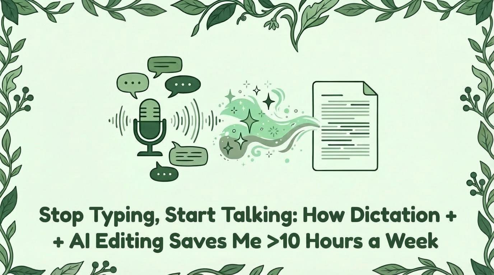
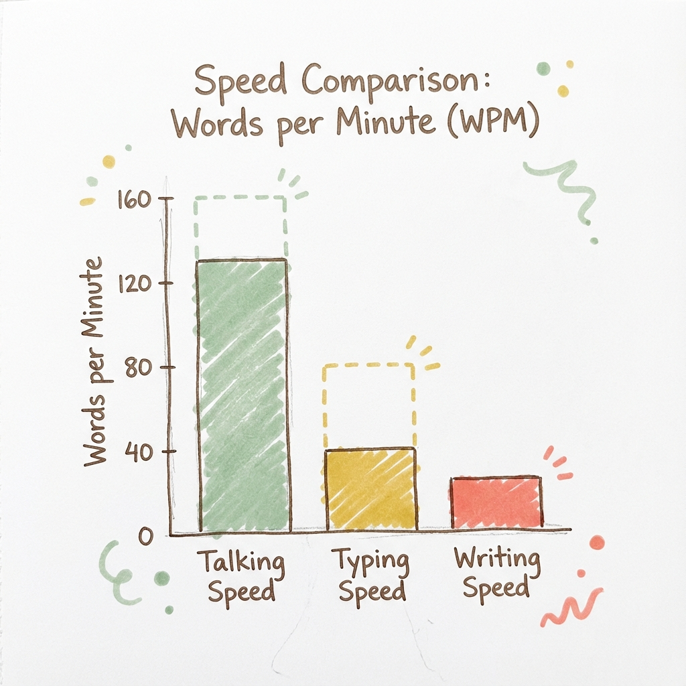
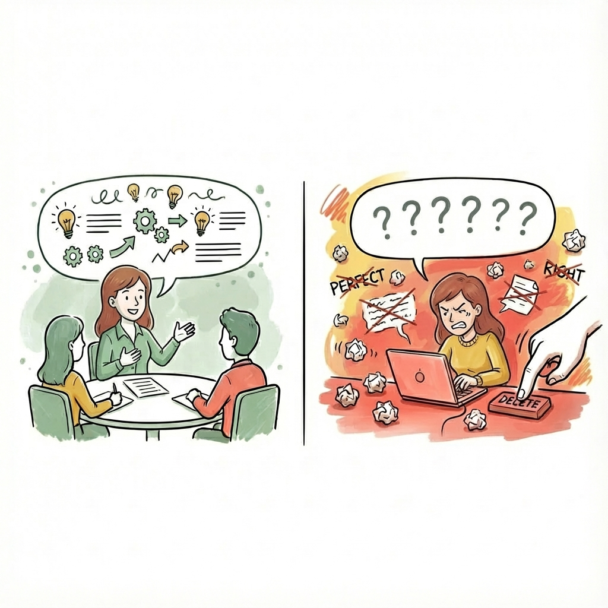
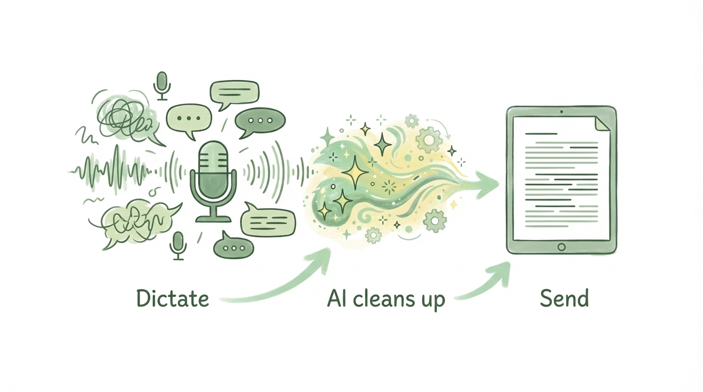

# Stop Typing, Start Talking: How Dictation + AI Editing Saves Me 10+ Hours a Week

*For anyone who's ever stared at a blank page knowing exactly what they want to say*

### You already know what you want to say - so why is writing it down so hard?

Ever notice how you can explain something perfectly in a meeting, but the second you sit down to write it up, the words won't come? You open a blank doc. Type a sentence. Delete it. Type another. Rephrase. Backspace. Start over. Twenty minutes later, you've written three paragraphs - and they somehow say less than what you rattled off out loud in two minutes.

The ideas were right there. You *knew* what you wanted to say. So what happened?

When you explained it out loud, you didn't stop mid-sentence to find the perfect word. You just talked. But when you type, you start editing before you've even finished a thought - backspacing, rephrasing, trying to get it right on the first pass. What if I told you there's a way to write anything - emails, docs, Slack messages - 3-4x faster? And no, it's not learning to type faster. ***It's learning to stop typing altogether.***

**In this article, I'll show you how to use voice dictation paired with AI editing to draft docs, emails, and messages in a fraction of the time - and why this workflow is a game-changer for longer-form content.** This technique has cut the time I spend writing long-form content by at least 50%, saving me more than 10 hours every week.

### Let's run an experiment

Before we go any further, I want you to do something. Open a new tab and take a quick typing test. [Here's a free one that takes 60 seconds.](https://www.typingtest.com/)

Go ahead. I'll wait.

...

Back? Good. What did you get? If you're like most people, you landed somewhere around 40 words per minute. If you hit 60+, congrats - you're faster than average. But here's the thing: **that's not your actual writing speed.**

### Your typing speed isn't your writing speed

That number you just got? That's how fast you type when you already know what to say. When you're staring at a blank doc desperately trying to crank out that critical assignment by your boss's deadline, you're not typing anywhere near that speed. You're writing and editing at the same time, and your real speed is a fraction of that.

Now compare that to speaking. The average person talks at 130-160 words per minute (3-4x faster than your typing speed, and many times faster than your actual writing speed).

This is where dictating comes in. When you talk through your ideas out loud, you skip the edit-while-you-write loop entirely. Get the raw material out fast, then use AI to clean it up afterward. You're separating the two things that typing forces you to do at once.

### The workflow: dictation + AI editing

The game-changer is pairing dictation with AI. Here's how it works - starting simple and scaling up:

**Basic: Dictate into any AI chat**

The simplest version of this workflow uses tools you probably already have:

1. **Dictate your raw thoughts** into ChatGPT, Claude, or any AI tool with a voice input option. Just talk. Don't worry about structure, filler words, or sounding polished.
2. **Ask the AI to clean it up.** Something like: "Clean this up, tighten the language, and format it as a professional email" or "Turn this into a clear, organized project update."
3. **Review, tweak, send.** The AI handles the "messy to polished" gap - your job is just the final check.

This is the foundation. If you stop here, you'll still save hours every week.

**Intermediate: Better transcription with Wispr Flow**

[Wispr Flow](https://wisprflow.ai/) upgrades your dictation in two ways:

1. **More accurate transcription.** In my experience, significantly better than ChatGPT or Claude's native voice options - which means less cleanup needed.
2. **Dictate into any app.** Slack, Gmail, Notion, Google Docs - even apps without built-in voice input.

This unlocks two workflows: dictate directly into AI tools (even ones without native voice support) for the full dictation + cleanup flow, or dictate straight into any app when you just want to talk instead of type.

**Advanced: AI coding tools with saved skills**

For those ready to go deeper: AI coding tools like [Claude Code](https://code.claude.com/docs/en/overview), [Cursor](https://cursor.com/), and [Antigravity](https://antigravity.google/) let you save custom editing instructions as reusable "skills" or commands. Instead of typing "clean this up and format it as a professional email" every time, you can build prompts that already know your writing style, your formatting preferences, and exactly how you want different types of content cleaned up.

I personally use Claude Code - I've built skills for different content types, so it already knows how to edit when I dictate. This is the highest-leverage version of the workflow, but it requires some upfront setup - and a willingness to experiment with tools built for developers.

**Start simple, scale up**

The more you have to say, the more time dictation saves. Start with the basic workflow for longer-form content - docs, emails, project updates - where typing from scratch is painfully slow. Once you're comfortable, Wispr Flow opens up dictation everywhere, even for quicker messages. And if you want to go all in, AI coding tools (which, despite the name, are a game-changer for knowledge work) let you build a fully customized dictation-to-draft pipeline.

### Your challenge: try dictation + AI editing once this week

This isn't about replacing typing for everything. It's about recognizing where dictation + AI gives you the biggest advantage.

It's a new year - a good time to try new habits. So here's my challenge to you: the next time you sit down to write something longer than a few sentences, don't open a blank document. Open ChatGPT or Claude, hit the mic, and just start talking.

Will it feel weird? Absolutely. Talking to your computer takes some getting used to. I urge you to push through the discomfort. By the end of the week, you'll be faster. By the end of the month, you'll wonder why you ever typed first drafts the hard way.

You don't need to type faster. You need to stop editing while you type.

Dictate first. Let AI polish it. Send.

*Coming soon: For complex long-form docs like strategy decks, a simple brain dump won't cut it. I'll share the section-by-section approach I use to dictate multi-page documents without losing quality.*
